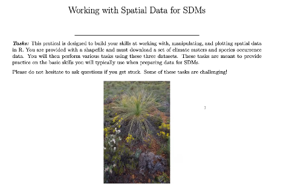
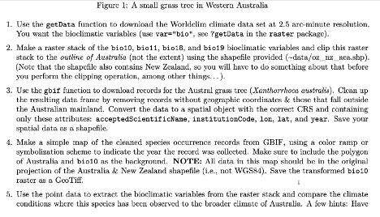
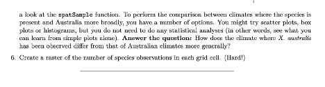

--- 
title: "A Minimal Book Example"
author: "Basim Alsaedi"
date: "2025-01-31"
site: bookdown::bookdown_site
documentclass: book
bibliography: [book.bib, packages.bib]
# url: your book url like https://bookdown.org/yihui/bookdown
# cover-image: path to the social sharing image like images/cover.jpg
description: |
  This is a minimal example of using the bookdown package to write a book.
  The HTML output format for this example is bookdown::bs4_book,
  set in the _output.yml file.
biblio-style: apalike
csl: chicago-fullnote-bibliography.csl
---

# Welcome!

Welcome to the **Species Distribution Modeling (SDM) Course**! 🎉 This course is designed to provide both **theoretical insights** and **hands-on practical skills** for understanding and predicting species distributions. Whether you're new to SDMs or looking to deepen your expertise, you're in the right place!

> **Goal:** Equip participants with the knowledge and tools to build reliable species distribution models using R.

---

## What to Expect

Throughout this course, you will engage in:

- **Interactive lectures** covering key SDM concepts.
- **Hands-on practical sessions** involving spatial data analysis in R.
- **Collaborative learning** through discussions and group activities.

### Learning Path

| **Module**               | **Content**                                                                 |
|--------------------------|-----------------------------------------------------------------------------|
| **Module 1**             | Introduction to Species Distribution Modeling                               |
| **Module 2**             | Preparing Spatial Data for Modeling                                         |
| **Module 3**             | Applying SDM Algorithms (MaxEnt, GLM, RF, etc.)                             |
| **Module 4**             | Model Evaluation & Interpretation                                           |
| **Module 5**             | Advanced Topics: Ensemble Modeling & Climate Projections                    |

---

## How to Get Started 🚀

Follow these steps to set up your environment and begin your SDM journey:

1. **Check the Resource Hub:**
   - Access essential files, including datasets, scripts, and reading materials, via the shared Google Drive.

2. **Set Up Your Environment:**
   - Ensure R and RStudio are installed.
   - Run the `installlibs.R` script to install required packages.

3. **Stay Engaged:**
   - Participate actively in lectures and practicals.
   - Ask questions and share your insights during sessions.

> **Tip:** Bookmark this guide for easy reference throughout the course. 📖

---

## Course Overview 🌍

Species Distribution Models (SDMs) are powerful tools for understanding where species are likely to occur based on environmental variables. They play a crucial role in:

- **Biodiversity conservation**
- **Ecological research**
- **Environmental management**

### Core Topics Covered

1. **Theoretical Framework:**
   - Learn the fundamental principles of SDMs, including ecological niche theory and predictor variables.

2. **Spatial Data Handling:**
   - Gain hands-on experience with spatial datasets in R (e.g., shapefiles, raster data).

3. **Modeling Algorithms:**
   - Explore different SDM algorithms, such as:
     - **MaxEnt:** For presence-only data.
     - **Generalized Linear Models (GLM)** and **Random Forests (RF)** for presence-absence data.

4. **Model Evaluation:**
   - Use metrics like AUC, TSS, and Kappa to assess model performance.

5. **Projection & Scenario Analysis:**
   - Predict species distributions under future climate scenarios using ensemble modeling.

---

## Logistics and Structure 🗓️

The course spans **two weeks**, with each week comprising:

- **Lectures** (1-2 hours)
- **Discussions** (30 minutes)
- **Practical Exercises** (2-3 hours)

### Daily Schedule Example

| **Time**        | **Activity**                         |
|------------------|-------------------------------------|
| 9:00 AM - 10:30 AM | Lecture: SDM Basics                  |
| 10:30 AM - 11:00 AM| Break                               |
| 11:00 AM - 1:00 PM | Practical: Preparing Spatial Data   |

---

## Instructor Background 👩‍🏫

The course instructor brings a unique blend of expertise in **aerospace engineering** and **ecological modeling**. Their research focuses on:

- **Climate change impacts**
- **Invasive species management**
- **Habitat suitability modeling**

This interdisciplinary approach ensures a well-rounded learning experience, combining technical rigor with ecological insight.

---

## Course Objectives 🎯

By the end of this course, you will be able to:

- **Understand** the principles of SDMs and spatial data analysis.
- **Prepare** spatial datasets for modeling.
- **Apply** various SDM algorithms using R.
- **Evaluate** model performance using appropriate metrics.
- **Interpret** and **project** model results under different scenarios.

> **Advanced learners:** Additional modules on ensemble modeling and climate downscaling will be available for those interested in more in-depth exploration.

---

## Practical Exercises 💻

This course emphasizes hands-on learning. Key practical exercises include:

### 1. Handling Spatial Data

- **Objective:** Prepare spatial data for SDM by loading, manipulating, and visualizing datasets in R.
- **Skills Learned:**
  - Loading shapefiles and raster data.
  - Performing spatial operations.
  - Visualizing spatial data using `ggplot2` and `leaflet`.

### 2. Fitting and Evaluating SDMs

- **Objective:** Apply SDM algorithms and evaluate model performance.
- **Skills Learned:**
  - Running MaxEnt and GLM models.
  - Evaluating models using AUC, TSS, and Kappa metrics.
  - Interpreting model outputs.

> **Note:** Solutions will be shared after the course to allow self-assessment.

---

## Communication and Support 🤝

Active participation is key to making the most of this course. Participants are encouraged to:

- **Ask questions** during sessions.
- **Share insights** and experiences.
- **Collaborate** with peers through group activities and discussions.

### Support Channels

- **Email Support:** Reach out to the instructor for any queries.
- **Discussion Forum:** A dedicated forum will be set up for ongoing discussions.
- **Office Hours:** Weekly office hours for one-on-one support.

> **Reminder:** Collaboration fosters better learning, so don’t hesitate to engage with your peers! 🤗

---

## References and Readings 📚

The course references several recent publications on best practices in SDM (2019-2023). Key references include:

1. **Elith & Leathwick (2019)** - A comprehensive review of SDM methods.
2. **Phillips et al. (2020)** - Guidelines for using MaxEnt in ecological modeling.

All papers are available in the shared Google Drive under the **"Best Practices"** folder.

### Supplementary Readings

Additional readings on advanced topics, such as:

- **Ensemble Modeling**
- **Climate Change Projections**

These will be provided for participants interested in further exploration.

---

## Final Words 🌟

We hope you find this course insightful and enjoyable. Let’s embark on this exciting journey into species distribution modeling together!

Happy learning! 🚀


<!--chapter:end:index.Rmd-->

# Introduction


------------------------------------------------------------------------

### **1. What is Species Distribution Modeling (SDM)?**

::: rmdnote
**Definition**:\
Species Distribution Modeling (SDM) uses statistical models to predict where species live based on environmental conditions. It helps us understand the relationship between species and their habitats.

Key terms to know: - **Environmental Niche Models**: These show the range of conditions where a species can live. - **Habitat Suitability Models**: These predict areas suitable for a species.
:::

------------------------------------------------------------------------

### **Why SDMs are Important?**

::: rmdimportant
SDMs play a crucial role in many areas:

1.  **Biodiversity Conservation**
    -   Helps protect endangered species by identifying their key habitats.\
    -   Aids in planning conservation zones and protected areas. 🌿
2.  **Ecological Research**
    -   Improves our understanding of how species interact with their environment.\
    -   Supports studies on how species respond to environmental changes, like temperature rise. 🌍
3.  **Environmental Management**
    -   Helps manage invasive species by predicting areas they may spread to.\
    -   Assists in assessing the impact of climate change on ecosystems. 🌦️
:::

------------------------------------------------------------------------

### **Applications of SDMs**

| **Application**                | **Description**                                                                       |
|---------------------|---------------------------------------------------|
| **Discovery of New Species**   | SDMs can help find new species by predicting potential habitats.                      |
| **Climate Change Impact**      | Predict how species distributions might shift in the future due to climate change. 🌡️ |
| **Invasion Risk Assessment**   | Identify areas at risk of invasion by non-native species. 🚫                          |
| **Niche Dynamics & Evolution** | Study how species niches change over time.                                            |
| **Community-Level Modeling**   | Analyze how groups of species interact and live together in different areas. 🐾       |

> **Tip:** SDMs are not just for researchers—they are used in real-world decision-making, like planning city expansions and protecting forests.

------------------------------------------------------------------------

### **2. Key Concepts in SDM**

---

#### **Species Data** 🐾

To build SDMs, you need **species data**, which shows where a species has been observed. There are two main types of species data:

1. **Presence-only data**  
   - This means you only know where the species was seen, but you don’t know where it wasn’t seen.  
   - Example: Using data from citizen science platforms like iNaturalist or GBIF.  
   - **Models that use presence-only data**:  
     - **MaxEnt (Maximum Entropy Model)** – One of the most popular tools for presence-only SDMs.  
     - Fun Fact: MaxEnt works by finding the distribution with the "maximum randomness" while still matching the observed data!

2. **Presence-absence data**  
   - Here, you have information on where the species was seen (**presence**) and where it wasn’t (**absence**).  
   - This type of data gives more information and allows for more robust modeling.  
   - **Models that use presence-absence data**:  
     - **Generalized Linear Models (GLM)**  
     - **Random Forests (RF)** – A machine learning approach that handles complex relationships well.

---

#### **Environmental Covariates** 🌍

In SDMs, you also need **environmental data**, often called **covariates**, which describe the conditions in different locations. These covariates help explain why a species might be present or absent.

Common types of environmental covariates:

- **Climate data**: Temperature, rainfall, and humidity influence where species can live.  
  > Example: Polar bears need cold temperatures to survive, while cacti thrive in dry, hot deserts. 🌵❄️

- **Soil properties**: Nutrient levels, pH, and texture are critical for plant species.  
  > Did you know? Some plants only grow in very specific soil types, like orchids that need well-drained soils.

- **Land cover and elevation**: Forests, grasslands, and mountains create different habitats.  
  > Elevation can affect climate — higher areas are colder, which influences where species can survive.

---

#### **Correlative vs. Mechanistic Models** 🔍

SDMs can be **correlative** or **mechanistic**, depending on how they relate species data to the environment:

1. **Correlative Models**  
   - These models find statistical relationships between where species are found and environmental conditions.  
   - Easy to implement but don’t explain the underlying biological processes.  
   - **Example**: MaxEnt, GLM, RF.

2. **Mechanistic Models**  
   - These models are based on biological processes, like how a species responds to temperature or food availability.  
   - They require detailed biological knowledge and data but can make better predictions in new environments.  
   - **Example**: Models that simulate species' energy balance under different climates.

> **Tip:** Correlative models are more commonly used in SDMs because they require less data and are easier to build.

---

### **3. The SDM Workflow**

Building a species distribution model involves several steps:

---

#### **Step-by-Step Overview**

1. **Data Collection** 📊  
   Collect species occurrence data (presence or presence-absence) and environmental covariates.  
   - Sources for species data: GBIF, iNaturalist, local biodiversity surveys.  
   - Sources for environmental data: WorldClim (for climate data), SoilGrids (for soil properties).

2. **Data Preparation** 🧹  
   Clean and format your data so it can be used in modeling.  
   - Ensure that the species data and environmental layers have the same coordinate system.  
   - Handle missing values and align data resolution (e.g., 1 km resolution for raster data).

3. **Model Fitting** 🔧  
   Choose an appropriate modeling algorithm and fit the model.  
   - Presence-only data → Use **MaxEnt**.  
   - Presence-absence data → Use **GLM** or **Random Forest**.

4. **Model Evaluation** ✅  
   Evaluate the model’s performance using metrics like:  
   - **AUC (Area Under the Curve)**: Measures how well the model distinguishes between presence and absence.  
   - **TSS (True Skill Statistic)**: Evaluates model accuracy by comparing predictions to actual observations.

5. **Model Prediction** 🌍  
   Use the fitted model to predict species distributions under current or future conditions.  
   - Example: Predict how a species’ range might shift under different climate change scenarios.

---

#### **Common Tools and Techniques**

1. **GIS Tools**  
   Geographic Information System (GIS) tools are essential for spatial data handling. You can use:  
   - **QGIS**: A free, open-source GIS tool.  
   - **ArcGIS**: A popular commercial GIS software.

2. **R Packages**  
   R offers powerful tools for SDM. Key packages include:  
   - **raster/terra**: For handling spatial data (e.g., raster and vector files).  
   - **dismo**: For running SDM algorithms like MaxEnt.  
   - **ggplot2**: For data visualization.  
   - **sf**: For handling spatial vector data (points, lines, polygons).

> **Fun Fact:** MaxEnt is often preferred for presence-only data because it works well even with small datasets and avoids overfitting by applying regularization.

---

### Example Workflow in R

Here’s a simple R code snippet to illustrate the SDM workflow:

```r
# Load necessary libraries
library(raster)
library(dismo)

# Load environmental data (stack of raster layers)
env <- stack(list.files(pattern = ".tif$", full.names = TRUE))

# Load species occurrence data
species <- read.csv("species_occurrence.csv")

# Fit a MaxEnt model
maxent_model <- maxent(env, species)

# Predict species distribution
prediction <- predict(maxent_model, env)

# Plot the prediction
plot(prediction)
```

---

### **4. Why Use R for SDM?**

---

#### **Benefits of R** 🚀

R is one of the best tools for Species Distribution Modeling (SDM) because:

- **Open-source**:  
  You can download and use R for free! This makes it accessible to students, researchers, and organizations everywhere. 🌎

- **Widely used in ecological research**:  
  Many ecologists and conservationists use R, which means there are plenty of resources, guides, and research papers available to learn from.

- **Large ecosystem of packages**:  
  R has many packages specifically designed for spatial data handling and ecological modeling. Whether it’s raster data manipulation or running complex SDMs, there’s a package for it!

- **Community support**:  
  Got stuck? No problem! The R community is huge, and platforms like Stack Overflow and R-bloggers have tons of answers and tutorials.

> **Did you know?**  
> Some of the world’s leading biodiversity databases, like GBIF, have tutorials and workflows written in R!

---

#### **Key R Packages for SDM** 📦

Here are some essential R packages for SDM:

| **Package**     | **Purpose**                                           |
|-----------------|-------------------------------------------------------|
| `raster`        | For working with raster data (e.g., climate layers).  |
| `terra`         | A newer, faster alternative to `raster`.              |
| `dismo`         | For running SDM algorithms like MaxEnt and Bioclim.   |
| `ggplot2`       | For creating beautiful visualizations.                |
| `sf`            | For handling spatial vector data (e.g., shapefiles).  |
| `MaxEnt`        | Specifically for fitting MaxEnt models in R.          |

> **Tip:**  
> Use `terra` instead of `raster` for faster performance, especially with large datasets. The syntax is slightly different but easy to learn.

---

### **5. Setting Up R for SDM**

---

#### **Installing R and RStudio** 🖥️

Here’s how to set up your R environment step-by-step:

1. **Download R**:  
   Go to the [CRAN website](https://cran.r-project.org) and download the latest version of R for your operating system (Windows, Mac, or Linux).

2. **Download RStudio**:  
   RStudio is an IDE (Integrated Development Environment) that makes coding in R easier. Download it from [RStudio’s website](https://posit.co/download/rstudio-desktop/).

3. **Install R and RStudio**:  
   Follow the installation instructions. Once done, open RStudio, and you’re ready to code!

> **Fun Fact:**  
> RStudio has features like syntax highlighting, built-in plotting, and project management that make it a favorite among R users.

---

#### **Installing Required Packages** 📦

Once R and RStudio are installed, you need to install the required packages. You can do this by running the following code in your R console:

```r
# Install essential SDM packages
install.packages(c("raster", "terra", "dismo", "ggplot2", "sf"))
```

> **Tip:**  
> Always keep your packages updated by using `update.packages()` regularly. This ensures compatibility with the latest R version.

---

#### **Loading Data in R** 📂

Let’s use a simple example to load environmental data and species occurrence data. The `dismo` package comes with built-in datasets, so you don’t need to download anything!

**Example: Loading environmental layers and species data**

```r
# Load necessary libraries
library(dismo)
library(terra)

# Load example environmental data (bioclim variables)
env <- getData("worldclim", var = "bio", res = 10)

# View the environmental layers
plot(env[[1]])  # Plot the first layer (Bio1: Annual Mean Temperature)

# Load example species occurrence data (Bradypus variegatus)
data(bradypus)  # Comes with the dismo package
head(bradypus)  # View the first few rows of data

# Plot species occurrences on top of the environmental layer
plot(env[[1]])
points(bradypus, col = "red", pch = 20)
```

---

#### **Explanation**

1. **Environmental Data**  
   The `getData()` function from the `dismo` package downloads climate data (WorldClim) at a 10-minute resolution. In this example, we load 19 bioclimatic variables, such as temperature and precipitation.

2. **Species Occurrence Data**  
   The `bradypus` dataset contains occurrence points for the brown-throated sloth (*Bradypus variegatus*), a species found in Central and South America.

3. **Plotting**  
   We first plot the environmental layer (annual mean temperature) and then overlay the species occurrence points in red.

> **Did you know?**  
> WorldClim is one of the most popular sources for global climate data, providing high-resolution layers for past, present, and future climate conditions!

---

### **6. Practical Example: Building a Simple SDM in R** 🛠️

---

In this section, we will build a simple **Species Distribution Model (SDM)** using R. We’ll use a built-in dataset from the `dismo` package, so you don’t need to download any external files.

---

#### **Dataset: Tsuga canadensis (Eastern Hemlock)** 🌲

- **Species**: *Tsuga canadensis*, a tree species native to eastern North America.
- **Goal**: Predict the potential distribution of this species based on environmental conditions.

---

#### **Steps to Build the SDM**

1. **Load Environmental Layers and Occurrence Data**  
2. **Fit a Basic MaxEnt Model**  
3. **Evaluate the Model Using AUC**  
4. **Generate and Plot Predictions**

---

#### **Step 1: Load Environmental Layers and Occurrence Data**

```r
# Load required libraries
library(dismo)
library(terra)

# Load environmental data (bioclim variables)
env <- getData("worldclim", var = "bio", res = 10)

# Load species occurrence data (for Tsuga canadensis)
data(tsuga)  # Built-in dataset in dismo
head(tsuga)  # View first few rows of occurrence data
```

Here, we use **WorldClim** data, which contains 19 bioclimatic variables (like temperature and precipitation) at a 10-minute resolution.

> **Fun Fact**:  
> WorldClim data is widely used in ecological studies because it provides historical, current, and future climate layers.

---

#### **Step 2: Fit a Basic MaxEnt Model**

```r
# Fit the MaxEnt model
maxent_model <- maxent(env, tsuga)

# View model summary
summary(maxent_model)
```

We use the `maxent()` function from the `dismo` package to fit a **Maximum Entropy (MaxEnt)** model. This algorithm is ideal for **presence-only data**, which means we only need locations where the species was observed.

---

#### **Step 3: Evaluate the Model Using AUC**

```r
# Evaluate model using AUC (Area Under the Curve)
evaluate_model <- evaluate(maxent_model, env, tsuga)
auc_value <- evaluate_model@auc
print(paste("AUC:", auc_value))
```

The **AUC** (Area Under the Curve) value tells us how well the model distinguishes between suitable and unsuitable habitats:

- **AUC > 0.9**: Excellent model  
- **AUC 0.7 – 0.9**: Good model  
- **AUC < 0.7**: Poor model

> **Tip**:  
> Always aim for an AUC above 0.7, but remember that a high AUC doesn’t always mean the model is perfect—it might just be overfitting!

---

#### **Step 4: Generate and Plot Predictions**

```r
# Generate predictions
prediction <- predict(maxent_model, env)

# Plot the predicted distribution
plot(prediction, main = "Predicted Distribution of Tsuga canadensis")
points(tsuga, col = "red", pch = 20)
```

This plot shows the predicted distribution of *Tsuga canadensis* based on the environmental conditions. The red points represent the locations where the species was observed.

---

### **7. Best Practices in SDM** ✅

---

#### **1. Ensuring Data Quality** 🧐

Quality data is the foundation of a good model. Here’s how to ensure your data is reliable:

- **Avoid Bias in Species Occurrence Data**  
  - Sampling bias can lead to incorrect predictions. For example, if most observations come from areas near roads, the model might think the species only lives near roads!
  - Use tools like **spatial thinning** to reduce bias.

- **Use Appropriate Resolution for Environmental Layers**  
  - Choose a resolution that matches your study scale.  
  - Example: If you’re modeling a local species, use high-resolution data (e.g., 1 km). For global models, 10 km resolution might be fine.

---

#### **2. Model Validation** 🏅

Model validation helps you assess how well your SDM performs:

- **Cross-validation Techniques**  
  - Use **k-fold cross-validation** to split your data into training and testing sets multiple times. This helps ensure the model isn’t overfitting.

- **Independent Test Data**  
  - If possible, use a completely independent dataset to validate your model. This gives a more realistic estimate of how well the model performs in the real world.

---

#### **3. Interpreting Results** 🔍

Interpreting SDM results correctly is crucial:

- **Understand Limitations**  
  - SDMs predict **potential** distributions, not actual ones. Just because the model says a species can live somewhere doesn’t mean it’s actually there!
  
- **Account for Uncertainties**  
  - Always report uncertainties in your predictions. For example, use **confidence intervals** or **ensemble models** to show variation in predictions.

> **Did You Know?**  
> Ensemble models combine predictions from multiple algorithms to improve accuracy and reduce uncertainty.

---

<!--chapter:end:01-course-intro.Rmd-->

# Understanding Spatial Data

---

### **1. Introduction to Spatial Data** 🌍

---

#### **What is Spatial Data?**

Spatial data is any data that tells us **where something is located on Earth**. It is tied to a specific location and often includes information about features like:

- **Natural elements**: Rivers, forests, mountains.  
- **Human-made structures**: Roads, cities, bridges.  
- **Environmental conditions**: Temperature, rainfall, soil type.

> **Think about this**:  
> Every time you check a weather map or search for a place on Google Maps, you’re working with spatial data!

---

#### **Why is Spatial Data Important?**

Spatial data helps us **understand patterns and relationships** in the environment. It is essential for answering questions like:

- **Where are species found?**  
  - Helps map species distributions and habitats.

- **What environmental conditions are present?**  
  - For example, where it’s warm or wet enough for specific plants to grow.

- **How are things changing over time?**  
  - Spatial data is crucial for monitoring climate change, urban expansion, or deforestation.

> **Fun Fact**:  
> Spatial data is used by conservationists to protect endangered species, by city planners to design better transport systems, and even by gamers to build realistic maps in video games!

---

#### **Real-World Example**

Let’s say we want to study the distribution of sloths in South America. We can combine **species occurrence data** (locations where sloths were spotted) with **environmental data** (temperature, forest cover) to build a **Species Distribution Model (SDM)**. This helps us predict where sloths might live—even in areas we haven’t explored yet.

---

#### **Types of Spatial Data**

Spatial data comes in two main forms:

1. **Vector Data**  
   - Represents features with clear boundaries, like roads, rivers, and city borders.  
   - Think of it as a detailed map showing shapes and lines.  

2. **Raster Data**  
   - Represents continuous data, like temperature or elevation, as a grid of cells (pixels).  
   - Think of it as a heatmap showing variations across a region.

---

> **Let’s Explore More**:  
> In the next sections, we’ll dive into these two types of spatial data and learn how to work with them in R. Stay curious! 🐾

---
---

### **2. Types of Spatial Data** 🗺️

Spatial data comes in two main types: **vector data** and **raster data**. Each has unique characteristics and is used for different purposes. Let’s dive in!

---

#### **2.1. Vector Data** ✏️

##### **What is Vector Data?**
Vector data represents features as **points**, **lines**, or **polygons**. It’s great for capturing objects with clear boundaries.

##### **Components of Vector Data**
- **Points**: Represent specific locations, like:  
  - Cities  
  - Tree locations  
  - Observation points for species occurrence.

- **Lines**: Represent linear features, such as:  
  - Roads  
  - Rivers  
  - Trails.

- **Polygons**: Represent areas, such as:  
  - Countries  
  - Lakes  
  - Forest boundaries.

##### **Attributes of Vector Data**
Each vector feature can have **attributes**, which provide additional information.  
For example:

| **Feature**    | **Attribute**          |
|-----------------|------------------------|
| A tree point    | Tree species name      |
| A road line     | Road name and length   |
| A country polygon | Population and area size |

> **Fun Fact**: The shapefile format (.shp) is one of the most common ways to store vector data, and it has been used since the 1990s!

---

##### **Vector Data in R**

In R, we use packages like `sf` and `terra` to work with vector data. Let’s see an example:


``` r
# Load the 'sf' package
library(sf)
#> Linking to GEOS 3.11.0, GDAL 3.5.3, PROJ 9.1.0; sf_use_s2()
#> is TRUE

# Load a sample shapefile (comes with the 'sf' package)
nc <- st_read(system.file("shape/nc.shp", package = "sf"))
#> Reading layer `nc' from data source 
#>   `/Library/Frameworks/R.framework/Versions/4.4-arm64/Resources/library/sf/shape/nc.shp' 
#>   using driver `ESRI Shapefile'
#> Simple feature collection with 100 features and 14 fields
#> Geometry type: MULTIPOLYGON
#> Dimension:     XY
#> Bounding box:  xmin: -84.32385 ymin: 33.88199 xmax: -75.45698 ymax: 36.58965
#> Geodetic CRS:  NAD27

# View the first few rows of the data
head(nc)
#> Simple feature collection with 6 features and 14 fields
#> Geometry type: MULTIPOLYGON
#> Dimension:     XY
#> Bounding box:  xmin: -81.74107 ymin: 36.07282 xmax: -75.77316 ymax: 36.58965
#> Geodetic CRS:  NAD27
#>    AREA PERIMETER CNTY_ CNTY_ID        NAME  FIPS FIPSNO
#> 1 0.114     1.442  1825    1825        Ashe 37009  37009
#> 2 0.061     1.231  1827    1827   Alleghany 37005  37005
#> 3 0.143     1.630  1828    1828       Surry 37171  37171
#> 4 0.070     2.968  1831    1831   Currituck 37053  37053
#> 5 0.153     2.206  1832    1832 Northampton 37131  37131
#> 6 0.097     1.670  1833    1833    Hertford 37091  37091
#>   CRESS_ID BIR74 SID74 NWBIR74 BIR79 SID79 NWBIR79
#> 1        5  1091     1      10  1364     0      19
#> 2        3   487     0      10   542     3      12
#> 3       86  3188     5     208  3616     6     260
#> 4       27   508     1     123   830     2     145
#> 5       66  1421     9    1066  1606     3    1197
#> 6       46  1452     7     954  1838     5    1237
#>                         geometry
#> 1 MULTIPOLYGON (((-81.47276 3...
#> 2 MULTIPOLYGON (((-81.23989 3...
#> 3 MULTIPOLYGON (((-80.45634 3...
#> 4 MULTIPOLYGON (((-76.00897 3...
#> 5 MULTIPOLYGON (((-77.21767 3...
#> 6 MULTIPOLYGON (((-76.74506 3...

# Plot the shapefile
plot(nc["NAME"], main = "Counties in North Carolina")
```


> **Tip**: Use `sf` for modern workflows. It’s faster and more flexible than the older `sp` package.

---

#### **2.2. Raster Data** 🖼️

##### **What is Raster Data?**
Raster data represents the world as a grid of equally sized cells (pixels). Each cell contains a value representing a specific property.

##### **Examples of Raster Data**
- **Land cover**: Shows different vegetation types or urban areas.  
- **Elevation**: Represents the height above sea level.  
- **Temperature**: Shows temperature variations across a region.

##### **Properties of Raster Data**
- **Resolution**: The size of each cell (e.g., 1 km vs. 10 m).  
  - **Higher resolution** = More detail (smaller cells).  
- **Values**: Each cell holds a value:
  - Example: A cell in a temperature raster might store 25°C.

---

##### **Raster Data in R**

In R, the `raster` and `terra` packages are used to handle raster data. Let’s explore:


``` r
# Load the 'raster' package
library(raster)
#> Loading required package: sp

# Load a sample raster dataset (comes with the 'raster' package)
r <- raster(system.file("external/test.grd", package = "raster"))

# View basic information about the raster
print(r)
#> class      : RasterLayer 
#> dimensions : 115, 80, 9200  (nrow, ncol, ncell)
#> resolution : 40, 40  (x, y)
#> extent     : 178400, 181600, 329400, 334000  (xmin, xmax, ymin, ymax)
#> crs        : +proj=sterea +lat_0=52.1561605555556 +lon_0=5.38763888888889 +k=0.9999079 +x_0=155000 +y_0=463000 +datum=WGS84 +units=m +no_defs 
#> source     : test.grd 
#> names      : test 
#> values     : 138.7071, 1736.058  (min, max)

# Plot the raster
plot(r, main = "Example Raster")
```


---

##### **Types of Raster Objects**
In R, there are different types of raster objects:
1. **RasterLayer**: A single raster layer (e.g., temperature).  
2. **RasterStack**: A collection of multiple raster layers (e.g., temperature, precipitation, elevation).  
3. **RasterBrick**: Similar to `RasterStack`, but more efficient for large datasets.

---

##### **Trade-offs of Raster Data**
- **Finer Resolution**:  
  - Captures more detail (e.g., 1 m grid cells show small features).  
  - **BUT**: Increases file size and processing time.  

- **Coarser Resolution**:  
  - Faster processing.  
  - **BUT**: Loses fine details.

> **Fun Fact**: Did you know satellite images, like those from NASA’s Landsat program, are raster data?

---

### **Key Takeaways**
| **Vector Data**               | **Raster Data**                   |
|--------------------------------|-----------------------------------|
| Points, lines, polygons        | Grid of cells (pixels)           |
| Best for discrete features     | Best for continuous variables    |
| Examples: Roads, rivers, areas | Examples: Elevation, temperature |

---

Next, we’ll explore **Coordinate Reference Systems (CRS)** and learn how they ensure that spatial data aligns correctly on a map. Stay tuned! 🌐

---
---

### **3. Coordinate Reference Systems (CRS)** 🌍

A **Coordinate Reference System (CRS)** is fundamental to working with spatial data. It ensures that data layers align properly on a map and that distances, areas, and other geographic relationships are accurately represented.

---

#### **3.1. What is a CRS?**

A CRS defines how locations on Earth's surface are mapped onto a flat 2D plane. Since Earth is a 3D sphere (or an ellipsoid), CRSs are necessary for projecting this curved surface into a flat map.

---

::: {.rmdimportant}
**Two Main Types of CRS**

1. **Angular Coordinates**  
   - Use **latitude (y)** and **longitude (x)** to represent positions.  
   - Commonly used for global datasets.  
   - Example: **WGS84 (EPSG:4326)** is the standard CRS for GPS systems.

2. **Planar Coordinates**  
   - Transform Earth's 3D surface into a 2D map using projections.  
   - Examples:  
     - **Mercator**: Great for navigation, but distorts areas near the poles.  
     - **UTM (Universal Transverse Mercator)**: Divides the world into zones for high-accuracy mapping.  
     - **Albers Equal-Area**: Maintains accurate area measurements, often used in environmental studies.
:::

> **Did You Know?**  
> The shape of Earth is not a perfect sphere; it's an **ellipsoid**. This slight flattening at the poles affects how CRSs are designed.

---

#### **3.2. Why CRS Matters**

::: {.rmdcaution}
CRS is critical because spatial datasets from different sources often use different coordinate systems. If the CRSs don’t match, layers won’t align, leading to inaccurate results.
:::

##### **Key Reasons Why CRS is Important**

1. **Alignment**  
   Ensures datasets from different sources overlap correctly on a map.  
   - Example: A road layer in WGS84 might not align with a satellite image in UTM until both are reprojected into the same CRS.

2. **Accuracy**  
   Preserves the integrity of spatial relationships like distance and area.  
   - Example: Calculating the area of a forest in the wrong CRS could result in significant errors.

##### **Real-World Example**
- **Incorrect CRS**:  

``` r
library(sf)
# Load two layers
layer1 <- st_read(system.file("shape/nc.shp", package = "sf"))
#> Reading layer `nc' from data source 
#>   `/Library/Frameworks/R.framework/Versions/4.4-arm64/Resources/library/sf/shape/nc.shp' 
#>   using driver `ESRI Shapefile'
#> Simple feature collection with 100 features and 14 fields
#> Geometry type: MULTIPOLYGON
#> Dimension:     XY
#> Bounding box:  xmin: -84.32385 ymin: 33.88199 xmax: -75.45698 ymax: 36.58965
#> Geodetic CRS:  NAD27
layer2 <- st_transform(layer1, crs = 3857)  # Transform to Web Mercator

# Plot misaligned layers
plot(st_geometry(layer1), col = "blue", main = "Misaligned Layers")
plot(st_geometry(layer2), col = "red", add = TRUE)
```


  > The two layers won’t overlap because they have different CRSs.

- **Correct CRS**:  

``` r
# Transform both layers to the same CRS
layer2 <- st_transform(layer2, crs = st_crs(layer1))

# Plot aligned layers
plot(st_geometry(layer1), col = "blue", main = "Aligned Layers")
plot(st_geometry(layer2), col = "red", add = TRUE)
```


  > Now the layers align perfectly.

---

#### **3.3. CRS in R**

R provides powerful tools to handle CRSs, primarily through the `sf` and `terra` packages.

##### **Checking CRS in R**
Use `st_crs()` to check the CRS of a vector object:


``` r
library(sf)
# Load a shapefile
nc <- st_read(system.file("shape/nc.shp", package = "sf"))
#> Reading layer `nc' from data source 
#>   `/Library/Frameworks/R.framework/Versions/4.4-arm64/Resources/library/sf/shape/nc.shp' 
#>   using driver `ESRI Shapefile'
#> Simple feature collection with 100 features and 14 fields
#> Geometry type: MULTIPOLYGON
#> Dimension:     XY
#> Bounding box:  xmin: -84.32385 ymin: 33.88199 xmax: -75.45698 ymax: 36.58965
#> Geodetic CRS:  NAD27

# Check the CRS
st_crs(nc)
#> Coordinate Reference System:
#>   User input: NAD27 
#>   wkt:
#> GEOGCRS["NAD27",
#>     DATUM["North American Datum 1927",
#>         ELLIPSOID["Clarke 1866",6378206.4,294.978698213898,
#>             LENGTHUNIT["metre",1]]],
#>     PRIMEM["Greenwich",0,
#>         ANGLEUNIT["degree",0.0174532925199433]],
#>     CS[ellipsoidal,2],
#>         AXIS["latitude",north,
#>             ORDER[1],
#>             ANGLEUNIT["degree",0.0174532925199433]],
#>         AXIS["longitude",east,
#>             ORDER[2],
#>             ANGLEUNIT["degree",0.0174532925199433]],
#>     ID["EPSG",4267]]
```


##### **Transforming CRS in R**
You can reproject (transform) a spatial object to a different CRS using `st_transform()`:


``` r
# Transform to WGS84 (EPSG:4326)
nc_wgs84 <- st_transform(nc, crs = 4326)

# Verify the new CRS
st_crs(nc_wgs84)
#> Coordinate Reference System:
#>   User input: EPSG:4326 
#>   wkt:
#> GEOGCRS["WGS 84",
#>     ENSEMBLE["World Geodetic System 1984 ensemble",
#>         MEMBER["World Geodetic System 1984 (Transit)"],
#>         MEMBER["World Geodetic System 1984 (G730)"],
#>         MEMBER["World Geodetic System 1984 (G873)"],
#>         MEMBER["World Geodetic System 1984 (G1150)"],
#>         MEMBER["World Geodetic System 1984 (G1674)"],
#>         MEMBER["World Geodetic System 1984 (G1762)"],
#>         MEMBER["World Geodetic System 1984 (G2139)"],
#>         ELLIPSOID["WGS 84",6378137,298.257223563,
#>             LENGTHUNIT["metre",1]],
#>         ENSEMBLEACCURACY[2.0]],
#>     PRIMEM["Greenwich",0,
#>         ANGLEUNIT["degree",0.0174532925199433]],
#>     CS[ellipsoidal,2],
#>         AXIS["geodetic latitude (Lat)",north,
#>             ORDER[1],
#>             ANGLEUNIT["degree",0.0174532925199433]],
#>         AXIS["geodetic longitude (Lon)",east,
#>             ORDER[2],
#>             ANGLEUNIT["degree",0.0174532925199433]],
#>     USAGE[
#>         SCOPE["Horizontal component of 3D system."],
#>         AREA["World."],
#>         BBOX[-90,-180,90,180]],
#>     ID["EPSG",4326]]
```

##### **Working with Raster Data**
For raster data, use the `crs()` function from the `terra` or `raster` packages:


``` r
library(terra)
#> terra 1.8.5

# Load a raster
r <- rast(system.file("ex/elev.tif", package = "terra"))

# Check the CRS
crs(r)
#> [1] "GEOGCRS[\"WGS 84\",\n    ENSEMBLE[\"World Geodetic System 1984 ensemble\",\n        MEMBER[\"World Geodetic System 1984 (Transit)\"],\n        MEMBER[\"World Geodetic System 1984 (G730)\"],\n        MEMBER[\"World Geodetic System 1984 (G873)\"],\n        MEMBER[\"World Geodetic System 1984 (G1150)\"],\n        MEMBER[\"World Geodetic System 1984 (G1674)\"],\n        MEMBER[\"World Geodetic System 1984 (G1762)\"],\n        MEMBER[\"World Geodetic System 1984 (G2139)\"],\n        ELLIPSOID[\"WGS 84\",6378137,298.257223563,\n            LENGTHUNIT[\"metre\",1]],\n        ENSEMBLEACCURACY[2.0]],\n    PRIMEM[\"Greenwich\",0,\n        ANGLEUNIT[\"degree\",0.0174532925199433]],\n    CS[ellipsoidal,2],\n        AXIS[\"geodetic latitude (Lat)\",north,\n            ORDER[1],\n            ANGLEUNIT[\"degree\",0.0174532925199433]],\n        AXIS[\"geodetic longitude (Lon)\",east,\n            ORDER[2],\n            ANGLEUNIT[\"degree\",0.0174532925199433]],\n    USAGE[\n        SCOPE[\"Horizontal component of 3D system.\"],\n        AREA[\"World.\"],\n        BBOX[-90,-180,90,180]],\n    ID[\"EPSG\",4326]]"

# Transform CRS
r_transformed <- project(r, "+proj=utm +zone=33 +datum=WGS84 +units=m")
```

---

#### **3.4. Common CRS Notations**

::: {.rmdtip}
1. **PROJ.4 Strings**:  
   Text-based format describing CRS properties. Example:  
   ```
   +proj=utm +zone=33 +datum=WGS84 +units=m +no_defs
   ```

2. **EPSG Codes**:  
   Numeric identifiers for CRSs. Examples:  
   - **EPSG:4326**: WGS84, the most commonly used CRS.  
   - **EPSG:3857**: Web Mercator, used by Google Maps.
:::

---

#### **Key Takeaways**

| **Task**                | **Function**                    | **Package** |
|-------------------------|---------------------------------|-------------|
| Check CRS               | `st_crs()`                     | `sf`        |
| Transform CRS           | `st_transform()`               | `sf`        |
| Check CRS (Raster)      | `crs()`                        | `terra`     |
| Set or Transform CRS    | `project()`                    | `terra`     |

> **Reminder**: Always ensure your spatial layers have the same CRS before performing any analysis.

---

By mastering CRS concepts and tools, you’ll avoid alignment errors and ensure accurate spatial analysis. In the next section, we’ll dive into **spatial data tools in R**! 🚀

---
---

### **4. Spatial Data Tools in R** 🛠️

In this section, we’ll explore the key tools and functions in R for working with spatial data. These tools allow us to load, manipulate, and visualize both **vector** and **raster** data.

---

#### **4.1. Vector Data Tools** ✏️

**Vector data** consists of points, lines, and polygons that represent discrete features on a map (e.g., cities, rivers, and country boundaries).

##### **Key Functions for Vector Data**

1. **`st_read()`**:  
   Loads vector data from various file formats (e.g., shapefiles, GeoJSON).  

``` r
   library(sf)
   # Load a shapefile of North Carolina counties
   nc <- st_read(system.file("shape/nc.shp", package = "sf"))
#> Reading layer `nc' from data source 
#>   `/Library/Frameworks/R.framework/Versions/4.4-arm64/Resources/library/sf/shape/nc.shp' 
#>   using driver `ESRI Shapefile'
#> Simple feature collection with 100 features and 14 fields
#> Geometry type: MULTIPOLYGON
#> Dimension:     XY
#> Bounding box:  xmin: -84.32385 ymin: 33.88199 xmax: -75.45698 ymax: 36.58965
#> Geodetic CRS:  NAD27
```

2. **`plot()`**:  
   Visualizes vector data.  

``` r
# Plot the shapefile
plot(nc["NAME"], main = "Counties in North Carolina")
```


3. **`st_transform()`**:  
   Reprojects vector data to a different CRS.  

``` r
# Transform to WGS84
nc_wgs84 <- st_transform(nc, crs = 4326)
```

4. **`st_write()`**:  
   Saves vector data to a file (e.g., shapefile or GeoJSON).  
```r
st_write(nc, "nc_counties.geojson", append=TRUE)
```

---

##### **Common File Formats for Vector Data**

| **Format**       | **Description**                                                                            |
|------------------|--------------------------------------------------------------------------------------------|
| **Shapefile (.shp)** | A widely used format for vector data, but requires multiple associated files (.shp, .shx, .dbf). |
| **GeoJSON**      | A lightweight, text-based format for vector data, often used in web mapping applications.  |
| **KML**          | Used by Google Earth to represent geographic data.                                         |

> **Did You Know?**  
> The shapefile format was introduced by Esri in the early 1990s and remains one of the most commonly used vector data formats, despite its limitations.

---

#### **4.2. Raster Data Tools** 🌄

**Raster data** represents the world as a grid of cells, where each cell has a value (e.g., elevation, temperature).

##### **Key Functions for Raster Data**

1. **`raster()`**:  
   Loads raster data from a file.  

``` r
library(raster)
# Load a sample raster
r <- raster(system.file("external/test.grd", package = "raster"))
```

2. **`terra::rast()`**:  
   An alternative to `raster()` from the `terra` package, which offers better performance.  

``` r
library(terra)
# Load the raster using terra but from raster's sample file
# in your local machine, run this commented line:
#r_terra <- rast(system.file("external/test.grd", package = "raster"))
# for demonstration, we do this:
r_terra = rast("datasets/sample_raster.tif")
plot(r_terra, main = "Sample Raster Loaded with terra")
```


3. **`plot()`**:  
   Visualizes raster layers.  

``` r
# Plot the raster
plot(r, main = "Example Raster Layer")
```


4. **`writeRaster()`**:  
   Saves raster data to a file (e.g., GeoTIFF).  

``` r
# Save the raster as a GeoTIFF file
writeRaster(r, "example_raster.tif", format = "GTiff", overwrite=TRUE)
```

---

##### **Common File Formats for Raster Data**

| **Format**         | **Description**                                                                            |
|--------------------|--------------------------------------------------------------------------------------------|
| **GeoTIFF**        | High-resolution raster format that supports metadata.                                       |
| **NetCDF**         | Commonly used for climate and environmental data, supports multi-dimensional data.          |
| **ASCII Grid**     | A text-based format for raster data, but less efficient than GeoTIFF.                       |
| **GRIB**           | Widely used for weather data, stores compressed raster data.                                |

> **Fun Fact**:  
> GeoTIFF is a georeferenced version of the popular TIFF image format. It’s widely used in remote sensing and GIS applications because it stores spatial information alongside the image data.

---

#### **Key Differences Between Vector and Raster Tools**

| **Aspect**           | **Vector Tools (`sf`, `terra`)**                      | **Raster Tools (`raster`, `terra`)**                   |
|----------------------|-------------------------------------------------------|-------------------------------------------------------|
| **Data Representation** | Points, lines, and polygons                           | Grid of cells (pixels)                                 |
| **Common Functions**   | `st_read()`, `st_transform()`, `st_write()`           | `raster()`, `plot()`, `writeRaster()`                 |
| **Common File Formats**| Shapefiles, GeoJSON, KML                              | GeoTIFF, NetCDF, ASCII Grid                           |

---

#### **Practical Example: Combining Vector and Raster Data**

Let’s say we want to extract the elevation values at specific observation points (vector data) from a digital elevation model (raster data):


``` r
library(sf)
library(raster)

# Load vector data (polygons)
nc <- st_read(system.file("shape/nc.shp", package = "sf"))
#> Reading layer `nc' from data source 
#>   `/Library/Frameworks/R.framework/Versions/4.4-arm64/Resources/library/sf/shape/nc.shp' 
#>   using driver `ESRI Shapefile'
#> Simple feature collection with 100 features and 14 fields
#> Geometry type: MULTIPOLYGON
#> Dimension:     XY
#> Bounding box:  xmin: -84.32385 ymin: 33.88199 xmax: -75.45698 ymax: 36.58965
#> Geodetic CRS:  NAD27

# Load the saved raster file
elev <- raster("datasets/elevation_data.grd")

# Calculate centroids of the polygons
centroids <- st_centroid(nc)
#> Warning: st_centroid assumes attributes are constant over
#> geometries

# Extract only the X and Y coordinates of the centroids
coords <- st_coordinates(centroids)

# Extract elevation values at the centroids
elevation_values <- extract(elev, coords)

# Add extracted values as a new column
nc$elevation <- elevation_values

# View the updated data
head(nc)
#> Simple feature collection with 6 features and 15 fields
#> Geometry type: MULTIPOLYGON
#> Dimension:     XY
#> Bounding box:  xmin: -81.74107 ymin: 36.07282 xmax: -75.77316 ymax: 36.58965
#> Geodetic CRS:  NAD27
#>    AREA PERIMETER CNTY_ CNTY_ID        NAME  FIPS FIPSNO
#> 1 0.114     1.442  1825    1825        Ashe 37009  37009
#> 2 0.061     1.231  1827    1827   Alleghany 37005  37005
#> 3 0.143     1.630  1828    1828       Surry 37171  37171
#> 4 0.070     2.968  1831    1831   Currituck 37053  37053
#> 5 0.153     2.206  1832    1832 Northampton 37131  37131
#> 6 0.097     1.670  1833    1833    Hertford 37091  37091
#>   CRESS_ID BIR74 SID74 NWBIR74 BIR79 SID79 NWBIR79
#> 1        5  1091     1      10  1364     0      19
#> 2        3   487     0      10   542     3      12
#> 3       86  3188     5     208  3616     6     260
#> 4       27   508     1     123   830     2     145
#> 5       66  1421     9    1066  1606     3    1197
#> 6       46  1452     7     954  1838     5    1237
#>                         geometry elevation
#> 1 MULTIPOLYGON (((-81.47276 3...        NA
#> 2 MULTIPOLYGON (((-81.23989 3...        NA
#> 3 MULTIPOLYGON (((-80.45634 3...        NA
#> 4 MULTIPOLYGON (((-76.00897 3...        NA
#> 5 MULTIPOLYGON (((-77.21767 3...        NA
#> 6 MULTIPOLYGON (((-76.74506 3...        NA
```

---

::: {.rmdtip}
**Tip**:  
Use the `terra` package for faster processing when working with large raster datasets.
:::

---

By mastering these tools, you’ll be well-equipped to handle a wide range of spatial data tasks in R. Next, we’ll explore **spatial analysis techniques**, including buffering, overlay operations, and spatial joins! 🚀

---
---

### **5. Practical Considerations** 🛠️

---

Working with spatial data requires careful attention to detail to ensure accurate analysis and meaningful results. Let’s go over some important **practical considerations** when using spatial data.

---

#### **5.1. Data Alignment**

::: {.rmdimportant}
When combining different spatial datasets, it’s crucial to ensure they are properly aligned. Misaligned data can lead to incorrect analysis and misleading results.
:::

**Key Points for Data Alignment**:

1. **Same CRS**  
   - All spatial layers (vector and raster) should use the same **Coordinate Reference System (CRS)**.  
   - Example: If your vector data uses **EPSG:4326** (WGS84), your raster data should be reprojected to match this CRS.

``` r
library(sf)
library(terra)
 
# Load vector data
nc <- st_read(system.file("shape/nc.shp", package = "sf"))
#> Reading layer `nc' from data source 
#>   `/Library/Frameworks/R.framework/Versions/4.4-arm64/Resources/library/sf/shape/nc.shp' 
#>   using driver `ESRI Shapefile'
#> Simple feature collection with 100 features and 14 fields
#> Geometry type: MULTIPOLYGON
#> Dimension:     XY
#> Bounding box:  xmin: -84.32385 ymin: 33.88199 xmax: -75.45698 ymax: 36.58965
#> Geodetic CRS:  NAD27

# Load raster data
elev <- rast("datasets/elevation_data.grd")
   
# Check CRS of both datasets
st_crs(nc)  # Vector CRS
#> Coordinate Reference System:
#>   User input: NAD27 
#>   wkt:
#> GEOGCRS["NAD27",
#>     DATUM["North American Datum 1927",
#>         ELLIPSOID["Clarke 1866",6378206.4,294.978698213898,
#>             LENGTHUNIT["metre",1]]],
#>     PRIMEM["Greenwich",0,
#>         ANGLEUNIT["degree",0.0174532925199433]],
#>     CS[ellipsoidal,2],
#>         AXIS["latitude",north,
#>             ORDER[1],
#>             ANGLEUNIT["degree",0.0174532925199433]],
#>         AXIS["longitude",east,
#>             ORDER[2],
#>             ANGLEUNIT["degree",0.0174532925199433]],
#>     ID["EPSG",4267]]
crs(elev)   # Raster CRS
#> [1] "PROJCRS[\"unknown\",\n    BASEGEOGCRS[\"unknown\",\n        DATUM[\"World Geodetic System 1984\",\n            ELLIPSOID[\"WGS 84\",6378137,298.257223563,\n                LENGTHUNIT[\"metre\",1]],\n            ID[\"EPSG\",6326]],\n        PRIMEM[\"Greenwich\",0,\n            ANGLEUNIT[\"degree\",0.0174532925199433],\n            ID[\"EPSG\",8901]]],\n    CONVERSION[\"unknown\",\n        METHOD[\"Oblique Stereographic\",\n            ID[\"EPSG\",9809]],\n        PARAMETER[\"Latitude of natural origin\",52.1561605555556,\n            ANGLEUNIT[\"degree\",0.0174532925199433],\n            ID[\"EPSG\",8801]],\n        PARAMETER[\"Longitude of natural origin\",5.38763888888889,\n            ANGLEUNIT[\"degree\",0.0174532925199433],\n            ID[\"EPSG\",8802]],\n        PARAMETER[\"Scale factor at natural origin\",0.9999079,\n            SCALEUNIT[\"unity\",1],\n            ID[\"EPSG\",8805]],\n        PARAMETER[\"False easting\",155000,\n            LENGTHUNIT[\"metre\",1],\n            ID[\"EPSG\",8806]],\n        PARAMETER[\"False northing\",463000,\n            LENGTHUNIT[\"metre\",1],\n            ID[\"EPSG\",8807]]],\n    CS[Cartesian,2],\n        AXIS[\"(E)\",east,\n            ORDER[1],\n            LENGTHUNIT[\"metre\",1,\n                ID[\"EPSG\",9001]]],\n        AXIS[\"(N)\",north,\n            ORDER[2],\n            LENGTHUNIT[\"metre\",1,\n                ID[\"EPSG\",9001]]]]"
   
# Reproject vector data to match raster CRS
nc_aligned <- st_transform(nc, crs(elev))
```

2. **Align Raster Layers**  
   - When working with multiple raster layers (e.g., temperature, precipitation), ensure they have the same **resolution**, **extent**, and **origin**.  
   - This ensures they can be used together without errors in analysis.

---

#### **5.2. Data Quality**

::: {.rmdcaution}
Always check your data for missing values or inconsistencies before analysis. Poor data quality leads to unreliable models.
:::

**Steps to Ensure Data Quality**:

1. **Check for Missing Values**  
   - Raster data often contains cells with **NoData** values.  
   - You can use `terra` to check and handle these missing values:

``` r
# Check for NoData cells
summary(elev)
#>       test       
#>  Min.   : 138.7  
#>  1st Qu.: 294.0  
#>  Median : 371.9  
#>  Mean   : 425.6  
#>  3rd Qu.: 501.0  
#>  Max.   :1736.1  
#>  NA's   :6022
```


``` r
# Replace NoData cells with 0 (if appropriate)
elev[is.na(elev)] <- 0
summary(elev)
#>       test       
#>  Min.   :   0.0  
#>  1st Qu.:   0.0  
#>  Median :   0.0  
#>  Mean   : 147.0  
#>  3rd Qu.: 302.8  
#>  Max.   :1736.1
```
We observe now that there are no missing observations in the data.


2. **Remove Duplicates** in Vector Data  
   - If your vector data contains duplicate points, it can bias your analysis.  
   - Use `distinct()` from `dplyr` or `st_as_sf()` to remove duplicates:

``` r
library(dplyr)
#> 
#> Attaching package: 'dplyr'
#> The following objects are masked from 'package:terra':
#> 
#>     intersect, union
#> The following objects are masked from 'package:raster':
#> 
#>     intersect, select, union
#> The following objects are masked from 'package:stats':
#> 
#>     filter, lag
#> The following objects are masked from 'package:base':
#> 
#>     intersect, setdiff, setequal, union
nc <- distinct(nc)
```

---

#### **5.3. Computational Trade-offs**

::: {.rmdtip}
High-resolution data provides more detail but increases computation time and memory usage. Choose a resolution appropriate for your study area.
:::

**Key Considerations**:

1. **Resolution**  
   - **High-resolution** data (e.g., 1 m cells) is great for detailed analysis but requires significant computational power.  
   - **Low-resolution** data (e.g., 10 km cells) is faster to process but may miss important details.
   
   > **Tip**: Start with lower resolution data when prototyping your analysis, then switch to high-resolution data for the final results.

2. **Extent**  
   - Limiting the spatial extent of your data can reduce processing time. If you’re only interested in a specific region, crop your raster to that region:
```r
# Crop raster to the extent of vector data
elev_cropped <- crop(elev, st_bbox(nc))
```

---

### **6. Fun Facts and Tips** 🎉

- **Did You Know?**  
  - Raster data is like an image grid, where each pixel stores environmental information, such as temperature or elevation.
  
- **Pro Tip**:  
  - Use the `terra` package instead of `raster` for faster computations with large datasets. It’s designed to handle big spatial data more efficiently.
  
- **Fun Fact**:  
  - The **Mercator projection** distorts areas near the poles, which is why Greenland looks much larger than it actually is!

---

### **7. Summary and Key Takeaways** 📝

Let’s wrap up what we’ve learned:

1. **Spatial Data Types**  
   - **Vector data**: Points, lines, polygons.  
   - **Raster data**: Grids of cells with values representing continuous data.

2. **CRS Importance**  
   - Always ensure that your spatial datasets have the same CRS to avoid alignment issues.  
   - Use functions like `st_transform()` (vector) and `project()` (raster) to reproject data when needed.

3. **R Packages for Spatial Data**  
   - Use `sf` for vector data and `terra` for raster data.  
   - These packages provide modern, efficient workflows for handling spatial data in R.

---

With these concepts in mind, you’re well on your way to becoming proficient in handling spatial data in R! Next, we’ll explore more advanced topics, such as **spatial analysis techniques** and **model building**. Stay tuned! 🚀

<!--chapter:end:02-spatial-data-overview.Rmd-->

# Spartial Data in R

------------------------------------------------------------------------

### **1. Introduction**

------------------------------------------------------------------------

In the previous section, we learned about **spatial data** and why it’s important for understanding species distribution and the environment. Now, we will move forward by learning how to actually work with this data in **R**.

------------------------------------------------------------------------

This part of the tutorial will show you step by step:

-   How to **create vector data** (like points, lines, and polygons).
-   How to **make raster layers** and combine them into stacks and bricks.
-   How to **set and change projections** so that your data lines up correctly on a map.
-   How to **get real-world data**, like climate information and species locations, which you can use to build models.

------------------------------------------------------------------------

By following along, you’ll learn basic methods for handling both **vector** and **raster data** in R. You’ll also get familiar with common GIS tasks like reading, writing, and transforming spatial data.

Let’s start! 🌍

---
---

### **2. Working with Vector Data in R**
---

Vector data includes points, lines, and polygons. In this section, we will focus on **creating point data**, converting it into a **spatial object**, and adding **attribute data**.

------------------------------------------------------------------------

#### **2.1. Creating Point Data**

To start, we need to create a set of points using longitude and latitude values. In R, this can be done using simple vectors.


``` r
# Creating vectors for longitude and latitude
longitude <- c(-116.7, -120.4, -116.7, -113.5, -115.5)
latitude <- c(45.3, 42.6, 38.9, 42.1, 35.7)

# Combine into a matrix of coordinates
lonlat <- cbind(longitude, latitude)

# Plot the points
plot(lonlat, pch = 19, col = "blue", xlab = "Longitude", ylab = "Latitude", 
     main = "Plot of Longitude and Latitude Points")
```


::: rmdnote
-   **Order matters**: Always specify coordinates as `(longitude, latitude)`, not `(latitude, longitude)`. This follows the common geographic convention.
-   The `plot()` function gives a quick view of the points.
:::

------------------------------------------------------------------------

#### **2.2. Converting to a Spatial Object**

Although we have plotted the points, they are not yet considered **spatial data**. To work with spatial data, we need to convert these points into a `SpatialPoints` object.


``` r
# Load the 'sp' package for spatial data handling
library(sp)

# Create a SpatialPoints object
pts <- SpatialPoints(lonlat)

# Check the class of the object
class(pts)
#> [1] "SpatialPoints"
#> attr(,"package")
#> [1] "sp"
```

::: rmdtip
The `sp` package is a core tool for handling vector data in R. `SpatialPoints` objects store spatial information, but they don’t yet have any associated attributes.
:::

------------------------------------------------------------------------

#### **Assigning a Coordinate Reference System (CRS)**

A **CRS** defines how the spatial data relates to locations on Earth. Without a CRS, your points won’t align properly with other spatial datasets.


``` r
# Assign a CRS to the SpatialPoints object
crs_string <- "+proj=longlat +datum=WGS84"
pts <- SpatialPoints(lonlat, proj4string = CRS(crs_string))
pts
#> SpatialPoints:
#>      longitude latitude
#> [1,]    -116.7     45.3
#> [2,]    -120.4     42.6
#> [3,]    -116.7     38.9
#> [4,]    -113.5     42.1
#> [5,]    -115.5     35.7
#> Coordinate Reference System (CRS) arguments:
#> +proj=longlat +datum=WGS84 +no_defs
```

::: rmdcaution
Always assign a CRS when working with spatial data!\
In most cases, use `"+proj=longlat +datum=WGS84"` for data with longitude and latitude coordinates.
:::

------------------------------------------------------------------------

#### **2.3. Creating a `SpatialPointsDataFrame`**

A `SpatialPointsDataFrame` combines spatial data with **attribute data**. Let’s add some random precipitation values to our points.


``` r
# Create a data frame of attribute data
set.seed(42)  # For reproducibility
precipValue <- runif(nrow(lonlat), min = 0, max = 100)  # Random precipitation values
df <- data.frame(ID = 1:nrow(lonlat), precip = precipValue)

# Combine the SpatialPoints object with the attribute data
ptsdf <- SpatialPointsDataFrame(pts, data = df)

# View the first few rows of the data
head(ptsdf@data)
#>   ID   precip
#> 1  1 91.48060
#> 2  2 93.70754
#> 3  3 28.61395
#> 4  4 83.04476
#> 5  5 64.17455
```

------------------------------------------------------------------------

#### **Output Check**

You can access both the **coordinates** and **attributes** separately.


``` r
# Access the spatial coordinates
ptsdf@coords
#>      longitude latitude
#> [1,]    -116.7     45.3
#> [2,]    -120.4     42.6
#> [3,]    -116.7     38.9
#> [4,]    -113.5     42.1
#> [5,]    -115.5     35.7
```


``` r
# Access the attribute data
ptsdf@data
#>   ID   precip
#> 1  1 91.48060
#> 2  2 93.70754
#> 3  3 28.61395
#> 4  4 83.04476
#> 5  5 64.17455
```

::: rmdtip
-   Use `ptsdf@coords` to extract the spatial coordinates.
-   Use `ptsdf@data` to extract the non-spatial attribute data.
:::

------------------------------------------------------------------------

#### **Plotting the Data**

We can now visualize the points on a simple plot, coloring them based on precipitation values.


``` r
# Plot with color based on precipitation
plot(ptsdf, pch = 19, col = heat.colors(5)[cut(ptsdf$precip, breaks = 5)],
     main = "Spatial Points with Precipitation", cex = 1.5)
legend("topright", legend = c("Low", "Medium", "High"), fill = heat.colors(5), 
       title = "Precipitation")
```


------------------------------------------------------------------------

### **Summary**

-   We learned how to **create point data** using longitude and latitude.
-   We converted the points into a **spatial object** using the `sp` package.
-   We added **attribute data** to create a `SpatialPointsDataFrame`.
-   Finally, we plotted the points with precipitation values.

### **3. Creating and Manipulating Raster Data in R**

#### **3.1. Creating a `RasterLayer`**

A **raster** represents spatial data as a grid of cells, where each cell has a value. This is useful for continuous data like temperature, elevation, or land cover.

We’ll start by creating a blank raster with **10 columns** and **10 rows**, and we’ll define its extent (the geographic area it covers).


``` r
# Load the 'raster' package
library(raster)

# Create a blank raster with specific extent and resolution
r <- raster(ncol = 10, nrow = 10, xmx = -80, xmn = -150, ymn = 20, ymx = 60)

# Print raster details
r
#> class      : RasterLayer 
#> dimensions : 10, 10, 100  (nrow, ncol, ncell)
#> resolution : 7, 4  (x, y)
#> extent     : -150, -80, 20, 60  (xmin, xmax, ymin, ymax)
#> crs        : +proj=longlat +datum=WGS84 +no_defs
```

::: rmdnote
-   The raster has **10 columns** and **10 rows**, meaning there are 100 cells in total.
-   The extent specifies the geographic boundaries:
    -   `xmn = -150` and `xmx = -80` (longitude range)
    -   `ymn = 20` and `ymx = 60` (latitude range)
-   The default **Coordinate Reference System (CRS)** is `WGS84`, which uses longitude and latitude.
:::

------------------------------------------------------------------------

#### **3.2. Adding Values to the Raster**

Now that we have a blank raster, we can assign values to its cells. Let’s assign random values between 0 and 100 using the `runif()` function, which generates random numbers.


``` r
# Assign random values to the raster cells
values(r) <- runif(ncell(r), min = 0, max = 100)

# Plot the raster
plot(r, main = "Random Values Raster", col = terrain.colors(10))
```


::: rmdtip
-   The `ncell()` function returns the total number of cells in the raster.
-   The `terrain.colors()` function is used to create a nice color gradient for the plot.
:::

------------------------------------------------------------------------

#### **3.3. Creating a `RasterStack`**

A **`RasterStack`** is a collection of multiple rasters with the same extent and resolution. This is useful when you have multiple layers of data for the same area, such as temperature, precipitation, and elevation.

Let’s create two more rasters and stack them together.


``` r
# Create two more rasters by performing operations on the original raster
r2 <- r * 2   # Multiply all values by 2
r3 <- sqrt(r) # Take the square root of all values

# Create a RasterStack
s <- stack(r, r2, r3)

# Plot the RasterStack with enhanced visualization
plot(s, main = c("Layer 1: Random Values", "Layer 2: Values * 2", "Layer 3: Square Root"),
     col = terrain.colors(10), nr = 1)
```


::: rmdnote
-   All rasters in the stack must have the **same resolution** and **extent**.
-   You can stack as many rasters as you need.
:::

------------------------------------------------------------------------

#### **3.4. Creating a `RasterBrick`**

A **`RasterBrick`** is similar to a `RasterStack`, but it is stored more efficiently in memory. This makes it faster to process when working with large datasets.


``` r
# Create a RasterBrick from the RasterStack
b <- brick(s)

# Plot the RasterBrick with enhanced visualization
plot(b, main = c("Layer 1: Random Values", "Layer 2: Values * 2", "Layer 3: Square Root"),
     col = heat.colors(10), nr = 1)
```


::: rmdtip
-   Use a `RasterBrick` when you need better performance and memory efficiency.
-   A `RasterBrick` is particularly useful when dealing with large datasets, such as satellite imagery or time-series data.
:::

------------------------------------------------------------------------

##### **Key Takeaways**

-   **RasterLayer**: A grid of cells representing spatial data.
-   **RasterStack**: A collection of rasters with the same resolution and extent.
-   **RasterBrick**: A more memory-efficient version of a `RasterStack`.

---
---

### **4. Working with Coordinate Reference Systems (CRS)**
---

#### **4.1. Assigning and Transforming CRS**

When working with spatial data, ensuring that all layers share a common CRS is crucial for proper alignment and accurate analysis. Let’s walk through assigning a CRS and transforming it to a new one using **vector** and **raster data**.

------------------------------------------------------------------------

##### **Assigning a CRS to Vector Data**


``` r
# Load necessary library
library(sf)
#> Linking to GEOS 3.11.0, GDAL 3.5.3, PROJ 9.1.0; sf_use_s2()
#> is TRUE

# Create sample point data
longitude <- c(-116.7, -120.4, -116.7, -113.5, -115.5)
latitude <- c(45.3, 42.6, 38.9, 42.1, 35.7)
pts <- data.frame(longitude, latitude)

# Convert to an sf object and assign WGS84 CRS
sf_pts <- st_as_sf(pts, coords = c("longitude", "latitude"), crs = 4326)

# View CRS of the spatial object
st_crs(sf_pts)
#> Coordinate Reference System:
#>   User input: EPSG:4326 
#>   wkt:
#> GEOGCRS["WGS 84",
#>     ENSEMBLE["World Geodetic System 1984 ensemble",
#>         MEMBER["World Geodetic System 1984 (Transit)"],
#>         MEMBER["World Geodetic System 1984 (G730)"],
#>         MEMBER["World Geodetic System 1984 (G873)"],
#>         MEMBER["World Geodetic System 1984 (G1150)"],
#>         MEMBER["World Geodetic System 1984 (G1674)"],
#>         MEMBER["World Geodetic System 1984 (G1762)"],
#>         MEMBER["World Geodetic System 1984 (G2139)"],
#>         ELLIPSOID["WGS 84",6378137,298.257223563,
#>             LENGTHUNIT["metre",1]],
#>         ENSEMBLEACCURACY[2.0]],
#>     PRIMEM["Greenwich",0,
#>         ANGLEUNIT["degree",0.0174532925199433]],
#>     CS[ellipsoidal,2],
#>         AXIS["geodetic latitude (Lat)",north,
#>             ORDER[1],
#>             ANGLEUNIT["degree",0.0174532925199433]],
#>         AXIS["geodetic longitude (Lon)",east,
#>             ORDER[2],
#>             ANGLEUNIT["degree",0.0174532925199433]],
#>     USAGE[
#>         SCOPE["Horizontal component of 3D system."],
#>         AREA["World."],
#>         BBOX[-90,-180,90,180]],
#>     ID["EPSG",4326]]
```

::: rmdnote
-   The **EPSG code `4326`** corresponds to the **WGS84** geographic CRS, commonly used for data with longitude and latitude coordinates.
-   Using `st_as_sf()` converts the data frame into a spatial object.
:::

------------------------------------------------------------------------

##### **Transforming Vector Data to a New CRS**

Let’s transform the spatial data from **WGS84** to a **Robinson projection**.


``` r
# Define the new CRS (Robinson projection)
new_crs <- "+proj=robin +datum=WGS84"

# Transform the spatial points to the new CRS
sf_pts_transformed <- st_transform(sf_pts, crs = new_crs)

# Plot the original and transformed data side by side
par(mfrow = c(1, 2))  # Set plotting layout

# Original data in WGS84
plot(sf_pts, main = "Original CRS: WGS84", col = "blue", pch = 19)
```


``` r

# Transformed data in Robinson projection
plot(sf_pts_transformed, main = "Transformed CRS: Robinson", col = "red", pch = 19)
```


::: rmdcaution
-   Different CRSs can distort distances, areas, and angles differently, depending on their projection method.
-   Always choose a CRS that fits your analysis needs (e.g., **UTM** for local-scale accuracy, **Albers Equal-Area** for area-preserving studies).
:::

------------------------------------------------------------------------

#### **4.2. Projecting Raster Data**

Projecting raster data involves recalculating cell values and adjusting the resolution to fit the new CRS. Let’s demonstrate this using a raster dataset.

------------------------------------------------------------------------

##### **Reprojecting a Raster**


``` r
# Load necessary library
library(terra)
#> terra 1.8.5

# Create a sample raster
r <- rast(ncol = 10, nrow = 10, xmin = -150, xmax = -80, ymin = 20, ymax = 60, crs = "EPSG:4326")
values(r) <- runif(ncell(r), min = 0, max = 100)  # Assign random values

# Define a new CRS (Lambert Conformal Conic projection)
new_crs_raster <- "+proj=lcc +lat_1=48 +lat_2=33 +lon_0=-100 +datum=WGS84"

# Project the raster to the new CRS
r_projected <- project(r, new_crs_raster)

# Plot original and reprojected raster
par(mfrow = c(1, 2))

# Original raster in WGS84
plot(r, main = "Original CRS: WGS84", col = terrain.colors(10))

# Projected raster in Lambert Conformal Conic
plot(r_projected, main = "Projected CRS: LCC", col = terrain.colors(10))
```


------------------------------------------------------------------------

::: rmdtip
-   The `project()` function from the **terra** package is used for raster reprojection.
-   Ensure that the target CRS is defined using PROJ.4 strings or EPSG codes.
:::

------------------------------------------------------------------------

### **Key Takeaways**

-   Always ensure that your spatial datasets use the same CRS before performing analysis.
-   Use `st_crs()` and `st_transform()` for vector data and `crs()` and `project()` for raster data.
-   Choose appropriate CRSs based on the scope and goals of your project.

---
---

### **5. Reading and Writing Spatial Data**
---

#### **5.1. Reading Shapefiles and Rasters**

Working with spatial data often starts by **reading external files** such as shapefiles and raster datasets. R provides convenient functions to load these files into spatial objects for analysis.

------------------------------------------------------------------------

##### **Reading a Shapefile**

Let’s read a sample shapefile provided by the `raster` package.


``` r
# Load necessary library
library(raster)

# Read a sample shapefile (comes with the 'raster' package)
shapefile_path <- system.file("external/lux.shp", package = "raster")
shape_data <- shapefile(shapefile_path)

# Print basic information about the shapefile
print(shape_data)
#> class       : SpatialPolygonsDataFrame 
#> features    : 12 
#> extent      : 5.74414, 6.528252, 49.44781, 50.18162  (xmin, xmax, ymin, ymax)
#> crs         : +proj=longlat +datum=WGS84 +no_defs 
#> variables   : 5
#> names       : ID_1,     NAME_1, ID_2,   NAME_2, AREA 
#> min values  :    1,   Diekirch,    1, Capellen,   76 
#> max values  :    3, Luxembourg,   12,    Wiltz,  312

# Plot the shapefile
plot(shape_data, main = "Sample Shapefile (Luxembourg)", col = "lightblue")
```


::: rmdnote
-   The function `shapefile()` reads vector data in **shapefile format** and loads it as a `Spatial*` object.
-   The `system.file()` function retrieves the path to a sample shapefile provided by the package.
:::

------------------------------------------------------------------------

##### **Reading a Raster File**

Now, let’s load a sample raster dataset, also provided by the `raster` package.


``` r
# Load a sample raster file (comes with the 'raster' package)
raster_path <- system.file("external/test.grd", package = "raster")
raster_data <- raster(raster_path)

# Print raster information
print(raster_data)
#> class      : RasterLayer 
#> dimensions : 115, 80, 9200  (nrow, ncol, ncell)
#> resolution : 40, 40  (x, y)
#> extent     : 178400, 181600, 329400, 334000  (xmin, xmax, ymin, ymax)
#> crs        : +proj=sterea +lat_0=52.1561605555556 +lon_0=5.38763888888889 +k=0.9999079 +x_0=155000 +y_0=463000 +datum=WGS84 +units=m +no_defs 
#> source     : test.grd 
#> names      : test 
#> values     : 138.7071, 1736.058  (min, max)
```


``` r
# Plot the raster
plot(raster_data, main = "Sample Raster Data", col = terrain.colors(10))
```


::: rmdtip
-   The function `raster()` reads raster files and loads them as `RasterLayer` objects.
-   Use `print()` to display basic metadata, such as resolution, extent, and CRS.
:::

------------------------------------------------------------------------

#### **5.2. Writing Spatial Data to Disk**

Once you’ve processed your spatial data, you’ll often want to **save it to disk** for sharing or future use. Let’s see how to save both shapefiles and rasters.

------------------------------------------------------------------------

##### **Saving a Shapefile**


``` r
# Define output file path
output_shapefile <- "output_shapefile.shp"

# Save the shapefile to disk
shapefile(shape_data, filename = output_shapefile, overwrite = TRUE)

# Confirm the file was created
list.files(pattern = "output_shapefile*")
#> [1] "output_shapefile.cpg" "output_shapefile.dbf"
#> [3] "output_shapefile.prj" "output_shapefile.shp"
#> [5] "output_shapefile.shx"
```

::: rmdtip
-   The `shapefile()` function writes a `Spatial*` object to disk in shapefile format.
-   Always set `overwrite = TRUE` if you want to overwrite existing files.
:::

------------------------------------------------------------------------

##### **Saving a Raster**

Let’s save the raster we read earlier to a new file in **GeoTIFF** format.


``` r
# Define output file path
output_raster <- "output_raster.tif"

# Save the raster to disk
writeRaster(raster_data, filename = output_raster, format = "GTiff", overwrite = TRUE)

# Confirm the file was created
list.files(pattern = "output_raster*")
#> [1] "output_raster.tif"
```

::: rmdnote
-   The `writeRaster()` function writes raster data to various formats, including **GeoTIFF**, **NetCDF**, and **ASCII Grid**.
-   Set `format = "GTiff"` to specify the file format as GeoTIFF.
:::

------------------------------------------------------------------------

### **Key Takeaways**

-   Use `shapefile()` to **read** and **write shapefiles**.
-   Use `raster()` and `writeRaster()` for **reading** and **saving raster data**.
-   The `system.file()` function is useful for accessing sample datasets bundled with R packages.
-   Always check the CRS, resolution, and extent of your data to ensure proper alignment when saving files.

---
---

### **6. Practical Applications in SDM**
---

Species Distribution Modeling (**SDM**) involves predicting the geographic distribution of species based on **environmental data** (e.g., climate variables) and **species occurrence data** (e.g., observed locations of a species). In this section, we’ll demonstrate how to:

1.  **Download environmental data** using the `getData()` function from the **`dismo`** package.\
2.  **Retrieve species occurrence data** from **GBIF** using the `gbif()` function.

------------------------------------------------------------------------

#### **6.1. Downloading Environmental Data**

Bioclimatic variables are commonly used in SDM. These variables represent different climate characteristics, such as annual mean temperature, temperature seasonality, and annual precipitation.


``` r
# Load necessary library
library(geodata)

# Specify a directory to save the data
data_path <- tempdir()  # Temporary directory for demonstration purposes

# Download bioclimatic variables at 10-minute resolution
bioclim_data <- worldclim_global(var = "bio", res = 10, path = data_path)

# Check the structure of the raster stack
print(bioclim_data)
#> class       : SpatRaster 
#> dimensions  : 1080, 2160, 19  (nrow, ncol, nlyr)
#> resolution  : 0.1666667, 0.1666667  (x, y)
#> extent      : -180, 180, -90, 90  (xmin, xmax, ymin, ymax)
#> coord. ref. : lon/lat WGS 84 (EPSG:4326) 
#> sources     : wc2.1_10m_bio_1.tif  
#>               wc2.1_10m_bio_2.tif  
#>               wc2.1_10m_bio_3.tif  
#>               ... and 16 more sources
#> names       : wc2.1~bio_1, wc2.1~bio_2, wc2.1~bio_3, wc2.1~bio_4, wc2.1~bio_5, wc2.1~bio_6, ... 
#> min values  :   -54.72435,     1.00000,    9.131122,       0.000,   -29.68600,   -72.50025, ... 
#> max values  :    30.98764,    21.14754,  100.000000,    2363.846,    48.08275,    26.30000, ...
```


``` r
# Plot the first bioclimatic variable: Annual Mean Temperature (Bio1)
plot(bioclim_data[[1]], main = "Annual Mean Temperature (Bio1)", col = terrain.colors(10))
```


::: rmdnote
-   The function `getData()` retrieves **bioclimatic variables** from the **WorldClim** dataset.\
-   `var = "bio"` specifies that we want **bioclimatic data**, and `res = 10` sets the grid resolution to **10 minutes**.
-   The result, `bioclim_data`, is a **RasterStack** containing multiple environmental layers.
:::

------------------------------------------------------------------------

##### **Key Bioclimatic Variables**

| **Variable Name** | **Description**                                      |
|-------------------|------------------------------------------------------|
| **Bio1**          | Annual Mean Temperature                              |
| **Bio4**          | Temperature Seasonality (Standard Deviation × 100)   |
| **Bio12**         | Annual Precipitation                                 |
| **Bio15**         | Precipitation Seasonality (Coefficient of Variation) |

------------------------------------------------------------------------

#### **6.2. Retrieving Species Occurrence Data**

The **Global Biodiversity Information Facility (GBIF)** provides open-access data on species occurrences worldwide. Let’s retrieve occurrence data for the **African lion** (*Panthera leo*).


``` r
# Load necessary library
library(dismo)

# Define a file path to save the data
file_path <- "lion_gbif_data.rds"

# Check if the data already exists locally
if (file.exists(file_path)) {
  # Load the data from the local file
  lion_data <- readRDS(file_path)
  message("Data loaded from local file.")
} else {
  # Retrieve the data from GBIF and save it locally
  lion_data <- gbif(genus = "Panthera", species = "leo")
  saveRDS(lion_data, file_path)
  message("Data downloaded and saved locally.")
}
#> Data loaded from local file.
```


``` r
# Subset the first 300 records for demonstration
lion_data_subset <- lion_data

# to limit the point to view, for example, 3000 points:
# lion_data_subset <- lion_data[1:3000, ]

# Plot the occurrence data on a world map
library(maps)
map("world", col = "gray90", fill = TRUE, bg = "lightblue", lwd = 0.5)
points(lion_data_subset$lon, lion_data_subset$lat, col = "red", pch = 10, cex = 0.7)
```


::: rmdcaution
-   **Data quality check**:\
    Always inspect GBIF data for **missing values** and **incorrect coordinates** before using it in models.\
    In particular, check for `NA` values in the longitude (`lon`) and latitude (`lat`) columns.
:::

------------------------------------------------------------------------

### **7. Summary and Key Takeaways**

------------------------------------------------------------------------

In this tutorial, we covered several essential steps for working with spatial data in R, particularly focusing on **Species Distribution Modeling (SDM)**.

#### **Summary Table**

| **Concept**                 | **Key Functions**                      | **Description**                                               |
|------------------|---------------------|---------------------------------|
| **Vector Data**             | `st_as_sf()`, `st_transform()`         | Creating, transforming, and plotting vector data.             |
| **Raster Data**             | `raster()`, `stack()`, `writeRaster()` | Creating and manipulating raster layers.                      |
| **CRS Handling**            | `st_crs()`, `project()`                | Checking and transforming Coordinate Reference Systems (CRS). |
| **Environmental Data**      | `getData()`                            | Downloading global bioclimatic variables for SDM.             |
| **Species Occurrence Data** | `gbif()`                               | Retrieving species occurrence data from GBIF.                 |

------------------------------------------------------------------------

### **Key Takeaways**

::: rmdimportant
1.  Always ensure that your **spatial datasets share the same CRS** before performing any analysis.
2.  Use reliable sources for **environmental data**, such as **WorldClim**, and carefully inspect **species occurrence data** from GBIF.
3.  Properly handle and visualize both vector and raster data in R using functions from packages like `sf`, `raster`, and `dismo`.
:::

------------------------------------------------------------------------

## Task

Try and do the following tasks to test your knowledge:

{width="600"}

{width="598"}

{width="596"}

------------------------------------------------------------------------

### **Next Steps**

------------------------------------------------------------------------

In the next part, we will dive deeper into:

-   **Advanced spatial analysis techniques**:
    -   Buffering, spatial joins, and overlay operations.
-   **Building SDMs**:
    -   Using machine learning methods (e.g., MaxEnt, Random Forest) to predict species distributions.
-   **Predictive modeling**:
    -   Projecting species distributions under **future climate scenarios** using environmental datasets.

------------------------------------------------------------------------

<!--chapter:end:03-spatial-data-basic-1.Rmd-->

# **Key Spatial Concepts and Terminologies**

In this section, we will clarify some important concepts and terminologies that have appeared throughout the tutorial. Understanding these terms is crucial for working effectively with spatial data.

------------------------------------------------------------------------

### **1. Vector Data**

**Definition**: Vector data represents geographic features as discrete shapes, including:

-   **Points**: Specific locations (e.g., observation sites or cities).\
-   **Lines**: Connected points forming linear features (e.g., roads or rivers).\
-   **Polygons**: Closed areas (e.g., country borders or lakes).

| **Vector Type** | **Example**          | **Usage**                           |
|------------------|----------------------|--------------------------------|
| **Points**      | Locations of species | Species occurrence data             |
| **Lines**       | Roads, rivers        | Mapping transport or water networks |
| **Polygons**    | Forest boundaries    | Land cover or administrative areas  |

------------------------------------------------------------------------

### **2. Raster Data**

**Definition**: Raster data represents the world as a grid of equally sized cells, where each cell holds a value representing a specific attribute (e.g., temperature, elevation).

| **Property**   | **Description**                               |
|----------------|-----------------------------------------------|
| **Resolution** | Size of each cell (e.g., 1 km or 10 m).       |
| **Extent**     | Geographic area covered by the raster.        |
| **Values**     | Data stored in each cell (e.g., temperature). |

------------------------------------------------------------------------

### **3. Coordinate Reference System (CRS)**

**Definition**: A CRS defines how spatial data is projected onto a flat surface, ensuring that different datasets align correctly.

| **Type**           | **Description**                                         |
|-------------------------|-----------------------------------------------|
| **Geographic CRS** | Based on latitude and longitude (e.g., WGS84).          |
| **Projected CRS**  | Converts the Earth's surface to a flat map (e.g., UTM). |

-   **Why CRS matters**: Without a common CRS, spatial layers will not align properly, leading to inaccurate analysis.

------------------------------------------------------------------------

### **4. WorldClim Bioclimatic Variables**

**Definition**: WorldClim provides high-resolution climate data used in environmental and ecological modeling. The **bioclimatic variables** summarize annual trends, seasonality, and extreme or limiting environmental factors.

| **Variable** | **Description**                                      |
|--------------|------------------------------------------------------|
| **Bio1**     | Annual Mean Temperature                              |
| **Bio12**    | Annual Precipitation                                 |
| **Bio4**     | Temperature Seasonality (Standard Deviation)         |
| **Bio15**    | Precipitation Seasonality (Coefficient of Variation) |

------------------------------------------------------------------------

### **5. Species Distribution Modeling (SDM)**

**Definition**: SDM is a method used to predict the potential distribution of species based on environmental conditions and known occurrence data.

| **Component**          | **Description**                                             |
|---------------------------|---------------------------------------------|
| **Environmental Data** | Climate and habitat variables influencing species presence. |
| **Occurrence Data**    | Locations where the species has been observed.              |
| **Modeling Algorithm** | Method used to predict species distribution (e.g., MaxEnt). |

------------------------------------------------------------------------

### **6. Global Biodiversity Information Facility (GBIF)**

**Definition**: GBIF is an international network providing access to biodiversity data, including species occurrence records from around the world.

| **Term**              | **Description**                                                                       |
|-------------------------|-----------------------------------------------|
| **Genus and Species** | Taxonomic rank for classifying organisms (e.g., *Panthera leo* for the African lion). |
| **Occurrence Record** | A specific instance where a species was observed.                                     |

------------------------------------------------------------------------

### **7. PROJ.4 Strings**

**Definition**: PROJ.4 strings are text representations of CRS parameters used in spatial analysis software.

| **Example**                       | **Meaning**                                       |
|-------------------------|-----------------------------------------------|
| `+proj=longlat +datum=WGS84`      | Geographic CRS with WGS84 datum.                  |
| `+proj=utm +zone=33 +datum=WGS84` | Projected CRS using UTM Zone 33 with WGS84 datum. |

------------------------------------------------------------------------

### **8. Shapefiles**

**Definition**: A shapefile is a popular file format for storing vector data. It consists of multiple files that together represent geographic features and their attributes.

| **File Extension** | **Purpose**                                |
|--------------------|--------------------------------------------|
| `.shp`             | Stores geometry (points, lines, polygons). |
| `.shx`             | Stores index of feature geometry.          |
| `.dbf`             | Stores attribute data (tabular data).      |

------------------------------------------------------------------------

### **9. GeoTIFF**

**Definition**: GeoTIFF is a raster file format that stores geographic information along with the raster data, making it suitable for spatial analysis.

------------------------------------------------------------------------

### **Key Points to Remember**

-   Always check the **CRS** of your spatial data before performing analysis.
-   Use appropriate **vector** or **raster data types** depending on whether you are working with discrete features (e.g., cities, roads) or continuous surfaces (e.g., temperature, elevation).
-   When downloading large datasets (e.g., GBIF or WorldClim), always save them locally to avoid repeated downloads.

------------------------------------------------------------------------

If you feel more terms need to be explained or expanded upon, feel free to let me know! 🚀


<!--chapter:end:04-key-spatial-concepts-and-terminologies.Rmd-->

# **8. Steps in Species Distribution Modeling (SDM)**

{width="379"}

In this section, we break down the **five critical steps** in building a **Species Distribution Model (SDM)**. Each step has unique goals, methodologies, and challenges that guide you through understanding and predicting species distributions.

---
### **Step 1: Conceptualization**
**Objective**: Define the research question and identify both biological and environmental data needs.
editor_options: 
  markdown: 
    wrap: 72
---

#### **Key Points to Consider**

##### **1. Research Design**

A well-thought-out research design ensures your SDM focuses on the species and factors that matter most. Ask yourself:

-   **What species are you studying?**
    -   Are you focusing on a rare or endangered species?\
    -   Does the species have ecological or economic importance?\
    -   Are there known relationships between the species and specific environmental variables?
-   **Which environmental factors (predictors) are likely to influence its distribution?**
    -   Consider variables that directly or indirectly affect the species:
        -   **Direct factors**: Temperature, precipitation, soil type.\
        -   **Indirect factors**: Elevation, aspect, vegetation cover.\
    -   Identify predictors based on ecological theory or prior studies.

------------------------------------------------------------------------

##### **2. Data Sources**

To ensure data quality and relevance, rely on a combination of **biological** and **environmental data sources**:

-   **Biological Data Sources**:
    -   **Field Observations**:
        -   Use surveys, citizen science data (e.g., iNaturalist, eBird), or camera trap records.
        -   Ensure data is georeferenced with accurate longitude and latitude.
    -   **Historical Records**:
        -   Extract data from herbarium specimens, museum records, or published literature.
-   **Environmental Data Sources**:
    -   **Remote Sensing Datasets**:
        -   Gather variables like land cover, vegetation indices (e.g., NDVI), and soil moisture from satellites like MODIS or Landsat.
    -   **Global Climate Datasets**:
        -   Use datasets like **WorldClim**, **CHELSA**, or **CMIP6** to extract temperature, precipitation, or bioclimatic variables.

::: rmdnote
**Example Sources**:\
- Biological data: GBIF for occurrence records.\
- Environmental data: WorldClim for climate variables (e.g., annual mean temperature, precipitation).
:::

------------------------------------------------------------------------

##### **3. Assumptions**

Every SDM is built on ecological and statistical assumptions. Identifying and addressing these assumptions ensures model reliability:

-   **Ecological Assumptions**:
    -   The species is in equilibrium with its environment (i.e., the distribution reflects its ecological preferences).\
    -   The environmental variables included in the model are sufficient to explain its distribution.
-   **Data Assumptions**:
    -   Absence data (if available) reflects true absences rather than sampling gaps.\
    -   Presence-only data (p-o) is not overly biased by sampling effort or geographic bias.
-   **Modeling Assumptions**:
    -   The chosen algorithm can capture the species-environment relationships effectively.\
    -   Predictors are independent of each other (e.g., no collinearity).

------------------------------------------------------------------------

#### **Practical Example: Eastern Hemlock (*Tsuga canadensis*)**

Let’s conceptualize an SDM for **eastern hemlock**, a late-successional conifer in North America.

-   **Research Design**:
    -   Question: How will climate change affect the future distribution of *Tsuga canadensis*?\
    -   Predictors: Key variables might include:
        -   **Climate**: Annual mean temperature (Bio1), precipitation seasonality (Bio15).\
        -   **Topography**: Elevation, slope, aspect.\
        -   **Soil Characteristics**: Drainage class, organic content.
-   **Data Sources**:
    -   Biological data: Combine **presence-absence data** from field surveys with occurrence records from GBIF.\
    -   Environmental data: Use **WorldClim bioclimatic variables** and a digital elevation model (DEM).
-   **Assumptions**:
    -   The distribution of *Tsuga canadensis* is primarily limited by climate and soil factors.\
    -   Presence records accurately represent locations where the species occurs under current climate conditions.

------------------------------------------------------------------------

#### **Why Conceptualization Matters**

Proper conceptualization ensures the SDM focuses on biologically meaningful relationships and avoids common pitfalls like using irrelevant predictors or biased occurrence data. It lays the groundwork for robust, interpretable models that can inform conservation and management strategies.

::: rmdtip
**Pro Tip**: Use a literature review to identify relevant predictors and validate your assumptions. This saves time and ensures your model is grounded in existing ecological knowledge.
:::

---
---

### **Step 2: Data Preparation**

::: {.rmdcaution}
**Objective**: Gather, clean, and process both biological and environmental data to ensure they are ready for modeling.
:::

Data preparation is a critical step in Species Distribution Modeling (SDM). The quality of your input data significantly influences the accuracy and reliability of the resulting model. This step involves cleaning and processing both biological (species occurrence) data and environmental predictors.
---

#### **Key Tasks**

##### **1. Preparing Biological Data**

Biological data forms the basis for understanding species distributions. It can come in two main formats:

-   **Presence-Only (p-o)**: Records of where the species has been observed but with no information on absence (e.g., citizen science data from GBIF).\
-   **Presence-Absence (p-a)**: Data explicitly indicating locations where the species is present or absent (e.g., survey data).

**Steps for Cleaning Biological Data**: - **Remove Duplicates**: - Ensure there are no duplicate records, especially for presence data.\
- Duplicates can over-represent certain locations and bias the model. - **Fix Erroneous Coordinates**: - Check for invalid or missing latitude/longitude values. - Remove records with extreme outliers (e.g., points plotted in the ocean for terrestrial species). - **Address Spatial Bias**: - Sampling effort can vary across regions. Use techniques like **spatial thinning** to reduce over-representation of areas with high sampling intensity.

::: rmdtip
**Tool Spotlight**: Use packages like **`CoordinateCleaner`** in R to identify and clean problematic occurrence records, such as duplicates or points in impossible locations.
:::

------------------------------------------------------------------------

##### **2. Preparing Environmental Data**

Environmental data consists of predictors that describe the abiotic and biotic conditions influencing species distributions. These predictors are typically derived from:

-   **Climate Variables**: Temperature, precipitation, seasonality (e.g., from WorldClim or CMIP6).\
-   **Topographic Variables**: Elevation, slope, aspect (e.g., from DEMs).\
-   **Land Cover**: Vegetation type, NDVI (e.g., from MODIS or ESA datasets).

**Key Considerations**: - **Alignment**: - Ensure that all raster layers (predictors) have the same: - **Resolution**: Each raster cell should represent the same area (e.g., 10 km × 10 km).\
- **Extent**: All rasters should cover the same geographic boundaries.\
- **CRS**: Use the same coordinate reference system (e.g., WGS84).\
- **Quality Check**: - Inspect rasters for missing or unrealistic values (e.g., negative precipitation).

::: rmdnote
**Why Alignment Matters**: Mismatched resolution, extent, or CRS can lead to errors during spatial analysis, such as misaligned layers or invalid predictions.
:::

------------------------------------------------------------------------

##### **3. Scaling and Temporal Matching**

Temporal and spatial consistency between biological and environmental data is essential for robust modeling:

-   **Temporal Alignment**:
    -   Biological data (e.g., species occurrences) and environmental data (e.g., climate variables) should reflect the same time period.\
    -   Example: If occurrence data is from 2020, use climate data from the same year or a comparable period.
-   **Scaling**:
    -   Standardize numerical predictors (e.g., z-scores or min-max scaling) to ensure all variables contribute equally to the model.

::: rmdcaution
**Watch Out For**: - Predictors with different temporal scales (e.g., historical vs. future climate data).\
- Variables with units that aren’t comparable (e.g., temperature in °C vs. precipitation in mm).
:::

------------------------------------------------------------------------

#### **Pro Tip: Checking Multicollinearity**

Multicollinearity occurs when predictors are highly correlated, which can distort the model's ability to attribute importance to variables. Common examples include: - Annual mean temperature (Bio1) and maximum temperature of the warmest month (Bio5). - Annual precipitation (Bio12) and precipitation seasonality (Bio15).

**How to Address It**: - Calculate a **correlation matrix** for your predictors and remove one variable from each highly correlated pair (e.g., correlation \> 0.7). - Use **dimensionality reduction** techniques like Principal Component Analysis (PCA) to summarize predictors into uncorrelated components.

::: rmdtip
**Tool Spotlight**: Use the **`vif()` function** from the `car` package to identify predictors with high variance inflation factors (VIF), which indicate multicollinearity.
:::

------------------------------------------------------------------------

#### **Example: Preparing Data for Eastern Hemlock SDM**

To model the distribution of eastern hemlock (*Tsuga canadensis*), you would:

-   **Biological Data**:
    -   Download occurrence records from GBIF.\
    -   Remove duplicates and points with missing or invalid coordinates.\
    -   Thin the data spatially to reduce sampling bias.
-   **Environmental Data**:
    -   Download bioclimatic variables (e.g., Bio1: Annual Mean Temperature, Bio12: Annual Precipitation) from WorldClim.\
    -   Align rasters to a common resolution of 10 km × 10 km, with the WGS84 CRS.
-   **Scaling and Matching**:
    -   Standardize climate variables (e.g., z-scores).\
    -   Ensure climate data corresponds to the same year as the occurrence data.

------------------------------------------------------------------------

#### **Why Data Preparation Matters**

High-quality data is the backbone of any SDM. Poorly prepared data can lead to: - Biased or inaccurate predictions. - Overfitting, where the model learns noise rather than meaningful patterns. - Misleading conservation decisions based on faulty models.

------------------------------------------------------------------------

::: rmdimportant
**Checklist for Data Preparation**: 1. Biological Data: - Remove duplicates and erroneous coordinates. - Address spatial bias in occurrence data. 2. Environmental Data: - Align predictors (resolution, extent, CRS). - Standardize numerical variables. 3. Temporal Matching: - Ensure biological and environmental data reflect the same time period. 4. Multicollinearity Check: - Remove or reduce highly correlated predictors.
:::

---
---

### **Step 3: Model Fitting**

::: {.rmdtip}
**Objective**: Select and apply the most appropriate modeling algorithm to fit the SDM, ensuring the model captures meaningful species-environment relationships while avoiding overfitting.
:::

Model fitting is the core step in SDM, where the relationship between species occurrence and environmental predictors is quantified. The choice of algorithm and careful selection of predictors are critical to building an accurate and interpretable model.
---

#### **Key Considerations**

------------------------------------------------------------------------

##### **1. Algorithm Selection**

Different algorithms are suitable for different data types and modeling goals. Choose an algorithm based on your biological data type (e.g., presence-only or presence-absence) and the complexity of the study.

| **Algorithm**                      | **Data Type**          | **Strengths**                                            | **Example Use Case**                                       |
|---------------|---------------|---------------------|----------------------|
| **MaxEnt**                         | Presence-Only (p-o)    | Handles small sample sizes and generates robust results. | Predicting distributions using citizen science data.       |
| **Random Forest (RF)**             | Presence-Absence (p-a) | Handles nonlinear relationships and interactions.        | Modeling habitat suitability with complex predictors.      |
| **GLMs/GAMs**                      | Presence-Absence (p-a) | Parametric models for interpretable relationships.       | Studying simple, linear species-environment responses.     |
| **Boosted Regression Trees (BRT)** | Presence-Absence (p-a) | Handles missing data and identifies important variables. | Predicting species presence in highly variable landscapes. |

::: rmdtip
**Pro Tip**: Start with a simple model (e.g., GLM) to establish baseline performance and then explore more complex algorithms like RF or BRT for improved accuracy.
:::

------------------------------------------------------------------------

##### **2. Variable Selection**

Careful selection of predictors ensures your model captures meaningful relationships without overfitting. Multicollinearity (high correlation between predictors) can distort the model’s interpretation and reliability.

**Steps for Variable Selection**: 1. **Check for Multicollinearity**: - Calculate a **correlation matrix** or **Variance Inflation Factor (VIF)** for predictors. - Remove one variable from each pair with correlation \> 0.7 (e.g., Bio1 and Bio5 in climate data).

2.  **Prioritize Ecological Relevance**:
    -   Retain variables that are biologically relevant to the species' niche.
    -   Example: For eastern hemlock (*Tsuga canadensis*), focus on predictors like **temperature seasonality** (Bio4) and **annual precipitation** (Bio12).
3.  **Iterative Refinement**:
    -   Test the model’s performance with different sets of predictors.
    -   Use techniques like **backward elimination** or **stepwise selection** to identify the best set.

::: rmdnote
**Example**: If you have 19 bioclimatic variables from WorldClim, select only a subset (e.g., 4–6 variables) based on their correlation and ecological significance.
:::

------------------------------------------------------------------------

##### **3. Overfitting Avoidance**

Overfitting occurs when the model becomes too complex and performs well on training data but poorly on unseen data. Avoid overfitting using the following strategies:

-   **Regularization**:
    -   In MaxEnt, adjust the **regularization multiplier** to penalize overly complex models.
-   **Cross-Validation**:
    -   Split the data into **training** and **testing subsets** (e.g., 70% training, 30% testing).
    -   Use **k-fold cross-validation** to evaluate the model on multiple splits of the data.
-   **Simplify the Model**:
    -   Avoid using too many predictors, especially if sample size is small.
    -   Example: For a dataset with 100 species occurrence records, limit the predictors to \~5–6 variables.

::: rmdcaution
**Watch Out For**: - Using all available predictors without assessing collinearity. - Relying solely on training accuracy without testing the model on independent data.
:::

------------------------------------------------------------------------

#### **Example: Fitting a Model for Eastern Hemlock**

For the eastern hemlock (*Tsuga canadensis*), we aim to understand how environmental factors influence its distribution:

1.  **Data**:
    -   Presence-absence records of the species across North America.
    -   Bioclimatic predictors (e.g., Bio4: Temperature Seasonality, Bio12: Annual Precipitation).
2.  **Algorithm**:
    -   Use **Random Forest (RF)** due to its ability to handle complex, nonlinear relationships.
3.  **Variable Selection**:
    -   Start with all 19 bioclimatic variables.
    -   Remove highly correlated variables (e.g., Bio1 and Bio5).
    -   Retain key predictors based on ecological knowledge.
4.  **Cross-Validation**:
    -   Perform 5-fold cross-validation to assess model performance.
    -   Evaluate metrics like AUC (Area Under the Curve) for discrimination ability.

------------------------------------------------------------------------

#### **Key Metrics for Model Assessment**

During model fitting, evaluate performance using appropriate metrics:

| **Metric**                        | **Description**                                                                        |
|------------------|------------------------------------------------------|
| **AUC (Area Under ROC Curve)**    | Measures the ability to distinguish presence from absence (0.5 = random, 1 = perfect). |
| **TSS (True Skill Statistic)**    | Balances sensitivity (true positives) and specificity (true negatives).                |
| **RMSE (Root Mean Square Error)** | Quantifies the difference between predicted and observed values.                       |

::: rmdtip
**Best Practice**: Use a combination of metrics (e.g., AUC + TSS) to evaluate both the accuracy and ecological validity of your model.
:::

------------------------------------------------------------------------

#### **Final Thoughts on Model Fitting**

The goal of model fitting is to create a balance between simplicity and accuracy. A good SDM: 1. Captures biologically meaningful relationships between the species and its environment. 2. Avoids overfitting while maintaining high predictive power. 3. Uses a well-documented and reproducible methodology for variable selection and model evaluation.

---
---

### **Step 4: Model Evaluation**

::: {.rmdnote}
**Objective**: Assess the model's accuracy, predictive performance, and ecological validity to ensure robust and reliable species distribution predictions.
:::
---

#### **Why Evaluate the Model?**

Model evaluation is a critical step to verify: 1. **Predictive Power**: How well does the model generalize to unseen data? 2. **Ecological Relevance**: Are the relationships between species and environment biologically meaningful? 3. **Model Limitations**: Identify overfitting or potential biases.

------------------------------------------------------------------------

#### **Evaluation Metrics**

Model evaluation metrics help quantify the predictive performance of the SDM. Use a combination of metrics to assess both discrimination ability and agreement between predictions and observations.

| **Metric**                        | **Description**                                                                                                                                                       |
|------------------|------------------------------------------------------|
| **AUC (Area Under ROC Curve)**    | Measures the model’s ability to distinguish presence from absence. Values range from 0.5 (random) to 1 (perfect discrimination).                                      |
| **TSS (True Skill Statistic)**    | Combines **sensitivity** (true positives) and **specificity** (true negatives) into a single measure. Values range from -1 to 1, where 1 indicates perfect agreement. |
| **Kappa**                         | Compares predicted and observed values, accounting for random chance. Values range from 0 (no agreement) to 1 (perfect agreement).                                    |
| **RMSE (Root Mean Square Error)** | Quantifies the difference between predicted and observed probabilities. Lower values indicate better performance.                                                     |

------------------------------------------------------------------------

#### **Validation Techniques**

A good SDM should be validated using appropriate techniques to assess its performance on independent data and its ecological soundness.

------------------------------------------------------------------------

##### **1. Train/Test Split**

-   **Method**:
    -   Split the data into **training** (e.g., 70%) and **testing** (e.g., 30%) subsets.
    -   Train the model on one subset and evaluate its performance on the other.
-   **Purpose**:
    -   Ensures the model is not overfitting and can generalize to unseen data.

::: rmdtip
**Best Practice**: Repeat the train/test split multiple times with different random seeds and average the evaluation metrics to reduce variability.
:::

------------------------------------------------------------------------

##### **2. Cross-Validation**

-   **Method**:
    -   Use **k-fold cross-validation**, where the dataset is split into `k` folds (e.g., 5 or 10).
    -   Train the model on `k-1` folds and evaluate it on the remaining fold. Repeat this process `k` times.
-   **Purpose**:
    -   Provides a robust estimate of model accuracy, especially for small datasets.

------------------------------------------------------------------------

##### **3. Ecological Plausibility**

-   **Steps**:
    -   Examine the fitted relationships between environmental predictors and species presence.
    -   Validate whether the results align with biological knowledge of the species.
-   **Example**:
    -   For **eastern hemlock**, ensure that higher probabilities of presence are associated with **cool, damp climates** and lower temperatures.

::: rmdcaution
**Watch Out For**: - Counterintuitive relationships (e.g., predicting higher probabilities in unsuitable environments). - Over-reliance on predictors that lack ecological significance.
:::

------------------------------------------------------------------------

#### **Example: Evaluating an SDM for Eastern Hemlock**

Let’s evaluate a fitted SDM for eastern hemlock:

1.  **Metrics**:
    -   Calculate **AUC** and **TSS** on the test dataset.
    -   Use **Kappa** to assess agreement between observed and predicted distributions.
2.  **Validation**:
    -   Visualize fitted response curves for key predictors (e.g., Bio1: Annual Mean Temperature).
    -   Check if areas predicted as suitable match known hemlock habitats.
3.  **Ecological Validation**:
    -   Verify if predicted distributions correspond to known locations in cool, damp regions.

------------------------------------------------------------------------

#### **Key Takeaways**

-   Use multiple metrics (e.g., AUC, TSS, Kappa) for a comprehensive evaluation.
-   Train/test splits and cross-validation are essential for estimating predictive accuracy.
-   Validate ecological plausibility to ensure biological relevance.

::: rmdtip
**Pro Tip**: Always interpret model results in the context of ecological knowledge. A high AUC score alone doesn’t guarantee a biologically meaningful model.
:::

---
---

### **Step 5: Model Prediction and Projection**

::: {.rmdimportant}
**Objective**: Leverage the fitted model to predict species distributions under current conditions and project potential changes under future scenarios, including climate change.
:::
---

#### **Key Applications**

Species Distribution Models (SDMs) can be used for various predictive and projection-based tasks:

------------------------------------------------------------------------

##### **1. Current Range Prediction**

-   **Purpose**:
    -   Use environmental predictors to estimate the species' potential distribution under current conditions.
    -   Generate suitability maps that highlight areas where the species is most likely to occur.
-   **Example**:
    -   For **eastern hemlock** (*Tsuga canadensis*), map its current habitat suitability based on predictors like temperature, precipitation, and soil type.

------------------------------------------------------------------------

##### **2. Future Projections**

-   **Purpose**:
    -   Assess how species distributions might shift under future climate conditions.
    -   Use **global climate models (GCMs)** and future emission scenarios (e.g., **Shared Socioeconomic Pathways (SSPs)** in **CMIP6** datasets).
-   **Method**:
    -   Replace current climate predictors with future climate layers (e.g., projected temperature and precipitation for 2050 or 2100).
    -   Explore multiple scenarios, such as **low emissions (SSP1-2.6)** or **high emissions (SSP5-8.5)**, to understand the range of possible outcomes.

------------------------------------------------------------------------

#### **Uncertainty Quantification**

Predicting species distributions involves several sources of uncertainty. It’s essential to quantify and communicate these uncertainties for reliable decision-making.

------------------------------------------------------------------------

##### **1. Ensemble Modeling**

-   **Approach**:
    -   Use projections from multiple models (e.g., several GCMs or SDM algorithms).
    -   Generate an ensemble prediction by averaging results across models.
-   **Benefits**:
    -   Reduces reliance on a single model, accounting for variability in projections.
-   **Example**:
    -   Combine habitat suitability maps for **eastern hemlock** from several GCMs to identify areas of high agreement.

------------------------------------------------------------------------

##### **2. Scenario Comparisons**

-   **Approach**:
    -   Compare projections across different future scenarios (e.g., SSP1-2.6 vs. SSP5-8.5).
    -   Highlight areas where predictions differ significantly.
-   **Benefits**:
    -   Provides a range of possible outcomes, helping policymakers prepare for varying conditions.

------------------------------------------------------------------------

##### **3. Confidence Intervals and Uncertainty Maps**

-   **Approach**:
    -   Calculate confidence intervals for predicted suitability values.
    -   Generate uncertainty maps showing areas with higher prediction variability.
-   **Benefits**:
    -   Identifies regions where predictions are less reliable, aiding in risk assessment.

------------------------------------------------------------------------

#### **Example: Projecting Eastern Hemlock Distribution**

For **eastern hemlock**, future climate warming might lead to: 1. **Habitat Loss**: - Warmer temperatures may reduce habitat suitability in southern regions.

2.  **Range Shifts**:
    -   Suitable habitats might shift to higher elevations or farther north as the climate changes.

**Steps**: - Replace current bioclimatic variables with projections for 2050 and 2100 from **CMIP6** datasets. - Run the model using different SSP scenarios (e.g., SSP1-2.6 and SSP5-8.5). - Map areas predicted to remain suitable, gain suitability, or lose suitability.

------------------------------------------------------------------------

#### **Key Considerations for Projections**

| **Aspect**                   | **Details**                                                                      |
|-------------------|-----------------------------------------------------|
| **Future Climate Scenarios** | Use datasets like **CMIP6** with multiple GCMs and SSP pathways.                 |
| **Model Generalization**     | Ensure the model is robust to novel environmental conditions (no extrapolation). |
| **Ecological Plausibility**  | Verify predictions align with the species' known biology and ecology.            |

------------------------------------------------------------------------

#### **Key Takeaways**

1.  **Predict Current Distributions**:
    -   Use current environmental data to identify suitable habitats.
2.  **Project Future Ranges**:
    -   Incorporate climate projections to assess potential impacts of climate change.
3.  **Quantify Uncertainty**:
    -   Adopt ensemble approaches and scenario comparisons to enhance prediction reliability.

::: rmdnote
**Pro Tip**: Visualize current and future suitability maps side by side to clearly illustrate range shifts and areas at risk of habitat loss.
:::

---
---

### **Illustrative Example: Hemlock Distribution Under Climate Change**

---

Let’s walk through a practical application of Species Distribution Modeling (SDM) using **eastern hemlock** (*Tsuga canadensis*). This example demonstrates how to apply the five steps of SDM to predict the species' current distribution and project future ranges under changing climate conditions.

---

#### **1. Conceptualization**

::: {.rmdimportant}
**Goal**: Understand how climate change might affect the distribution of *Tsuga canadensis*.
:::

Key considerations:

- **Species Ecology**:
  - Eastern hemlock thrives in **cool, damp environments**, often found in regions with high soil moisture and moderate temperatures.

- **Predictors**:
  - Relevant environmental variables include:
    - **Temperature**: Annual mean temperature (Bio1).
    - **Soil Moisture**: Precipitation during the driest quarter (Bio17).
    - **Topography**: Elevation data from digital elevation models (DEMs).

- **Research Questions**:
  - How will warming temperatures impact hemlock's suitable habitat?
  - Will the species shift to higher elevations or latitudes?

---

#### **2. Data Preparation**

::: {.rmdcaution}
**Objective**: Gather, clean, and align biological and environmental data.
:::

Steps involved:

- **Biological Data**:
  - Use **presence-absence data** from field surveys or **GBIF occurrence records**.
  - Clean the dataset:
    - Remove duplicates and outliers.
    - Verify coordinate accuracy.
    - Address spatial bias (e.g., oversampling near roads).

- **Environmental Data**:
  - Download bioclimatic variables from **WorldClim** or **CMIP6**:
    - Current climate data for baseline predictions.
    - Future climate projections for RCP 4.5 (moderate emissions) and RCP 8.5 (high emissions).
  - Ensure:
    - **Resolution**: Same cell size for all layers (e.g., 1 km).
    - **Extent**: Cover the same geographic area as the biological data.
    - **CRS**: Use a common coordinate reference system (e.g., WGS84).

- **Scaling**:
  - Standardize predictors for comparability.
  - Align temporal scales (e.g., match occurrence data with climate data for the same year).

---

#### **3. Model Fitting**

::: {.rmdtip}
**Objective**: Develop a model that accurately predicts suitable habitats for *Tsuga canadensis*.
:::

Steps:

- **Algorithm**:
  - Use **MaxEnt** for presence-only data or **Random Forest** for presence-absence data.

- **Variable Selection**:
  - Refine predictors iteratively by:
    - Calculating **Variance Inflation Factor (VIF)** to identify collinear variables.
    - Prioritizing ecologically meaningful variables.

- **Model Tuning**:
  - Adjust MaxEnt regularization to avoid overfitting.
  - Use cross-validation to optimize model performance.

Example:
- Fit the model using predictors like Bio1 (temperature) and Bio17 (precipitation during the driest quarter).
- Visualize the suitability map for current conditions.

---

#### **4. Model Evaluation**

::: {.rmdnote}
**Objective**: Validate the model to ensure it makes biologically and statistically sound predictions.
:::

Steps:

- **Metrics**:
  - Use **AUC** to assess the model’s ability to distinguish between suitable and unsuitable areas.
  - Use **TSS** and **Kappa** for additional validation.

- **Ecological Validation**:
  - Check species-environment relationships.
  - Ensure predictions align with known habitat preferences (e.g., cool, damp climates for hemlock).

- **Cross-Validation**:
  - Split data into training and testing sets to evaluate predictive performance on unseen data.

---

#### **5. Projection**

::: {.rmdimportant}
**Objective**: Map current and future distributions to assess potential impacts of climate change.
:::

Steps:

- **Current Distribution**:
  - Predict hemlock’s habitat suitability under current climate conditions.
  - Map the species' potential range.

- **Future Projections**:
  - Use **RCP 4.5** (moderate emissions) and **RCP 8.5** (high emissions) to project future ranges.
  - Map potential range shifts due to warming temperatures.

- **Scenario Comparison**:
  - Identify areas of habitat loss, persistence, and gain.
  - Quantify uncertainty using ensemble models from multiple climate projections.

Example:
- Under **RCP 8.5**, hemlock may lose low-altitude habitats and shift to higher elevations or northern regions.

---

#### **Visualization**

**Current and Future Range Maps**:
1. **Current Range**:
   - Map areas with high habitat suitability under current conditions.
2. **Future Projections**:
   - Create side-by-side maps for **RCP 4.5** and **RCP 8.5** scenarios.
   - Highlight regions of range expansion, contraction, or persistence.

---

### **Summary**

By applying these steps to *Tsuga canadensis*, we can:
- Understand its current habitat preferences.
- Predict how its range might shift under different climate change scenarios.
- Inform conservation strategies to mitigate potential habitat loss.

Remember to:
1. Prioritize **data quality** and ensure alignment of predictors.
2. Validate the model using appropriate metrics.
3. Account for uncertainties in projections by using ensemble approaches.

This framework can be adapted to study other species and ecological questions, making it a powerful tool for conservation planning and ecological research.

------------------------------------------------------------------------

<!--chapter:end:05-5-steps-sdm.Rmd-->


<!--chapter:end:06-sdm-algorithms-mahaldist.Rmd-->


# References {-}


<!--chapter:end:07-sdm-algorithms-maxent.Rmd-->


<!--chapter:end:08-maxent-r-tutorial.Rmd-->


<!--chapter:end:09-maxent-bias-correction.Rmd-->


<!--chapter:end:10-sdm-algorithms-cart-rf-gbm.Rmd-->


<!--chapter:end:11-sdm-algorithms-gbm-var-selection.Rmd-->


<!--chapter:end:12-model-evaluation.Rmd-->


<!--chapter:end:13-sdm-theory-part-1.Rmd-->


<!--chapter:end:14-sdm-theory-part-2.Rmd-->


<!--chapter:end:15-ensemble-models.Rmd-->

