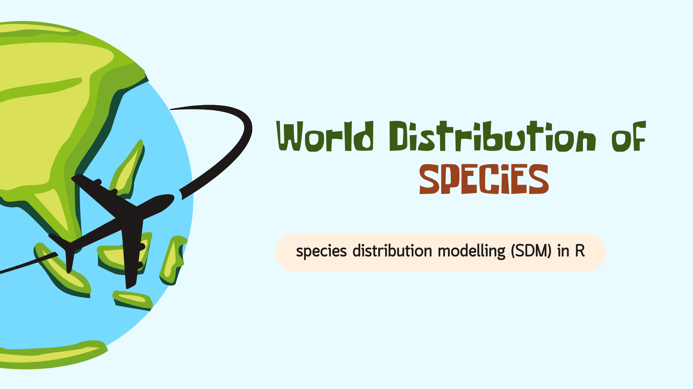

# Introduction

{width="550"}

------------------------------------------------------------------------

### **1. What is Species Distribution Modeling (SDM)?**

::: rmdnote
**Definition**:\
Species Distribution Modeling (SDM) uses statistical models to predict where species live based on environmental conditions. It helps us understand the relationship between species and their habitats.

Key terms to know: - **Environmental Niche Models**: These show the range of conditions where a species can live. - **Habitat Suitability Models**: These predict areas suitable for a species.
:::

------------------------------------------------------------------------

### **Why SDMs are Important?**

::: rmdimportant
SDMs play a crucial role in many areas:

1.  **Biodiversity Conservation**
    -   Helps protect endangered species by identifying their key habitats.\
    -   Aids in planning conservation zones and protected areas. 🌿
2.  **Ecological Research**
    -   Improves our understanding of how species interact with their environment.\
    -   Supports studies on how species respond to environmental changes, like temperature rise. 🌍
3.  **Environmental Management**
    -   Helps manage invasive species by predicting areas they may spread to.\
    -   Assists in assessing the impact of climate change on ecosystems. 🌦️
:::

------------------------------------------------------------------------

### **Applications of SDMs**

| **Application**                | **Description**                                                                       |
|---------------------|---------------------------------------------------|
| **Discovery of New Species**   | SDMs can help find new species by predicting potential habitats.                      |
| **Climate Change Impact**      | Predict how species distributions might shift in the future due to climate change. 🌡️ |
| **Invasion Risk Assessment**   | Identify areas at risk of invasion by non-native species. 🚫                          |
| **Niche Dynamics & Evolution** | Study how species niches change over time.                                            |
| **Community-Level Modeling**   | Analyze how groups of species interact and live together in different areas. 🐾       |

> **Tip:** SDMs are not just for researchers—they are used in real-world decision-making, like planning city expansions and protecting forests.

------------------------------------------------------------------------

### **2. Key Concepts in SDM**

---

#### **Species Data** 🐾

To build SDMs, you need **species data**, which shows where a species has been observed. There are two main types of species data:

1. **Presence-only data**  
   - This means you only know where the species was seen, but you don’t know where it wasn’t seen.  
   - Example: Using data from citizen science platforms like iNaturalist or GBIF.  
   - **Models that use presence-only data**:  
     - **MaxEnt (Maximum Entropy Model)** – One of the most popular tools for presence-only SDMs.  
     - Fun Fact: MaxEnt works by finding the distribution with the "maximum randomness" while still matching the observed data!

2. **Presence-absence data**  
   - Here, you have information on where the species was seen (**presence**) and where it wasn’t (**absence**).  
   - This type of data gives more information and allows for more robust modeling.  
   - **Models that use presence-absence data**:  
     - **Generalized Linear Models (GLM)**  
     - **Random Forests (RF)** – A machine learning approach that handles complex relationships well.

---

#### **Environmental Covariates** 🌍

In SDMs, you also need **environmental data**, often called **covariates**, which describe the conditions in different locations. These covariates help explain why a species might be present or absent.

Common types of environmental covariates:

- **Climate data**: Temperature, rainfall, and humidity influence where species can live.  
  > Example: Polar bears need cold temperatures to survive, while cacti thrive in dry, hot deserts. 🌵❄️

- **Soil properties**: Nutrient levels, pH, and texture are critical for plant species.  
  > Did you know? Some plants only grow in very specific soil types, like orchids that need well-drained soils.

- **Land cover and elevation**: Forests, grasslands, and mountains create different habitats.  
  > Elevation can affect climate — higher areas are colder, which influences where species can survive.

---

#### **Correlative vs. Mechanistic Models** 🔍

SDMs can be **correlative** or **mechanistic**, depending on how they relate species data to the environment:

1. **Correlative Models**  
   - These models find statistical relationships between where species are found and environmental conditions.  
   - Easy to implement but don’t explain the underlying biological processes.  
   - **Example**: MaxEnt, GLM, RF.

2. **Mechanistic Models**  
   - These models are based on biological processes, like how a species responds to temperature or food availability.  
   - They require detailed biological knowledge and data but can make better predictions in new environments.  
   - **Example**: Models that simulate species' energy balance under different climates.

> **Tip:** Correlative models are more commonly used in SDMs because they require less data and are easier to build.

---

### **3. The SDM Workflow**

Building a species distribution model involves several steps:

---

#### **Step-by-Step Overview**

1. **Data Collection** 📊  
   Collect species occurrence data (presence or presence-absence) and environmental covariates.  
   - Sources for species data: GBIF, iNaturalist, local biodiversity surveys.  
   - Sources for environmental data: WorldClim (for climate data), SoilGrids (for soil properties).

2. **Data Preparation** 🧹  
   Clean and format your data so it can be used in modeling.  
   - Ensure that the species data and environmental layers have the same coordinate system.  
   - Handle missing values and align data resolution (e.g., 1 km resolution for raster data).

3. **Model Fitting** 🔧  
   Choose an appropriate modeling algorithm and fit the model.  
   - Presence-only data → Use **MaxEnt**.  
   - Presence-absence data → Use **GLM** or **Random Forest**.

4. **Model Evaluation** ✅  
   Evaluate the model’s performance using metrics like:  
   - **AUC (Area Under the Curve)**: Measures how well the model distinguishes between presence and absence.  
   - **TSS (True Skill Statistic)**: Evaluates model accuracy by comparing predictions to actual observations.

5. **Model Prediction** 🌍  
   Use the fitted model to predict species distributions under current or future conditions.  
   - Example: Predict how a species’ range might shift under different climate change scenarios.

---

#### **Common Tools and Techniques**

1. **GIS Tools**  
   Geographic Information System (GIS) tools are essential for spatial data handling. You can use:  
   - **QGIS**: A free, open-source GIS tool.  
   - **ArcGIS**: A popular commercial GIS software.

2. **R Packages**  
   R offers powerful tools for SDM. Key packages include:  
   - **raster/terra**: For handling spatial data (e.g., raster and vector files).  
   - **dismo**: For running SDM algorithms like MaxEnt.  
   - **ggplot2**: For data visualization.  
   - **sf**: For handling spatial vector data (points, lines, polygons).

> **Fun Fact:** MaxEnt is often preferred for presence-only data because it works well even with small datasets and avoids overfitting by applying regularization.

---

### Example Workflow in R

Here’s a simple R code snippet to illustrate the SDM workflow:

```r
# Load necessary libraries
library(raster)
library(dismo)

# Load environmental data (stack of raster layers)
env <- stack(list.files(pattern = ".tif$", full.names = TRUE))

# Load species occurrence data
species <- read.csv("species_occurrence.csv")

# Fit a MaxEnt model
maxent_model <- maxent(env, species)

# Predict species distribution
prediction <- predict(maxent_model, env)

# Plot the prediction
plot(prediction)
```

---

### **4. Why Use R for SDM?**

---

#### **Benefits of R** 🚀

R is one of the best tools for Species Distribution Modeling (SDM) because:

- **Open-source**:  
  You can download and use R for free! This makes it accessible to students, researchers, and organizations everywhere. 🌎

- **Widely used in ecological research**:  
  Many ecologists and conservationists use R, which means there are plenty of resources, guides, and research papers available to learn from.

- **Large ecosystem of packages**:  
  R has many packages specifically designed for spatial data handling and ecological modeling. Whether it’s raster data manipulation or running complex SDMs, there’s a package for it!

- **Community support**:  
  Got stuck? No problem! The R community is huge, and platforms like Stack Overflow and R-bloggers have tons of answers and tutorials.

> **Did you know?**  
> Some of the world’s leading biodiversity databases, like GBIF, have tutorials and workflows written in R!

---

#### **Key R Packages for SDM** 📦

Here are some essential R packages for SDM:

| **Package**     | **Purpose**                                           |
|-----------------|-------------------------------------------------------|
| `raster`        | For working with raster data (e.g., climate layers).  |
| `terra`         | A newer, faster alternative to `raster`.              |
| `dismo`         | For running SDM algorithms like MaxEnt and Bioclim.   |
| `ggplot2`       | For creating beautiful visualizations.                |
| `sf`            | For handling spatial vector data (e.g., shapefiles).  |
| `MaxEnt`        | Specifically for fitting MaxEnt models in R.          |

> **Tip:**  
> Use `terra` instead of `raster` for faster performance, especially with large datasets. The syntax is slightly different but easy to learn.

---

### **5. Setting Up R for SDM**

---

#### **Installing R and RStudio** 🖥️

Here’s how to set up your R environment step-by-step:

1. **Download R**:  
   Go to the [CRAN website](https://cran.r-project.org) and download the latest version of R for your operating system (Windows, Mac, or Linux).

2. **Download RStudio**:  
   RStudio is an IDE (Integrated Development Environment) that makes coding in R easier. Download it from [RStudio’s website](https://posit.co/download/rstudio-desktop/).

3. **Install R and RStudio**:  
   Follow the installation instructions. Once done, open RStudio, and you’re ready to code!

> **Fun Fact:**  
> RStudio has features like syntax highlighting, built-in plotting, and project management that make it a favorite among R users.

---

#### **Installing Required Packages** 📦

Once R and RStudio are installed, you need to install the required packages. You can do this by running the following code in your R console:

```r
# Install essential SDM packages
install.packages(c("raster", "terra", "dismo", "ggplot2", "sf"))
```

> **Tip:**  
> Always keep your packages updated by using `update.packages()` regularly. This ensures compatibility with the latest R version.

---

#### **Loading Data in R** 📂

Let’s use a simple example to load environmental data and species occurrence data. The `dismo` package comes with built-in datasets, so you don’t need to download anything!

**Example: Loading environmental layers and species data**

```r
# Load necessary libraries
library(dismo)
library(terra)

# Load example environmental data (bioclim variables)
env <- getData("worldclim", var = "bio", res = 10)

# View the environmental layers
plot(env[[1]])  # Plot the first layer (Bio1: Annual Mean Temperature)

# Load example species occurrence data (Bradypus variegatus)
data(bradypus)  # Comes with the dismo package
head(bradypus)  # View the first few rows of data

# Plot species occurrences on top of the environmental layer
plot(env[[1]])
points(bradypus, col = "red", pch = 20)
```

---

#### **Explanation**

1. **Environmental Data**  
   The `getData()` function from the `dismo` package downloads climate data (WorldClim) at a 10-minute resolution. In this example, we load 19 bioclimatic variables, such as temperature and precipitation.

2. **Species Occurrence Data**  
   The `bradypus` dataset contains occurrence points for the brown-throated sloth (*Bradypus variegatus*), a species found in Central and South America.

3. **Plotting**  
   We first plot the environmental layer (annual mean temperature) and then overlay the species occurrence points in red.

> **Did you know?**  
> WorldClim is one of the most popular sources for global climate data, providing high-resolution layers for past, present, and future climate conditions!

---

### **6. Practical Example: Building a Simple SDM in R** 🛠️

---

In this section, we will build a simple **Species Distribution Model (SDM)** using R. We’ll use a built-in dataset from the `dismo` package, so you don’t need to download any external files.

---

#### **Dataset: Tsuga canadensis (Eastern Hemlock)** 🌲

- **Species**: *Tsuga canadensis*, a tree species native to eastern North America.
- **Goal**: Predict the potential distribution of this species based on environmental conditions.

---

#### **Steps to Build the SDM**

1. **Load Environmental Layers and Occurrence Data**  
2. **Fit a Basic MaxEnt Model**  
3. **Evaluate the Model Using AUC**  
4. **Generate and Plot Predictions**

---

#### **Step 1: Load Environmental Layers and Occurrence Data**

```r
# Load required libraries
library(dismo)
library(terra)

# Load environmental data (bioclim variables)
env <- getData("worldclim", var = "bio", res = 10)

# Load species occurrence data (for Tsuga canadensis)
data(tsuga)  # Built-in dataset in dismo
head(tsuga)  # View first few rows of occurrence data
```

Here, we use **WorldClim** data, which contains 19 bioclimatic variables (like temperature and precipitation) at a 10-minute resolution.

> **Fun Fact**:  
> WorldClim data is widely used in ecological studies because it provides historical, current, and future climate layers.

---

#### **Step 2: Fit a Basic MaxEnt Model**

```r
# Fit the MaxEnt model
maxent_model <- maxent(env, tsuga)

# View model summary
summary(maxent_model)
```

We use the `maxent()` function from the `dismo` package to fit a **Maximum Entropy (MaxEnt)** model. This algorithm is ideal for **presence-only data**, which means we only need locations where the species was observed.

---

#### **Step 3: Evaluate the Model Using AUC**

```r
# Evaluate model using AUC (Area Under the Curve)
evaluate_model <- evaluate(maxent_model, env, tsuga)
auc_value <- evaluate_model@auc
print(paste("AUC:", auc_value))
```

The **AUC** (Area Under the Curve) value tells us how well the model distinguishes between suitable and unsuitable habitats:

- **AUC > 0.9**: Excellent model  
- **AUC 0.7 – 0.9**: Good model  
- **AUC < 0.7**: Poor model

> **Tip**:  
> Always aim for an AUC above 0.7, but remember that a high AUC doesn’t always mean the model is perfect—it might just be overfitting!

---

#### **Step 4: Generate and Plot Predictions**

```r
# Generate predictions
prediction <- predict(maxent_model, env)

# Plot the predicted distribution
plot(prediction, main = "Predicted Distribution of Tsuga canadensis")
points(tsuga, col = "red", pch = 20)
```

This plot shows the predicted distribution of *Tsuga canadensis* based on the environmental conditions. The red points represent the locations where the species was observed.

---

### **7. Best Practices in SDM** ✅

---

#### **1. Ensuring Data Quality** 🧐

Quality data is the foundation of a good model. Here’s how to ensure your data is reliable:

- **Avoid Bias in Species Occurrence Data**  
  - Sampling bias can lead to incorrect predictions. For example, if most observations come from areas near roads, the model might think the species only lives near roads!
  - Use tools like **spatial thinning** to reduce bias.

- **Use Appropriate Resolution for Environmental Layers**  
  - Choose a resolution that matches your study scale.  
  - Example: If you’re modeling a local species, use high-resolution data (e.g., 1 km). For global models, 10 km resolution might be fine.

---

#### **2. Model Validation** 🏅

Model validation helps you assess how well your SDM performs:

- **Cross-validation Techniques**  
  - Use **k-fold cross-validation** to split your data into training and testing sets multiple times. This helps ensure the model isn’t overfitting.

- **Independent Test Data**  
  - If possible, use a completely independent dataset to validate your model. This gives a more realistic estimate of how well the model performs in the real world.

---

#### **3. Interpreting Results** 🔍

Interpreting SDM results correctly is crucial:

- **Understand Limitations**  
  - SDMs predict **potential** distributions, not actual ones. Just because the model says a species can live somewhere doesn’t mean it’s actually there!
  
- **Account for Uncertainties**  
  - Always report uncertainties in your predictions. For example, use **confidence intervals** or **ensemble models** to show variation in predictions.

> **Did You Know?**  
> Ensemble models combine predictions from multiple algorithms to improve accuracy and reduce uncertainty.

---
