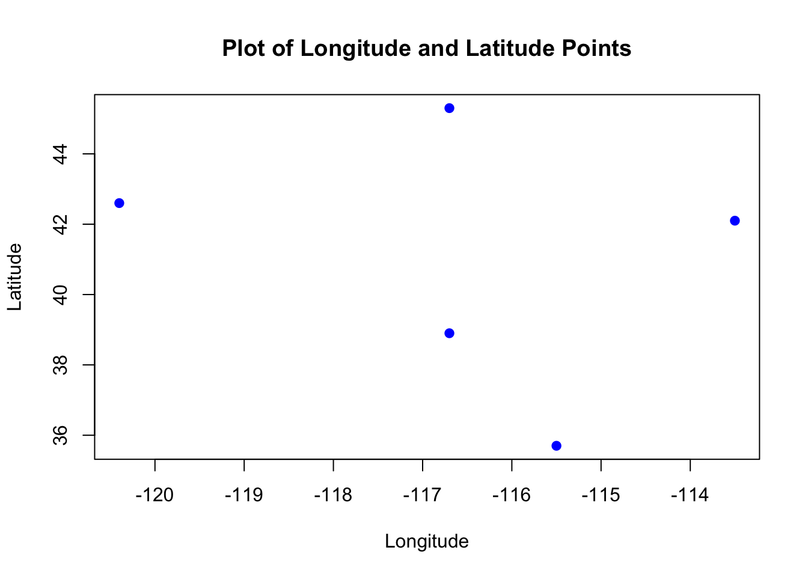
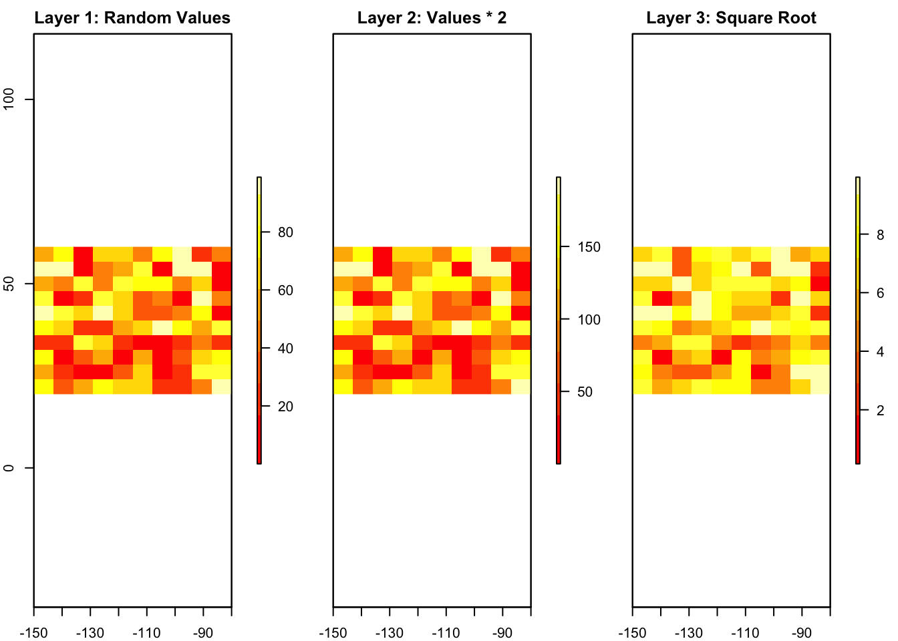
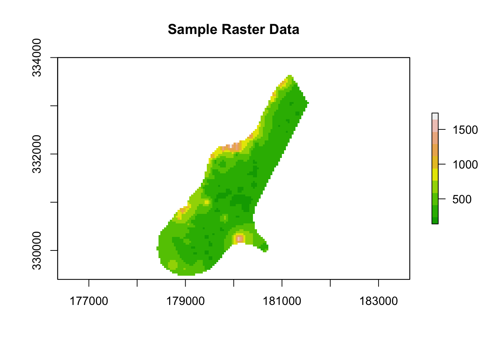
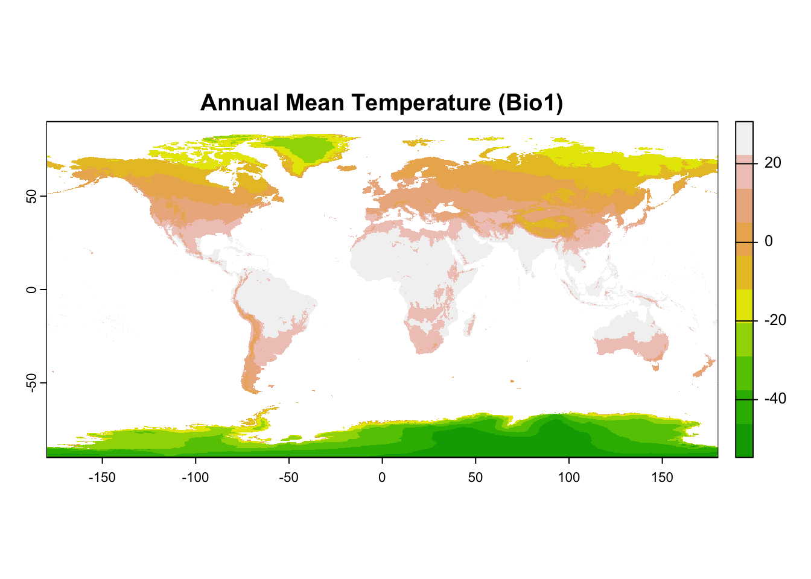
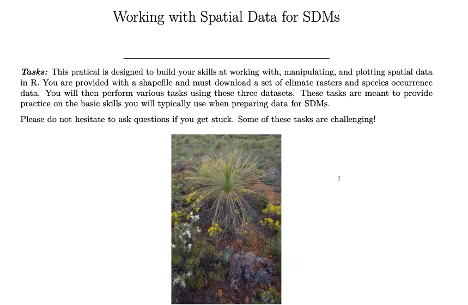
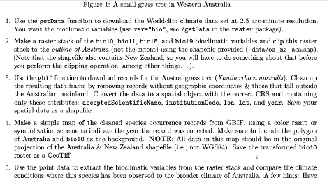
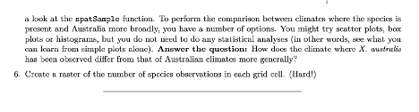

# Spartial Data in R

------------------------------------------------------------------------

### **1. Introduction**

------------------------------------------------------------------------

In the previous section, we learned about **spatial data** and why it’s important for understanding species distribution and the environment. Now, we will move forward by learning how to actually work with this data in **R**.

------------------------------------------------------------------------

This part of the tutorial will show you step by step:

-   How to **create vector data** (like points, lines, and polygons).
-   How to **make raster layers** and combine them into stacks and bricks.
-   How to **set and change projections** so that your data lines up correctly on a map.
-   How to **get real-world data**, like climate information and species locations, which you can use to build models.

------------------------------------------------------------------------

By following along, you’ll learn basic methods for handling both **vector** and **raster data** in R. You’ll also get familiar with common GIS tasks like reading, writing, and transforming spatial data.

Let’s start! 🌍

---
---

### **2. Working with Vector Data in R**
---

Vector data includes points, lines, and polygons. In this section, we will focus on **creating point data**, converting it into a **spatial object**, and adding **attribute data**.

------------------------------------------------------------------------

#### **2.1. Creating Point Data**

To start, we need to create a set of points using longitude and latitude values. In R, this can be done using simple vectors.


``` r
# Creating vectors for longitude and latitude
longitude <- c(-116.7, -120.4, -116.7, -113.5, -115.5)
latitude <- c(45.3, 42.6, 38.9, 42.1, 35.7)

# Combine into a matrix of coordinates
lonlat <- cbind(longitude, latitude)

# Plot the points
plot(lonlat, pch = 19, col = "blue", xlab = "Longitude", ylab = "Latitude", 
     main = "Plot of Longitude and Latitude Points")
```



::: rmdnote
-   **Order matters**: Always specify coordinates as `(longitude, latitude)`, not `(latitude, longitude)`. This follows the common geographic convention.
-   The `plot()` function gives a quick view of the points.
:::

------------------------------------------------------------------------

#### **2.2. Converting to a Spatial Object**

Although we have plotted the points, they are not yet considered **spatial data**. To work with spatial data, we need to convert these points into a `SpatialPoints` object.


``` r
# Load the 'sp' package for spatial data handling
library(sp)

# Create a SpatialPoints object
pts <- SpatialPoints(lonlat)

# Check the class of the object
class(pts)
#> [1] "SpatialPoints"
#> attr(,"package")
#> [1] "sp"
```

::: rmdtip
The `sp` package is a core tool for handling vector data in R. `SpatialPoints` objects store spatial information, but they don’t yet have any associated attributes.
:::

------------------------------------------------------------------------

#### **Assigning a Coordinate Reference System (CRS)**

A **CRS** defines how the spatial data relates to locations on Earth. Without a CRS, your points won’t align properly with other spatial datasets.


``` r
# Assign a CRS to the SpatialPoints object
crs_string <- "+proj=longlat +datum=WGS84"
pts <- SpatialPoints(lonlat, proj4string = CRS(crs_string))
pts
#> SpatialPoints:
#>      longitude latitude
#> [1,]    -116.7     45.3
#> [2,]    -120.4     42.6
#> [3,]    -116.7     38.9
#> [4,]    -113.5     42.1
#> [5,]    -115.5     35.7
#> Coordinate Reference System (CRS) arguments:
#> +proj=longlat +datum=WGS84 +no_defs
```

::: rmdcaution
Always assign a CRS when working with spatial data!\
In most cases, use `"+proj=longlat +datum=WGS84"` for data with longitude and latitude coordinates.
:::

------------------------------------------------------------------------

#### **2.3. Creating a `SpatialPointsDataFrame`**

A `SpatialPointsDataFrame` combines spatial data with **attribute data**. Let’s add some random precipitation values to our points.


``` r
# Create a data frame of attribute data
set.seed(42)  # For reproducibility
precipValue <- runif(nrow(lonlat), min = 0, max = 100)  # Random precipitation values
df <- data.frame(ID = 1:nrow(lonlat), precip = precipValue)

# Combine the SpatialPoints object with the attribute data
ptsdf <- SpatialPointsDataFrame(pts, data = df)

# View the first few rows of the data
head(ptsdf@data)
#>   ID   precip
#> 1  1 91.48060
#> 2  2 93.70754
#> 3  3 28.61395
#> 4  4 83.04476
#> 5  5 64.17455
```

------------------------------------------------------------------------

#### **Output Check**

You can access both the **coordinates** and **attributes** separately.


``` r
# Access the spatial coordinates
ptsdf@coords
#>      longitude latitude
#> [1,]    -116.7     45.3
#> [2,]    -120.4     42.6
#> [3,]    -116.7     38.9
#> [4,]    -113.5     42.1
#> [5,]    -115.5     35.7
```


``` r
# Access the attribute data
ptsdf@data
#>   ID   precip
#> 1  1 91.48060
#> 2  2 93.70754
#> 3  3 28.61395
#> 4  4 83.04476
#> 5  5 64.17455
```

::: rmdtip
-   Use `ptsdf@coords` to extract the spatial coordinates.
-   Use `ptsdf@data` to extract the non-spatial attribute data.
:::

------------------------------------------------------------------------

#### **Plotting the Data**

We can now visualize the points on a simple plot, coloring them based on precipitation values.


``` r
# Plot with color based on precipitation
plot(ptsdf, pch = 19, col = heat.colors(5)[cut(ptsdf$precip, breaks = 5)],
     main = "Spatial Points with Precipitation", cex = 1.5)
legend("topright", legend = c("Low", "Medium", "High"), fill = heat.colors(5), 
       title = "Precipitation")
```


------------------------------------------------------------------------

### **Summary**

-   We learned how to **create point data** using longitude and latitude.
-   We converted the points into a **spatial object** using the `sp` package.
-   We added **attribute data** to create a `SpatialPointsDataFrame`.
-   Finally, we plotted the points with precipitation values.

### **3. Creating and Manipulating Raster Data in R**

#### **3.1. Creating a `RasterLayer`**

A **raster** represents spatial data as a grid of cells, where each cell has a value. This is useful for continuous data like temperature, elevation, or land cover.

We’ll start by creating a blank raster with **10 columns** and **10 rows**, and we’ll define its extent (the geographic area it covers).


``` r
# Load the 'raster' package
library(raster)

# Create a blank raster with specific extent and resolution
r <- raster(ncol = 10, nrow = 10, xmx = -80, xmn = -150, ymn = 20, ymx = 60)

# Print raster details
r
#> class      : RasterLayer 
#> dimensions : 10, 10, 100  (nrow, ncol, ncell)
#> resolution : 7, 4  (x, y)
#> extent     : -150, -80, 20, 60  (xmin, xmax, ymin, ymax)
#> crs        : +proj=longlat +datum=WGS84 +no_defs
```

::: rmdnote
-   The raster has **10 columns** and **10 rows**, meaning there are 100 cells in total.
-   The extent specifies the geographic boundaries:
    -   `xmn = -150` and `xmx = -80` (longitude range)
    -   `ymn = 20` and `ymx = 60` (latitude range)
-   The default **Coordinate Reference System (CRS)** is `WGS84`, which uses longitude and latitude.
:::

------------------------------------------------------------------------

#### **3.2. Adding Values to the Raster**

Now that we have a blank raster, we can assign values to its cells. Let’s assign random values between 0 and 100 using the `runif()` function, which generates random numbers.


``` r
# Assign random values to the raster cells
values(r) <- runif(ncell(r), min = 0, max = 100)

# Plot the raster
plot(r, main = "Random Values Raster", col = terrain.colors(10))
```


::: rmdtip
-   The `ncell()` function returns the total number of cells in the raster.
-   The `terrain.colors()` function is used to create a nice color gradient for the plot.
:::

------------------------------------------------------------------------

#### **3.3. Creating a `RasterStack`**

A **`RasterStack`** is a collection of multiple rasters with the same extent and resolution. This is useful when you have multiple layers of data for the same area, such as temperature, precipitation, and elevation.

Let’s create two more rasters and stack them together.


``` r
# Create two more rasters by performing operations on the original raster
r2 <- r * 2   # Multiply all values by 2
r3 <- sqrt(r) # Take the square root of all values

# Create a RasterStack
s <- stack(r, r2, r3)

# Plot the RasterStack with enhanced visualization
plot(s, main = c("Layer 1: Random Values", "Layer 2: Values * 2", "Layer 3: Square Root"),
     col = terrain.colors(10), nr = 1)
```


::: rmdnote
-   All rasters in the stack must have the **same resolution** and **extent**.
-   You can stack as many rasters as you need.
:::

------------------------------------------------------------------------

#### **3.4. Creating a `RasterBrick`**

A **`RasterBrick`** is similar to a `RasterStack`, but it is stored more efficiently in memory. This makes it faster to process when working with large datasets.


``` r
# Create a RasterBrick from the RasterStack
b <- brick(s)

# Plot the RasterBrick with enhanced visualization
plot(b, main = c("Layer 1: Random Values", "Layer 2: Values * 2", "Layer 3: Square Root"),
     col = heat.colors(10), nr = 1)
```



::: rmdtip
-   Use a `RasterBrick` when you need better performance and memory efficiency.
-   A `RasterBrick` is particularly useful when dealing with large datasets, such as satellite imagery or time-series data.
:::

------------------------------------------------------------------------

##### **Key Takeaways**

-   **RasterLayer**: A grid of cells representing spatial data.
-   **RasterStack**: A collection of rasters with the same resolution and extent.
-   **RasterBrick**: A more memory-efficient version of a `RasterStack`.

---
---

### **4. Working with Coordinate Reference Systems (CRS)**
---

#### **4.1. Assigning and Transforming CRS**

When working with spatial data, ensuring that all layers share a common CRS is crucial for proper alignment and accurate analysis. Let’s walk through assigning a CRS and transforming it to a new one using **vector** and **raster data**.

------------------------------------------------------------------------

##### **Assigning a CRS to Vector Data**


``` r
# Load necessary library
library(sf)
#> Linking to GEOS 3.11.0, GDAL 3.5.3, PROJ 9.1.0; sf_use_s2()
#> is TRUE

# Create sample point data
longitude <- c(-116.7, -120.4, -116.7, -113.5, -115.5)
latitude <- c(45.3, 42.6, 38.9, 42.1, 35.7)
pts <- data.frame(longitude, latitude)

# Convert to an sf object and assign WGS84 CRS
sf_pts <- st_as_sf(pts, coords = c("longitude", "latitude"), crs = 4326)

# View CRS of the spatial object
st_crs(sf_pts)
#> Coordinate Reference System:
#>   User input: EPSG:4326 
#>   wkt:
#> GEOGCRS["WGS 84",
#>     ENSEMBLE["World Geodetic System 1984 ensemble",
#>         MEMBER["World Geodetic System 1984 (Transit)"],
#>         MEMBER["World Geodetic System 1984 (G730)"],
#>         MEMBER["World Geodetic System 1984 (G873)"],
#>         MEMBER["World Geodetic System 1984 (G1150)"],
#>         MEMBER["World Geodetic System 1984 (G1674)"],
#>         MEMBER["World Geodetic System 1984 (G1762)"],
#>         MEMBER["World Geodetic System 1984 (G2139)"],
#>         ELLIPSOID["WGS 84",6378137,298.257223563,
#>             LENGTHUNIT["metre",1]],
#>         ENSEMBLEACCURACY[2.0]],
#>     PRIMEM["Greenwich",0,
#>         ANGLEUNIT["degree",0.0174532925199433]],
#>     CS[ellipsoidal,2],
#>         AXIS["geodetic latitude (Lat)",north,
#>             ORDER[1],
#>             ANGLEUNIT["degree",0.0174532925199433]],
#>         AXIS["geodetic longitude (Lon)",east,
#>             ORDER[2],
#>             ANGLEUNIT["degree",0.0174532925199433]],
#>     USAGE[
#>         SCOPE["Horizontal component of 3D system."],
#>         AREA["World."],
#>         BBOX[-90,-180,90,180]],
#>     ID["EPSG",4326]]
```

::: rmdnote
-   The **EPSG code `4326`** corresponds to the **WGS84** geographic CRS, commonly used for data with longitude and latitude coordinates.
-   Using `st_as_sf()` converts the data frame into a spatial object.
:::

------------------------------------------------------------------------

##### **Transforming Vector Data to a New CRS**

Let’s transform the spatial data from **WGS84** to a **Robinson projection**.


``` r
# Define the new CRS (Robinson projection)
new_crs <- "+proj=robin +datum=WGS84"

# Transform the spatial points to the new CRS
sf_pts_transformed <- st_transform(sf_pts, crs = new_crs)

# Plot the original and transformed data side by side
par(mfrow = c(1, 2))  # Set plotting layout

# Original data in WGS84
plot(sf_pts, main = "Original CRS: WGS84", col = "blue", pch = 19)
```


``` r

# Transformed data in Robinson projection
plot(sf_pts_transformed, main = "Transformed CRS: Robinson", col = "red", pch = 19)
```


::: rmdcaution
-   Different CRSs can distort distances, areas, and angles differently, depending on their projection method.
-   Always choose a CRS that fits your analysis needs (e.g., **UTM** for local-scale accuracy, **Albers Equal-Area** for area-preserving studies).
:::

------------------------------------------------------------------------

#### **4.2. Projecting Raster Data**

Projecting raster data involves recalculating cell values and adjusting the resolution to fit the new CRS. Let’s demonstrate this using a raster dataset.

------------------------------------------------------------------------

##### **Reprojecting a Raster**


``` r
# Load necessary library
library(terra)
#> terra 1.8.5

# Create a sample raster
r <- rast(ncol = 10, nrow = 10, xmin = -150, xmax = -80, ymin = 20, ymax = 60, crs = "EPSG:4326")
values(r) <- runif(ncell(r), min = 0, max = 100)  # Assign random values

# Define a new CRS (Lambert Conformal Conic projection)
new_crs_raster <- "+proj=lcc +lat_1=48 +lat_2=33 +lon_0=-100 +datum=WGS84"

# Project the raster to the new CRS
r_projected <- project(r, new_crs_raster)

# Plot original and reprojected raster
par(mfrow = c(1, 2))

# Original raster in WGS84
plot(r, main = "Original CRS: WGS84", col = terrain.colors(10))

# Projected raster in Lambert Conformal Conic
plot(r_projected, main = "Projected CRS: LCC", col = terrain.colors(10))
```


------------------------------------------------------------------------

::: rmdtip
-   The `project()` function from the **terra** package is used for raster reprojection.
-   Ensure that the target CRS is defined using PROJ.4 strings or EPSG codes.
:::

------------------------------------------------------------------------

### **Key Takeaways**

-   Always ensure that your spatial datasets use the same CRS before performing analysis.
-   Use `st_crs()` and `st_transform()` for vector data and `crs()` and `project()` for raster data.
-   Choose appropriate CRSs based on the scope and goals of your project.

---
---

### **5. Reading and Writing Spatial Data**
---

#### **5.1. Reading Shapefiles and Rasters**

Working with spatial data often starts by **reading external files** such as shapefiles and raster datasets. R provides convenient functions to load these files into spatial objects for analysis.

------------------------------------------------------------------------

##### **Reading a Shapefile**

Let’s read a sample shapefile provided by the `raster` package.


``` r
# Load necessary library
library(raster)

# Read a sample shapefile (comes with the 'raster' package)
shapefile_path <- system.file("external/lux.shp", package = "raster")
shape_data <- shapefile(shapefile_path)

# Print basic information about the shapefile
print(shape_data)
#> class       : SpatialPolygonsDataFrame 
#> features    : 12 
#> extent      : 5.74414, 6.528252, 49.44781, 50.18162  (xmin, xmax, ymin, ymax)
#> crs         : +proj=longlat +datum=WGS84 +no_defs 
#> variables   : 5
#> names       : ID_1,     NAME_1, ID_2,   NAME_2, AREA 
#> min values  :    1,   Diekirch,    1, Capellen,   76 
#> max values  :    3, Luxembourg,   12,    Wiltz,  312

# Plot the shapefile
plot(shape_data, main = "Sample Shapefile (Luxembourg)", col = "lightblue")
```


::: rmdnote
-   The function `shapefile()` reads vector data in **shapefile format** and loads it as a `Spatial*` object.
-   The `system.file()` function retrieves the path to a sample shapefile provided by the package.
:::

------------------------------------------------------------------------

##### **Reading a Raster File**

Now, let’s load a sample raster dataset, also provided by the `raster` package.


``` r
# Load a sample raster file (comes with the 'raster' package)
raster_path <- system.file("external/test.grd", package = "raster")
raster_data <- raster(raster_path)

# Print raster information
print(raster_data)
#> class      : RasterLayer 
#> dimensions : 115, 80, 9200  (nrow, ncol, ncell)
#> resolution : 40, 40  (x, y)
#> extent     : 178400, 181600, 329400, 334000  (xmin, xmax, ymin, ymax)
#> crs        : +proj=sterea +lat_0=52.1561605555556 +lon_0=5.38763888888889 +k=0.9999079 +x_0=155000 +y_0=463000 +datum=WGS84 +units=m +no_defs 
#> source     : test.grd 
#> names      : test 
#> values     : 138.7071, 1736.058  (min, max)
```


``` r
# Plot the raster
plot(raster_data, main = "Sample Raster Data", col = terrain.colors(10))
```



::: rmdtip
-   The function `raster()` reads raster files and loads them as `RasterLayer` objects.
-   Use `print()` to display basic metadata, such as resolution, extent, and CRS.
:::

------------------------------------------------------------------------

#### **5.2. Writing Spatial Data to Disk**

Once you’ve processed your spatial data, you’ll often want to **save it to disk** for sharing or future use. Let’s see how to save both shapefiles and rasters.

------------------------------------------------------------------------

##### **Saving a Shapefile**


``` r
# Define output file path
output_shapefile <- "output_shapefile.shp"

# Save the shapefile to disk
shapefile(shape_data, filename = output_shapefile, overwrite = TRUE)

# Confirm the file was created
list.files(pattern = "output_shapefile*")
#> [1] "output_shapefile.cpg" "output_shapefile.dbf"
#> [3] "output_shapefile.prj" "output_shapefile.shp"
#> [5] "output_shapefile.shx"
```

::: rmdtip
-   The `shapefile()` function writes a `Spatial*` object to disk in shapefile format.
-   Always set `overwrite = TRUE` if you want to overwrite existing files.
:::

------------------------------------------------------------------------

##### **Saving a Raster**

Let’s save the raster we read earlier to a new file in **GeoTIFF** format.


``` r
# Define output file path
output_raster <- "output_raster.tif"

# Save the raster to disk
writeRaster(raster_data, filename = output_raster, format = "GTiff", overwrite = TRUE)

# Confirm the file was created
list.files(pattern = "output_raster*")
#> [1] "output_raster.tif"
```

::: rmdnote
-   The `writeRaster()` function writes raster data to various formats, including **GeoTIFF**, **NetCDF**, and **ASCII Grid**.
-   Set `format = "GTiff"` to specify the file format as GeoTIFF.
:::

------------------------------------------------------------------------

### **Key Takeaways**

-   Use `shapefile()` to **read** and **write shapefiles**.
-   Use `raster()` and `writeRaster()` for **reading** and **saving raster data**.
-   The `system.file()` function is useful for accessing sample datasets bundled with R packages.
-   Always check the CRS, resolution, and extent of your data to ensure proper alignment when saving files.

---
---

### **6. Practical Applications in SDM**
---

Species Distribution Modeling (**SDM**) involves predicting the geographic distribution of species based on **environmental data** (e.g., climate variables) and **species occurrence data** (e.g., observed locations of a species). In this section, we’ll demonstrate how to:

1.  **Download environmental data** using the `getData()` function from the **`dismo`** package.\
2.  **Retrieve species occurrence data** from **GBIF** using the `gbif()` function.

------------------------------------------------------------------------

#### **6.1. Downloading Environmental Data**

Bioclimatic variables are commonly used in SDM. These variables represent different climate characteristics, such as annual mean temperature, temperature seasonality, and annual precipitation.


``` r
# Load necessary library
library(geodata)

# Specify a directory to save the data
data_path <- tempdir()  # Temporary directory for demonstration purposes

# Download bioclimatic variables at 10-minute resolution
bioclim_data <- worldclim_global(var = "bio", res = 10, path = data_path)

# Check the structure of the raster stack
print(bioclim_data)
#> class       : SpatRaster 
#> dimensions  : 1080, 2160, 19  (nrow, ncol, nlyr)
#> resolution  : 0.1666667, 0.1666667  (x, y)
#> extent      : -180, 180, -90, 90  (xmin, xmax, ymin, ymax)
#> coord. ref. : lon/lat WGS 84 (EPSG:4326) 
#> sources     : wc2.1_10m_bio_1.tif  
#>               wc2.1_10m_bio_2.tif  
#>               wc2.1_10m_bio_3.tif  
#>               ... and 16 more sources
#> names       : wc2.1~bio_1, wc2.1~bio_2, wc2.1~bio_3, wc2.1~bio_4, wc2.1~bio_5, wc2.1~bio_6, ... 
#> min values  :   -54.72435,     1.00000,    9.131122,       0.000,   -29.68600,   -72.50025, ... 
#> max values  :    30.98764,    21.14754,  100.000000,    2363.846,    48.08275,    26.30000, ...
```


``` r
# Plot the first bioclimatic variable: Annual Mean Temperature (Bio1)
plot(bioclim_data[[1]], main = "Annual Mean Temperature (Bio1)", col = terrain.colors(10))
```



::: rmdnote
-   The function `getData()` retrieves **bioclimatic variables** from the **WorldClim** dataset.\
-   `var = "bio"` specifies that we want **bioclimatic data**, and `res = 10` sets the grid resolution to **10 minutes**.
-   The result, `bioclim_data`, is a **RasterStack** containing multiple environmental layers.
:::

------------------------------------------------------------------------

##### **Key Bioclimatic Variables**

| **Variable Name** | **Description**                                      |
|-------------------|------------------------------------------------------|
| **Bio1**          | Annual Mean Temperature                              |
| **Bio4**          | Temperature Seasonality (Standard Deviation × 100)   |
| **Bio12**         | Annual Precipitation                                 |
| **Bio15**         | Precipitation Seasonality (Coefficient of Variation) |

------------------------------------------------------------------------

#### **6.2. Retrieving Species Occurrence Data**

The **Global Biodiversity Information Facility (GBIF)** provides open-access data on species occurrences worldwide. Let’s retrieve occurrence data for the **African lion** (*Panthera leo*).


``` r
# Load necessary library
library(dismo)

# Define a file path to save the data
file_path <- "lion_gbif_data.rds"

# Check if the data already exists locally
if (file.exists(file_path)) {
  # Load the data from the local file
  lion_data <- readRDS(file_path)
  message("Data loaded from local file.")
} else {
  # Retrieve the data from GBIF and save it locally
  lion_data <- gbif(genus = "Panthera", species = "leo")
  saveRDS(lion_data, file_path)
  message("Data downloaded and saved locally.")
}
#> Data loaded from local file.
```


``` r
# Subset the first 300 records for demonstration
lion_data_subset <- lion_data

# to limit the point to view, for example, 3000 points:
# lion_data_subset <- lion_data[1:3000, ]

# Plot the occurrence data on a world map
library(maps)
map("world", col = "gray90", fill = TRUE, bg = "lightblue", lwd = 0.5)
points(lion_data_subset$lon, lion_data_subset$lat, col = "red", pch = 10, cex = 0.7)
```


::: rmdcaution
-   **Data quality check**:\
    Always inspect GBIF data for **missing values** and **incorrect coordinates** before using it in models.\
    In particular, check for `NA` values in the longitude (`lon`) and latitude (`lat`) columns.
:::

------------------------------------------------------------------------

### **7. Summary and Key Takeaways**

------------------------------------------------------------------------

In this tutorial, we covered several essential steps for working with spatial data in R, particularly focusing on **Species Distribution Modeling (SDM)**.

#### **Summary Table**

| **Concept**                 | **Key Functions**                      | **Description**                                               |
|------------------|---------------------|---------------------------------|
| **Vector Data**             | `st_as_sf()`, `st_transform()`         | Creating, transforming, and plotting vector data.             |
| **Raster Data**             | `raster()`, `stack()`, `writeRaster()` | Creating and manipulating raster layers.                      |
| **CRS Handling**            | `st_crs()`, `project()`                | Checking and transforming Coordinate Reference Systems (CRS). |
| **Environmental Data**      | `getData()`                            | Downloading global bioclimatic variables for SDM.             |
| **Species Occurrence Data** | `gbif()`                               | Retrieving species occurrence data from GBIF.                 |

------------------------------------------------------------------------

### **Key Takeaways**

::: rmdimportant
1.  Always ensure that your **spatial datasets share the same CRS** before performing any analysis.
2.  Use reliable sources for **environmental data**, such as **WorldClim**, and carefully inspect **species occurrence data** from GBIF.
3.  Properly handle and visualize both vector and raster data in R using functions from packages like `sf`, `raster`, and `dismo`.
:::

------------------------------------------------------------------------

## Task

Try and do the following tasks to test your knowledge:

{width="600"}

{width="598"}

{width="596"}

------------------------------------------------------------------------

### **Next Steps**

------------------------------------------------------------------------

In the next part, we will dive deeper into:

-   **Advanced spatial analysis techniques**:
    -   Buffering, spatial joins, and overlay operations.
-   **Building SDMs**:
    -   Using machine learning methods (e.g., MaxEnt, Random Forest) to predict species distributions.
-   **Predictive modeling**:
    -   Projecting species distributions under **future climate scenarios** using environmental datasets.

------------------------------------------------------------------------
