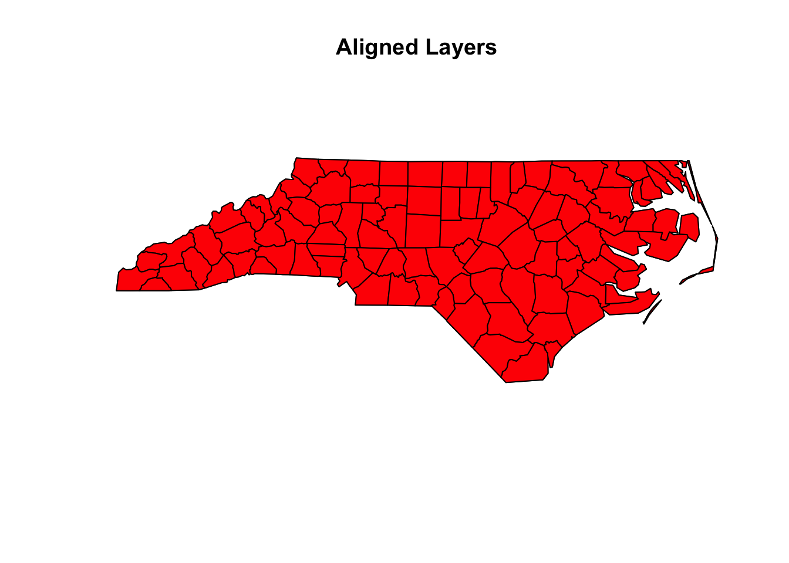

# Understanding Spatial Data

---

### **1. Introduction to Spatial Data** 🌍

---

#### **What is Spatial Data?**

Spatial data is any data that tells us **where something is located on Earth**. It is tied to a specific location and often includes information about features like:

- **Natural elements**: Rivers, forests, mountains.  
- **Human-made structures**: Roads, cities, bridges.  
- **Environmental conditions**: Temperature, rainfall, soil type.

> **Think about this**:  
> Every time you check a weather map or search for a place on Google Maps, you’re working with spatial data!

---

#### **Why is Spatial Data Important?**

Spatial data helps us **understand patterns and relationships** in the environment. It is essential for answering questions like:

- **Where are species found?**  
  - Helps map species distributions and habitats.

- **What environmental conditions are present?**  
  - For example, where it’s warm or wet enough for specific plants to grow.

- **How are things changing over time?**  
  - Spatial data is crucial for monitoring climate change, urban expansion, or deforestation.

> **Fun Fact**:  
> Spatial data is used by conservationists to protect endangered species, by city planners to design better transport systems, and even by gamers to build realistic maps in video games!

---

#### **Real-World Example**

Let’s say we want to study the distribution of sloths in South America. We can combine **species occurrence data** (locations where sloths were spotted) with **environmental data** (temperature, forest cover) to build a **Species Distribution Model (SDM)**. This helps us predict where sloths might live—even in areas we haven’t explored yet.

---

#### **Types of Spatial Data**

Spatial data comes in two main forms:

1. **Vector Data**  
   - Represents features with clear boundaries, like roads, rivers, and city borders.  
   - Think of it as a detailed map showing shapes and lines.  

2. **Raster Data**  
   - Represents continuous data, like temperature or elevation, as a grid of cells (pixels).  
   - Think of it as a heatmap showing variations across a region.

---

> **Let’s Explore More**:  
> In the next sections, we’ll dive into these two types of spatial data and learn how to work with them in R. Stay curious! 🐾

---
---

### **2. Types of Spatial Data** 🗺️

Spatial data comes in two main types: **vector data** and **raster data**. Each has unique characteristics and is used for different purposes. Let’s dive in!

---

#### **2.1. Vector Data** ✏️

##### **What is Vector Data?**
Vector data represents features as **points**, **lines**, or **polygons**. It’s great for capturing objects with clear boundaries.

##### **Components of Vector Data**
- **Points**: Represent specific locations, like:  
  - Cities  
  - Tree locations  
  - Observation points for species occurrence.

- **Lines**: Represent linear features, such as:  
  - Roads  
  - Rivers  
  - Trails.

- **Polygons**: Represent areas, such as:  
  - Countries  
  - Lakes  
  - Forest boundaries.

##### **Attributes of Vector Data**
Each vector feature can have **attributes**, which provide additional information.  
For example:
| **Feature**    | **Attribute**          |
|-----------------|------------------------|
| A tree point    | Tree species name      |
| A road line     | Road name and length   |
| A country polygon | Population and area size |

> **Fun Fact**: The shapefile format (.shp) is one of the most common ways to store vector data, and it has been used since the 1990s!

---

##### **Vector Data in R**

In R, we use packages like `sf` and `terra` to work with vector data. Let’s see an example:


``` r
# Load the 'sf' package
library(sf)
#> Linking to GEOS 3.11.0, GDAL 3.5.3, PROJ 9.1.0; sf_use_s2()
#> is TRUE
```

``` r

# Load a sample shapefile (comes with the 'sf' package)
nc <- st_read(system.file("shape/nc.shp", package = "sf"))
#> Reading layer `nc' from data source 
#>   `/Library/Frameworks/R.framework/Versions/4.4-arm64/Resources/library/sf/shape/nc.shp' 
#>   using driver `ESRI Shapefile'
#> Simple feature collection with 100 features and 14 fields
#> Geometry type: MULTIPOLYGON
#> Dimension:     XY
#> Bounding box:  xmin: -84.32385 ymin: 33.88199 xmax: -75.45698 ymax: 36.58965
#> Geodetic CRS:  NAD27
```

``` r

# View the first few rows of the data
head(nc)
#> Simple feature collection with 6 features and 14 fields
#> Geometry type: MULTIPOLYGON
#> Dimension:     XY
#> Bounding box:  xmin: -81.74107 ymin: 36.07282 xmax: -75.77316 ymax: 36.58965
#> Geodetic CRS:  NAD27
#>    AREA PERIMETER CNTY_ CNTY_ID        NAME  FIPS FIPSNO
#> 1 0.114     1.442  1825    1825        Ashe 37009  37009
#> 2 0.061     1.231  1827    1827   Alleghany 37005  37005
#> 3 0.143     1.630  1828    1828       Surry 37171  37171
#> 4 0.070     2.968  1831    1831   Currituck 37053  37053
#> 5 0.153     2.206  1832    1832 Northampton 37131  37131
#> 6 0.097     1.670  1833    1833    Hertford 37091  37091
#>   CRESS_ID BIR74 SID74 NWBIR74 BIR79 SID79 NWBIR79
#> 1        5  1091     1      10  1364     0      19
#> 2        3   487     0      10   542     3      12
#> 3       86  3188     5     208  3616     6     260
#> 4       27   508     1     123   830     2     145
#> 5       66  1421     9    1066  1606     3    1197
#> 6       46  1452     7     954  1838     5    1237
#>                         geometry
#> 1 MULTIPOLYGON (((-81.47276 3...
#> 2 MULTIPOLYGON (((-81.23989 3...
#> 3 MULTIPOLYGON (((-80.45634 3...
#> 4 MULTIPOLYGON (((-76.00897 3...
#> 5 MULTIPOLYGON (((-77.21767 3...
#> 6 MULTIPOLYGON (((-76.74506 3...
```

``` r

# Plot the shapefile
plot(nc["NAME"], main = "Counties in North Carolina")
```


> **Tip**: Use `sf` for modern workflows. It’s faster and more flexible than the older `sp` package.

---

#### **2.2. Raster Data** 🖼️

##### **What is Raster Data?**
Raster data represents the world as a grid of equally sized cells (pixels). Each cell contains a value representing a specific property.

##### **Examples of Raster Data**
- **Land cover**: Shows different vegetation types or urban areas.  
- **Elevation**: Represents the height above sea level.  
- **Temperature**: Shows temperature variations across a region.

##### **Properties of Raster Data**
- **Resolution**: The size of each cell (e.g., 1 km vs. 10 m).  
  - **Higher resolution** = More detail (smaller cells).  
- **Values**: Each cell holds a value:
  - Example: A cell in a temperature raster might store 25°C.

---

##### **Raster Data in R**

In R, the `raster` and `terra` packages are used to handle raster data. Let’s explore:


``` r
# Load the 'raster' package
library(raster)
#> Loading required package: sp
```

``` r

# Load a sample raster dataset (comes with the 'raster' package)
r <- raster(system.file("external/test.grd", package = "raster"))

# View basic information about the raster
print(r)
#> class      : RasterLayer 
#> dimensions : 115, 80, 9200  (nrow, ncol, ncell)
#> resolution : 40, 40  (x, y)
#> extent     : 178400, 181600, 329400, 334000  (xmin, xmax, ymin, ymax)
#> crs        : +proj=sterea +lat_0=52.1561605555556 +lon_0=5.38763888888889 +k=0.9999079 +x_0=155000 +y_0=463000 +datum=WGS84 +units=m +no_defs 
#> source     : test.grd 
#> names      : test 
#> values     : 138.7071, 1736.058  (min, max)
```

``` r

# Plot the raster
plot(r, main = "Example Raster")
```


---

##### **Types of Raster Objects**
In R, there are different types of raster objects:
1. **RasterLayer**: A single raster layer (e.g., temperature).  
2. **RasterStack**: A collection of multiple raster layers (e.g., temperature, precipitation, elevation).  
3. **RasterBrick**: Similar to `RasterStack`, but more efficient for large datasets.

---

##### **Trade-offs of Raster Data**
- **Finer Resolution**:  
  - Captures more detail (e.g., 1 m grid cells show small features).  
  - **BUT**: Increases file size and processing time.  

- **Coarser Resolution**:  
  - Faster processing.  
  - **BUT**: Loses fine details.

> **Fun Fact**: Did you know satellite images, like those from NASA’s Landsat program, are raster data?

---

### **Key Takeaways**
| **Vector Data**               | **Raster Data**                   |
|--------------------------------|-----------------------------------|
| Points, lines, polygons        | Grid of cells (pixels)           |
| Best for discrete features     | Best for continuous variables    |
| Examples: Roads, rivers, areas | Examples: Elevation, temperature |

---

Next, we’ll explore **Coordinate Reference Systems (CRS)** and learn how they ensure that spatial data aligns correctly on a map. Stay tuned! 🌐

---
---

### **3. Coordinate Reference Systems (CRS)** 🌍

A **Coordinate Reference System (CRS)** is fundamental to working with spatial data. It ensures that data layers align properly on a map and that distances, areas, and other geographic relationships are accurately represented.

---

#### **3.1. What is a CRS?**

A CRS defines how locations on Earth's surface are mapped onto a flat 2D plane. Since Earth is a 3D sphere (or an ellipsoid), CRSs are necessary for projecting this curved surface into a flat map.

---

::: {.rmdimportant}
**Two Main Types of CRS**

1. **Angular Coordinates**  
   - Use **latitude (y)** and **longitude (x)** to represent positions.  
   - Commonly used for global datasets.  
   - Example: **WGS84 (EPSG:4326)** is the standard CRS for GPS systems.

2. **Planar Coordinates**  
   - Transform Earth's 3D surface into a 2D map using projections.  
   - Examples:  
     - **Mercator**: Great for navigation, but distorts areas near the poles.  
     - **UTM (Universal Transverse Mercator)**: Divides the world into zones for high-accuracy mapping.  
     - **Albers Equal-Area**: Maintains accurate area measurements, often used in environmental studies.
:::

> **Did You Know?**  
> The shape of Earth is not a perfect sphere; it's an **ellipsoid**. This slight flattening at the poles affects how CRSs are designed.

---

#### **3.2. Why CRS Matters**

::: {.rmdcaution}
CRS is critical because spatial datasets from different sources often use different coordinate systems. If the CRSs don’t match, layers won’t align, leading to inaccurate results.
:::

##### **Key Reasons Why CRS is Important**

1. **Alignment**  
   Ensures datasets from different sources overlap correctly on a map.  
   - Example: A road layer in WGS84 might not align with a satellite image in UTM until both are reprojected into the same CRS.

2. **Accuracy**  
   Preserves the integrity of spatial relationships like distance and area.  
   - Example: Calculating the area of a forest in the wrong CRS could result in significant errors.

##### **Real-World Example**
- **Incorrect CRS**:  

``` r
library(sf)
# Load two layers
layer1 <- st_read(system.file("shape/nc.shp", package = "sf"))
#> Reading layer `nc' from data source 
#>   `/Library/Frameworks/R.framework/Versions/4.4-arm64/Resources/library/sf/shape/nc.shp' 
#>   using driver `ESRI Shapefile'
#> Simple feature collection with 100 features and 14 fields
#> Geometry type: MULTIPOLYGON
#> Dimension:     XY
#> Bounding box:  xmin: -84.32385 ymin: 33.88199 xmax: -75.45698 ymax: 36.58965
#> Geodetic CRS:  NAD27
```

``` r
layer2 <- st_transform(layer1, crs = 3857)  # Transform to Web Mercator

# Plot misaligned layers
plot(st_geometry(layer1), col = "blue", main = "Misaligned Layers")
plot(st_geometry(layer2), col = "red", add = TRUE)
```


  > The two layers won’t overlap because they have different CRSs.

- **Correct CRS**:  

``` r
# Transform both layers to the same CRS
layer2 <- st_transform(layer2, crs = st_crs(layer1))

# Plot aligned layers
plot(st_geometry(layer1), col = "blue", main = "Aligned Layers")
plot(st_geometry(layer2), col = "red", add = TRUE)
```


  > Now the layers align perfectly.

---

#### **3.3. CRS in R**

R provides powerful tools to handle CRSs, primarily through the `sf` and `terra` packages.

##### **Checking CRS in R**
Use `st_crs()` to check the CRS of a vector object:


``` r
library(sf)
# Load a shapefile
nc <- st_read(system.file("shape/nc.shp", package = "sf"))
#> Reading layer `nc' from data source 
#>   `/Library/Frameworks/R.framework/Versions/4.4-arm64/Resources/library/sf/shape/nc.shp' 
#>   using driver `ESRI Shapefile'
#> Simple feature collection with 100 features and 14 fields
#> Geometry type: MULTIPOLYGON
#> Dimension:     XY
#> Bounding box:  xmin: -84.32385 ymin: 33.88199 xmax: -75.45698 ymax: 36.58965
#> Geodetic CRS:  NAD27
```

``` r

# Check the CRS
st_crs(nc)
#> Coordinate Reference System:
#>   User input: NAD27 
#>   wkt:
#> GEOGCRS["NAD27",
#>     DATUM["North American Datum 1927",
#>         ELLIPSOID["Clarke 1866",6378206.4,294.978698213898,
#>             LENGTHUNIT["metre",1]]],
#>     PRIMEM["Greenwich",0,
#>         ANGLEUNIT["degree",0.0174532925199433]],
#>     CS[ellipsoidal,2],
#>         AXIS["latitude",north,
#>             ORDER[1],
#>             ANGLEUNIT["degree",0.0174532925199433]],
#>         AXIS["longitude",east,
#>             ORDER[2],
#>             ANGLEUNIT["degree",0.0174532925199433]],
#>     ID["EPSG",4267]]
```


##### **Transforming CRS in R**
You can reproject (transform) a spatial object to a different CRS using `st_transform()`:


``` r
# Transform to WGS84 (EPSG:4326)
nc_wgs84 <- st_transform(nc, crs = 4326)

# Verify the new CRS
st_crs(nc_wgs84)
#> Coordinate Reference System:
#>   User input: EPSG:4326 
#>   wkt:
#> GEOGCRS["WGS 84",
#>     ENSEMBLE["World Geodetic System 1984 ensemble",
#>         MEMBER["World Geodetic System 1984 (Transit)"],
#>         MEMBER["World Geodetic System 1984 (G730)"],
#>         MEMBER["World Geodetic System 1984 (G873)"],
#>         MEMBER["World Geodetic System 1984 (G1150)"],
#>         MEMBER["World Geodetic System 1984 (G1674)"],
#>         MEMBER["World Geodetic System 1984 (G1762)"],
#>         MEMBER["World Geodetic System 1984 (G2139)"],
#>         ELLIPSOID["WGS 84",6378137,298.257223563,
#>             LENGTHUNIT["metre",1]],
#>         ENSEMBLEACCURACY[2.0]],
#>     PRIMEM["Greenwich",0,
#>         ANGLEUNIT["degree",0.0174532925199433]],
#>     CS[ellipsoidal,2],
#>         AXIS["geodetic latitude (Lat)",north,
#>             ORDER[1],
#>             ANGLEUNIT["degree",0.0174532925199433]],
#>         AXIS["geodetic longitude (Lon)",east,
#>             ORDER[2],
#>             ANGLEUNIT["degree",0.0174532925199433]],
#>     USAGE[
#>         SCOPE["Horizontal component of 3D system."],
#>         AREA["World."],
#>         BBOX[-90,-180,90,180]],
#>     ID["EPSG",4326]]
```

##### **Working with Raster Data**
For raster data, use the `crs()` function from the `terra` or `raster` packages:


``` r
library(terra)
#> terra 1.8.5
```

``` r

# Load a raster
r <- rast(system.file("ex/elev.tif", package = "terra"))

# Check the CRS
crs(r)
#> [1] "GEOGCRS[\"WGS 84\",\n    ENSEMBLE[\"World Geodetic System 1984 ensemble\",\n        MEMBER[\"World Geodetic System 1984 (Transit)\"],\n        MEMBER[\"World Geodetic System 1984 (G730)\"],\n        MEMBER[\"World Geodetic System 1984 (G873)\"],\n        MEMBER[\"World Geodetic System 1984 (G1150)\"],\n        MEMBER[\"World Geodetic System 1984 (G1674)\"],\n        MEMBER[\"World Geodetic System 1984 (G1762)\"],\n        MEMBER[\"World Geodetic System 1984 (G2139)\"],\n        ELLIPSOID[\"WGS 84\",6378137,298.257223563,\n            LENGTHUNIT[\"metre\",1]],\n        ENSEMBLEACCURACY[2.0]],\n    PRIMEM[\"Greenwich\",0,\n        ANGLEUNIT[\"degree\",0.0174532925199433]],\n    CS[ellipsoidal,2],\n        AXIS[\"geodetic latitude (Lat)\",north,\n            ORDER[1],\n            ANGLEUNIT[\"degree\",0.0174532925199433]],\n        AXIS[\"geodetic longitude (Lon)\",east,\n            ORDER[2],\n            ANGLEUNIT[\"degree\",0.0174532925199433]],\n    USAGE[\n        SCOPE[\"Horizontal component of 3D system.\"],\n        AREA[\"World.\"],\n        BBOX[-90,-180,90,180]],\n    ID[\"EPSG\",4326]]"
```

``` r

# Transform CRS
r_transformed <- project(r, "+proj=utm +zone=33 +datum=WGS84 +units=m")
```

---

#### **3.4. Common CRS Notations**

::: {.rmdtip}
1. **PROJ.4 Strings**:  
   Text-based format describing CRS properties. Example:  
   ```
   +proj=utm +zone=33 +datum=WGS84 +units=m +no_defs
   ```

2. **EPSG Codes**:  
   Numeric identifiers for CRSs. Examples:  
   - **EPSG:4326**: WGS84, the most commonly used CRS.  
   - **EPSG:3857**: Web Mercator, used by Google Maps.
:::

---

#### **Key Takeaways**

| **Task**                | **Function**                    | **Package** |
|-------------------------|---------------------------------|-------------|
| Check CRS               | `st_crs()`                     | `sf`        |
| Transform CRS           | `st_transform()`               | `sf`        |
| Check CRS (Raster)      | `crs()`                        | `terra`     |
| Set or Transform CRS    | `project()`                    | `terra`     |

> **Reminder**: Always ensure your spatial layers have the same CRS before performing any analysis.

---

By mastering CRS concepts and tools, you’ll avoid alignment errors and ensure accurate spatial analysis. In the next section, we’ll dive into **spatial data tools in R**! 🚀

---
---

### **4. Spatial Data Tools in R** 🛠️

In this section, we’ll explore the key tools and functions in R for working with spatial data. These tools allow us to load, manipulate, and visualize both **vector** and **raster** data.

---

#### **4.1. Vector Data Tools** ✏️

**Vector data** consists of points, lines, and polygons that represent discrete features on a map (e.g., cities, rivers, and country boundaries).

##### **Key Functions for Vector Data**

1. **`st_read()`**:  
   Loads vector data from various file formats (e.g., shapefiles, GeoJSON).  

``` r
   library(sf)
   # Load a shapefile of North Carolina counties
   nc <- st_read(system.file("shape/nc.shp", package = "sf"))
#> Reading layer `nc' from data source 
#>   `/Library/Frameworks/R.framework/Versions/4.4-arm64/Resources/library/sf/shape/nc.shp' 
#>   using driver `ESRI Shapefile'
#> Simple feature collection with 100 features and 14 fields
#> Geometry type: MULTIPOLYGON
#> Dimension:     XY
#> Bounding box:  xmin: -84.32385 ymin: 33.88199 xmax: -75.45698 ymax: 36.58965
#> Geodetic CRS:  NAD27
```

2. **`plot()`**:  
   Visualizes vector data.  

``` r
# Plot the shapefile
plot(nc["NAME"], main = "Counties in North Carolina")
```


3. **`st_transform()`**:  
   Reprojects vector data to a different CRS.  

``` r
# Transform to WGS84
nc_wgs84 <- st_transform(nc, crs = 4326)
```

4. **`st_write()`**:  
   Saves vector data to a file (e.g., shapefile or GeoJSON).  
```r
st_write(nc, "nc_counties.geojson", append=TRUE)
```

---

##### **Common File Formats for Vector Data**

| **Format**       | **Description**                                                                            |
|------------------|--------------------------------------------------------------------------------------------|
| **Shapefile (.shp)** | A widely used format for vector data, but requires multiple associated files (.shp, .shx, .dbf). |
| **GeoJSON**      | A lightweight, text-based format for vector data, often used in web mapping applications.  |
| **KML**          | Used by Google Earth to represent geographic data.                                         |

> **Did You Know?**  
> The shapefile format was introduced by Esri in the early 1990s and remains one of the most commonly used vector data formats, despite its limitations.

---

#### **4.2. Raster Data Tools** 🌄

**Raster data** represents the world as a grid of cells, where each cell has a value (e.g., elevation, temperature).

##### **Key Functions for Raster Data**

1. **`raster()`**:  
   Loads raster data from a file.  

``` r
library(raster)
# Load a sample raster
r <- raster(system.file("external/test.grd", package = "raster"))
```

2. **`terra::rast()`**:  
   An alternative to `raster()` from the `terra` package, which offers better performance.  

``` r
library(terra)
# Load the raster using terra but from raster's sample file
# in your local machine, run this commented line:
#r_terra <- rast(system.file("external/test.grd", package = "raster"))
# for demonstration, we do this:
r_terra = rast("sample_raster.tif")
plot(r_terra, main = "Sample Raster Loaded with terra")
```


3. **`plot()`**:  
   Visualizes raster layers.  

``` r
# Plot the raster
plot(r, main = "Example Raster Layer")
```


4. **`writeRaster()`**:  
   Saves raster data to a file (e.g., GeoTIFF).  

``` r
# Save the raster as a GeoTIFF file
writeRaster(r, "example_raster.tif", format = "GTiff", overwrite=TRUE)
```

---

##### **Common File Formats for Raster Data**

| **Format**         | **Description**                                                                            |
|--------------------|--------------------------------------------------------------------------------------------|
| **GeoTIFF**        | High-resolution raster format that supports metadata.                                       |
| **NetCDF**         | Commonly used for climate and environmental data, supports multi-dimensional data.          |
| **ASCII Grid**     | A text-based format for raster data, but less efficient than GeoTIFF.                       |
| **GRIB**           | Widely used for weather data, stores compressed raster data.                                |

> **Fun Fact**:  
> GeoTIFF is a georeferenced version of the popular TIFF image format. It’s widely used in remote sensing and GIS applications because it stores spatial information alongside the image data.

---

#### **Key Differences Between Vector and Raster Tools**

| **Aspect**           | **Vector Tools (`sf`, `terra`)**                      | **Raster Tools (`raster`, `terra`)**                   |
|----------------------|-------------------------------------------------------|-------------------------------------------------------|
| **Data Representation** | Points, lines, and polygons                           | Grid of cells (pixels)                                 |
| **Common Functions**   | `st_read()`, `st_transform()`, `st_write()`           | `raster()`, `plot()`, `writeRaster()`                 |
| **Common File Formats**| Shapefiles, GeoJSON, KML                              | GeoTIFF, NetCDF, ASCII Grid                           |

---

#### **Practical Example: Combining Vector and Raster Data**

Let’s say we want to extract the elevation values at specific observation points (vector data) from a digital elevation model (raster data):


``` r
library(sf)
library(raster)

# Load vector data (polygons)
nc <- st_read(system.file("shape/nc.shp", package = "sf"))
#> Reading layer `nc' from data source 
#>   `/Library/Frameworks/R.framework/Versions/4.4-arm64/Resources/library/sf/shape/nc.shp' 
#>   using driver `ESRI Shapefile'
#> Simple feature collection with 100 features and 14 fields
#> Geometry type: MULTIPOLYGON
#> Dimension:     XY
#> Bounding box:  xmin: -84.32385 ymin: 33.88199 xmax: -75.45698 ymax: 36.58965
#> Geodetic CRS:  NAD27
```

``` r

# Load the saved raster file
elev <- raster("datasets/elevation_data.grd")

# Calculate centroids of the polygons
centroids <- st_centroid(nc)
#> Warning: st_centroid assumes attributes are constant over
#> geometries
```

``` r

# Extract only the X and Y coordinates of the centroids
coords <- st_coordinates(centroids)

# Extract elevation values at the centroids
elevation_values <- extract(elev, coords)

# Add extracted values as a new column
nc$elevation <- elevation_values

# View the updated data
head(nc)
#> Simple feature collection with 6 features and 15 fields
#> Geometry type: MULTIPOLYGON
#> Dimension:     XY
#> Bounding box:  xmin: -81.74107 ymin: 36.07282 xmax: -75.77316 ymax: 36.58965
#> Geodetic CRS:  NAD27
#>    AREA PERIMETER CNTY_ CNTY_ID        NAME  FIPS FIPSNO
#> 1 0.114     1.442  1825    1825        Ashe 37009  37009
#> 2 0.061     1.231  1827    1827   Alleghany 37005  37005
#> 3 0.143     1.630  1828    1828       Surry 37171  37171
#> 4 0.070     2.968  1831    1831   Currituck 37053  37053
#> 5 0.153     2.206  1832    1832 Northampton 37131  37131
#> 6 0.097     1.670  1833    1833    Hertford 37091  37091
#>   CRESS_ID BIR74 SID74 NWBIR74 BIR79 SID79 NWBIR79
#> 1        5  1091     1      10  1364     0      19
#> 2        3   487     0      10   542     3      12
#> 3       86  3188     5     208  3616     6     260
#> 4       27   508     1     123   830     2     145
#> 5       66  1421     9    1066  1606     3    1197
#> 6       46  1452     7     954  1838     5    1237
#>                         geometry elevation
#> 1 MULTIPOLYGON (((-81.47276 3...        NA
#> 2 MULTIPOLYGON (((-81.23989 3...        NA
#> 3 MULTIPOLYGON (((-80.45634 3...        NA
#> 4 MULTIPOLYGON (((-76.00897 3...        NA
#> 5 MULTIPOLYGON (((-77.21767 3...        NA
#> 6 MULTIPOLYGON (((-76.74506 3...        NA
```

---

::: {.rmdtip}
**Tip**:  
Use the `terra` package for faster processing when working with large raster datasets.
:::

---

By mastering these tools, you’ll be well-equipped to handle a wide range of spatial data tasks in R. Next, we’ll explore **spatial analysis techniques**, including buffering, overlay operations, and spatial joins! 🚀

---
---

### **5. Practical Considerations**
   #### **5.1. Data Alignment**
   - Ensure that vector and raster data use the same CRS.
   - Align raster layers (same resolution, extent, and origin).

   #### **5.2. Data Quality**
   - Check for missing values (e.g., `NoData` cells in rasters).
   - Remove duplicates in vector data.

   #### **5.3. Computational Trade-offs**
   - High-resolution data increases processing time.
   - Use appropriate resolution for your study area.

---

### **6. Fun Facts and Tips**
   - Did you know?  
     - Raster data is like an image grid, where each pixel stores environmental information!  
   - Pro Tip:  
     - Use `terra` over `raster` for faster computations with large datasets.
   - Fun Fact:  
     - CRSs like Mercator distort area near the poles, which is why Greenland looks so big on some maps!

---

### **7. Summary and Key Takeaways**
   - **Spatial Data Types**: Vector (points, lines, polygons) vs. Raster (grids).  
   - **CRS Importance**: Ensures accurate alignment and analysis.  
   - **R Packages**: Use `sf` and `terra` for modern and efficient workflows.  

---

This outline covers all the major topics from the slides and organizes them into logical sections and sub-sections to help students easily follow and learn about spatial data concepts. Let me know if this works!
