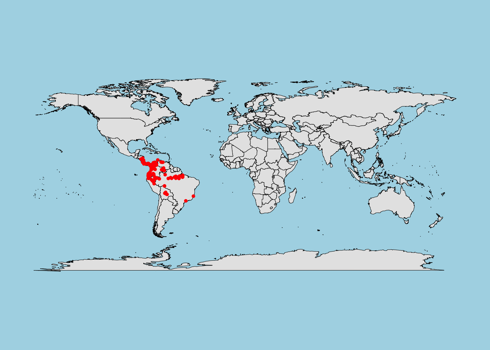
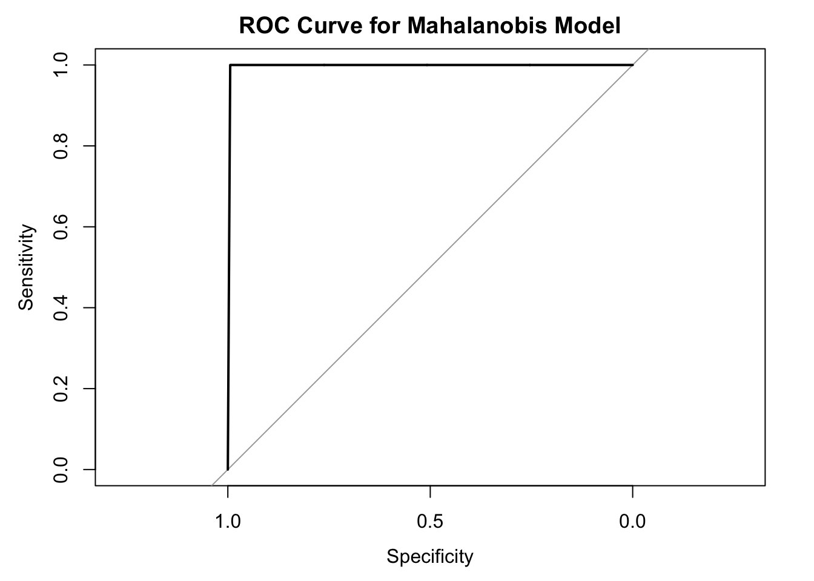

# **SDM Techniques**

---

## **1. Introduction to SDM Techniques**

::: {.rmdimportant}
**What are SDM Techniques?**

Species Distribution Modeling (SDM) techniques are statistical or machine learning methods used to predict the distribution of species based on environmental and biological data. These techniques analyze relationships between observed species occurrences and environmental predictors to create maps of potential distributions.
:::

### **Why Are SDM Techniques Important?**

- **Understanding Species-Environment Interactions**:  
  SDM techniques help ecologists identify the factors influencing where species thrive or struggle.
  
- **Conservation Planning**:  
  They support decisions about habitat protection, restoration, and species reintroduction by highlighting critical areas for biodiversity.

- **Climate Change Adaptation**:  
  Predict how species' ranges might shift under future environmental scenarios, aiding proactive conservation strategies.

---

::: {.rmdtip}
**Choosing the Right Technique Matters!**

Different SDM techniques are suited to specific types of data and research objectives. The success of your model depends on matching the right approach to your study goals and dataset characteristics.
:::

### **How SDM Techniques Work**

At their core, SDM techniques rely on three main components:

1. **Species Data**:  
   - **Presence-only data**: Where species are observed (e.g., herbarium records).
   - **Presence-absence data**: Locations where a species is both present and absent (e.g., systematic surveys).

2. **Environmental Predictors**:  
   - Variables like temperature, precipitation, soil type, or elevation, which influence species distributions.

3. **Modeling Algorithms**:  
   - Statistical or computational methods used to analyze relationships and generate predictions.

---

### **Key Goals of SDM Techniques**

| **Goal**                      | **Explanation**                                                                 |
|-------------------------------|---------------------------------------------------------------------------------|
| **Identify Key Predictors**   | Determine which environmental factors most influence species' distributions.    |
| **Predict Current Range**     | Map where species are likely to occur under current environmental conditions.   |
| **Forecast Future Scenarios** | Project potential range shifts due to climate change or habitat alterations.    |

---

::: {.rmdnote}
**Example**:  
For the eastern hemlock (*Tsuga canadensis*), SDM techniques might explore how temperature, soil moisture, and elevation influence its distribution, providing insights into its response to climate change.
:::

### **Takeaway**

SDM techniques are powerful tools for addressing ecological and conservation challenges. In the following sections, we will explore various SDM approaches, their strengths, and how to choose the best one for your research.


---

## **2. Primary Categories of SDM Techniques**

---

Species Distribution Modeling (SDM) techniques are diverse, each tailored to specific types of data and research objectives. They can be broadly categorized into four main groups:

---

### **2.1. Envelopes and Distance-Based Methods**

::: {.rmdnote}
**Overview**: These methods define the environmental conditions (or "envelopes") suitable for a species or use similarity metrics to assess habitat suitability.
:::

#### **BIOCLIM**
- **What it does**:  
  Identifies climatic envelopes by considering species occurrences within the range of environmental conditions.
- **Strengths**:  
  - Simple and intuitive.
  - Effective for presence-only data.
- **Limitations**:  
  - Assumes all conditions within the envelope are equally suitable.
- **Use Case**: Mapping climatic suitability for plant species based on temperature and precipitation.

#### **DOMAIN**
- **What it does**:  
  Calculates environmental similarity using Gower's distance to assess habitat suitability.
- **Strengths**:  
  - Easy to implement.
  - Handles multi-dimensional environmental data well.
- **Limitations**:  
  - Sensitive to outliers.
- **Use Case**: Predicting the distribution of insect species based on microhabitat conditions.

#### **Mahalanobis Distance**
- **What it does**:  
  Measures multivariate similarity based on the covariance structure of the data.
- **Strengths**:  
  - Robust to multicollinearity among predictors.
  - Suitable for continuous environmental data.
- **Limitations**:  
  - Assumes a linear relationship between variables.
- **Use Case**: Modeling habitat suitability for mammals in forested landscapes.

#### **Ecological Niche Factor Analysis (ENFA)**
- **What it does**:  
  Identifies the species' ecological niche by comparing environmental conditions at presence locations to the overall study area.
- **Strengths**:  
  - Provides insights into ecological specialization.
  - Useful for rare species with limited data.
- **Limitations**:  
  - Requires careful interpretation of niche parameters.
- **Use Case**: Studying niche shifts in invasive species.

---

### **2.2. Regression-Based Methods**

::: {.rmdtip}
**Overview**: These methods analyze the relationship between species occurrences and environmental predictors, often providing interpretable models.
:::

#### **Generalized Linear Models (GLMs)**
- **What it does**:  
  Models species-environment relationships using linear predictors and a link function.
- **Strengths**:  
  - Flexible and interpretable.
  - Handles presence-absence data well.
- **Limitations**:  
  - Assumes linear or predefined relationships.
- **Use Case**: Analyzing the effect of temperature and precipitation on bird distributions.

#### **Generalized Additive Models (GAMs)**
- **What it does**:  
  Extends GLMs by allowing non-linear relationships through smooth functions.
- **Strengths**:  
  - Captures complex, non-linear relationships.
  - Highly flexible.
- **Limitations**:  
  - Computationally intensive for large datasets.
- **Use Case**: Modeling species distribution along temperature gradients.

#### **Multivariate Adaptive Regression Splines (MARS)**
- **What it does**:  
  Breaks predictor relationships into piecewise linear segments.
- **Strengths**:  
  - Handles complex, non-linear interactions.
  - Automatic feature selection.
- **Limitations**:  
  - Requires careful parameter tuning.
- **Use Case**: Predicting fish distributions in aquatic systems.

#### **Bayesian Approaches**
- **What it does**:  
  Incorporates prior knowledge and updates predictions with observed data.
- **Strengths**:  
  - Accounts for uncertainty.
  - Ideal for sparse or noisy data.
- **Limitations**:  
  - Computationally demanding.
- **Use Case**: Modeling rare species distributions with limited occurrence data.

---

### **2.3. Decision Tree Methods**

::: {.rmdnote}
**Overview**: Decision trees split data into hierarchical branches, providing interpretable models for species-environment relationships.
:::

#### **Classification and Regression Trees (CART)**
- **What it does**:  
  Builds a decision tree to classify species presence or absence based on environmental thresholds.
- **Strengths**:  
  - Simple and intuitive.
  - Handles non-linear relationships well.
- **Limitations**:  
  - Prone to overfitting without pruning.
- **Use Case**: Identifying habitat thresholds for amphibian species based on wetland characteristics.

---

### **2.4. Machine Learning Approaches**

::: {.rmdimportant}
**Overview**: Advanced techniques that excel in handling complex data with high dimensionality and interactions.
:::

#### **Maximum Entropy (MaxEnt)**
- **What it does**:  
  Predicts species distribution by maximizing entropy under environmental constraints.
- **Strengths**:  
  - Works well with presence-only data.
  - Easy to interpret.
- **Limitations**:  
  - May overfit with small datasets.
- **Use Case**: Mapping potential distributions of endangered plants.

#### **Random Forests**
- **What it does**:  
  Combines multiple decision trees to improve predictive accuracy.
- **Strengths**:  
  - Handles large datasets and complex interactions.
  - Robust to overfitting.
- **Limitations**:  
  - Difficult to interpret compared to simpler models.
- **Use Case**: Predicting bird distributions across diverse habitats.

#### **Boosted Regression Trees (BRT/GBM)**
- **What it does**:  
  Sequentially builds decision trees to minimize prediction errors.
- **Strengths**:  
  - High predictive accuracy.
  - Handles non-linear relationships and interactions.
- **Limitations**:  
  - Computationally expensive.
- **Use Case**: Modeling shifts in species ranges under future climate scenarios.

#### **Artificial Neural Networks (ANNs)**
- **What it does**:  
  Mimics human brain processes to model complex relationships.
- **Strengths**:  
  - Highly flexible and powerful for large datasets.
  - Captures non-linear relationships.
- **Limitations**:  
  - Requires large training datasets.
  - Difficult to interpret.
- **Use Case**: Predicting aquatic species distributions based on multiple predictors.

#### **Support Vector Machines (SVMs)**
- **What it does**:  
  Separates species presence and absence data using hyperplanes in high-dimensional space.
- **Strengths**:  
  - Effective for small datasets with complex boundaries.
  - Handles high-dimensional data well.
- **Limitations**:  
  - Computationally intensive.
- **Use Case**: Mapping species distributions in fragmented landscapes.

---

### **Key Takeaways**

- Different SDM techniques cater to different types of data (e.g., presence-only, presence-absence) and study goals.
- **Envelopes and Distance-Based Methods** are simple and intuitive but limited in complexity.
- **Regression-Based Methods** balance interpretability and flexibility.
- **Decision Tree Methods** are easy to understand but can overfit.
- **Machine Learning Approaches** provide powerful tools for complex, high-dimensional data but require careful tuning and interpretation.

## **3. Focus on Mahalanobis Distance**

---

### **What is it?**

::: {.rmdnote}
**Mahalanobis Distance**: A statistical measure of multivariate similarity that evaluates how similar a new observation is to a reference set based on multiple variables.
:::

#### **Key Characteristics**
- **Accounts for Correlations**: It considers correlations between variables and adjusts for differences in their scales.
- **Presence-Only Method**: Suitable for datasets where only species presence is recorded.
- **Linear Assumptions**: Assumes a linear relationship between predictors.
- **Output**: Provides a distance metric (D²), where smaller values indicate higher similarity to the reference conditions.

---

### **Key Features**

#### **Advantages**
- **Collinearity-Free Analysis**: Handles correlated predictors effectively by considering their covariance structure.
- **Continuous Predictors**: Works seamlessly with continuous environmental data.
- **Simple and Accessible**: Easy to implement with minimal data preprocessing.

#### **Limitations**
- **Assumes Equal Weights**: All predictors are treated as equally important unless modified.
- **Linear Assumptions**: May not perform well with non-linear relationships or categorical data.

---

### **Implementation in R**

::: {.rmdtip}
The **`mahal` function** from the **`dismo`** package is commonly used to calculate Mahalanobis distances for SDM.
:::

#### **Steps for Implementation**
1. Prepare presence-only data and environmental variables.
2. Compute the Mahalanobis distance for each cell in the study area.
3. Map the resulting suitability values.

---

## **4. Comparing SDM Techniques**

### **Summary Table of SDM Techniques**

| **Technique**                | **Strengths**                                                   | **Limitations**                                                | **When to Use**                              |
|------------------------------|---------------------------------------------------------------|--------------------------------------------------------------|---------------------------------------------|
| **BIOCLIM**                  | Simple and intuitive; requires minimal data                   | Assumes equal suitability within climatic envelopes           | Quick assessments of climatic suitability   |
| **Mahalanobis Distance**     | Handles correlated predictors; suitable for presence-only data | Assumes linear relationships; continuous predictors only      | Presence-only data with multivariate traits |
| **GLMs/GAMs**                | Flexible and interpretable                                    | Sensitive to multicollinearity; assumes predefined functions  | Parametric analyses of species relationships|
| **MaxEnt**                   | Robust for presence-only data                                 | Risk of overfitting with small datasets                      | Predictive modeling with limited presence data |
| **Random Forests**           | Handles complex interactions and high-dimensional data        | Computationally intensive; less interpretable                | Complex ecological interactions             |
| **Boosted Regression Trees** | High predictive accuracy                                      | Requires tuning; computationally expensive                   | Predicting range shifts under climate change|

---

### **Guidance on Technique Selection**

#### **Data Type**
- **Presence-Only**: Consider **MaxEnt**, **BIOCLIM**, or **Mahalanobis Distance**.
- **Presence-Absence**: Use **GLMs**, **GAMs**, or **Random Forests**.

#### **Study Goals**
- **Ecological Insights**: Choose interpretable models like **GLMs** or **BIOCLIM**.
- **Predictive Accuracy**: Opt for machine learning approaches like **MaxEnt** or **BRT**.

---

## **5. Key Considerations for Choosing an SDM Technique**

---

### **1. Data Availability**
- **Presence-Only vs. Presence-Absence**:
  - Presence-only data limits the choice of models but is common in ecological datasets.
  - Presence-absence data allows for more complex algorithms and better evaluation metrics.

### **2. Predictor Selection**
- Choose variables that are ecologically relevant to the species.
- Avoid multicollinearity to prevent misleading results.

::: {.rmdcaution}
**Pro Tip**: Use techniques like **Variance Inflation Factor (VIF)** to identify and remove highly correlated predictors.
:::

### **3. Computational Resources**
- **Simpler Methods**: Use regression-based or distance-based models for quick analyses.
- **Machine Learning**: Requires more resources but provides higher predictive accuracy.

### **4. Study Objectives**
- Align the model choice with the research question. For example:
  - Use **MaxEnt** for endangered species with sparse data.
  - Opt for **BRT** to model complex interactions and project future distributions.

---

## **6. Summary and Key Takeaways**

---

### **Key Points**
- SDM techniques vary in complexity, data requirements, and predictive capabilities.
- **Mahalanobis Distance** is a versatile method for presence-only data, particularly when predictors are continuous and correlated.
- Machine learning approaches like **Random Forests** and **MaxEnt** excel in predictive accuracy but require careful tuning and validation.

### **Next Steps**
- Explore hybrid models that combine the strengths of different SDM techniques.
- Delve into advanced topics like ensemble modeling and integrating ecological processes.

By choosing the right SDM technique, researchers can effectively address ecological questions and inform conservation strategies with robust predictions.


``` r
# Step 1: Load Required Libraries
library(dismo)  # For species distribution modeling
#> Loading required package: raster
#> Loading required package: sp
library(raster) # For raster data manipulation
library(maps)   # For base map visualization
library(pROC)   # For model evaluation (ROC curve)
#> Type 'citation("pROC")' for a citation.
#> 
#> Attaching package: 'pROC'
#> The following objects are masked from 'package:stats':
#> 
#>     cov, smooth, var
```


``` r
# Step 2: Load Example Occurrence Data
# Using Bradypus (sloth) occurrence data included in the `dismo` package
file <- paste0(system.file("ex", package = "dismo"), "/bradypus.csv")
bradypus <- read.csv(file)

# Keep only longitude and latitude columns
bradypus <- bradypus[, 2:3]
names(bradypus) <- c("lon", "lat")

# Visualize the occurrence data on a world map
map("world", col = "gray90", fill = TRUE, bg = "lightblue", lwd = 0.5)
points(bradypus, col = "red", pch = 20, cex = 0.8)
```




``` r
# Step 3: Load Environmental Data
# Load environmental predictors provided in the `dismo` package
path <- system.file("ex", package = "dismo")
files <- list.files(path, pattern = "grd$", full.names = TRUE)
predictors <- stack(files)  # Stack all raster layers

# Ensure predictors have a valid CRS and check their structure
crs(predictors)  # Verify CRS
#> Coordinate Reference System:
#> Deprecated Proj.4 representation:
#>  +proj=longlat +ellps=WGS84 +towgs84=0,0,0,0,0,0,0
#> +no_defs 
#> WKT2 2019 representation:
#> BOUNDCRS[
#>     SOURCECRS[
#>         GEOGCRS["unknown",
#>             DATUM["World Geodetic System 1984",
#>                 ELLIPSOID["WGS 84",6378137,298.257223563,
#>                     LENGTHUNIT["metre",1]],
#>                 ID["EPSG",6326]],
#>             PRIMEM["Greenwich",0,
#>                 ANGLEUNIT["degree",0.0174532925199433],
#>                 ID["EPSG",8901]],
#>             CS[ellipsoidal,2],
#>                 AXIS["longitude",east,
#>                     ORDER[1],
#>                     ANGLEUNIT["degree",0.0174532925199433,
#>                         ID["EPSG",9122]]],
#>                 AXIS["latitude",north,
#>                     ORDER[2],
#>                     ANGLEUNIT["degree",0.0174532925199433,
#>                         ID["EPSG",9122]]]]],
#>     TARGETCRS[
#>         GEOGCRS["WGS 84",
#>             DATUM["World Geodetic System 1984",
#>                 ELLIPSOID["WGS 84",6378137,298.257223563,
#>                     LENGTHUNIT["metre",1]]],
#>             PRIMEM["Greenwich",0,
#>                 ANGLEUNIT["degree",0.0174532925199433]],
#>             CS[ellipsoidal,2],
#>                 AXIS["geodetic latitude (Lat)",north,
#>                     ORDER[1],
#>                     ANGLEUNIT["degree",0.0174532925199433]],
#>                 AXIS["geodetic longitude (Lon)",east,
#>                     ORDER[2],
#>                     ANGLEUNIT["degree",0.0174532925199433]],
#>             ID["EPSG",4326]]],
#>     ABRIDGEDTRANSFORMATION["Transformation from unknown to WGS84",
#>         METHOD["Geocentric translations (geog2D domain)",
#>             ID["EPSG",9603]],
#>         PARAMETER["X-axis translation",0,
#>             ID["EPSG",8605]],
#>         PARAMETER["Y-axis translation",0,
#>             ID["EPSG",8606]],
#>         PARAMETER["Z-axis translation",0,
#>             ID["EPSG",8607]]]]
names(predictors)  # View predictor names
#> [1] "bio1"  "bio12" "bio16" "bio17" "bio5"  "bio6"  "bio7" 
#> [8] "bio8"  "biome"

# Visualize one of the predictors
plot(predictors[[1]], main = "Environmental Predictor: Layer 1")
```


``` r
# Step 4: Extract Environmental Values at Occurrence Points
# Get the environmental values corresponding to the occurrence locations
presvals <- extract(predictors, bradypus)
head(presvals)  # This contains environmental values, not coordinates
#>      bio1 bio12 bio16 bio17 bio5 bio6 bio7 bio8 biome
#> [1,]  263  1639   724    62  338  191  147  261     1
#> [2,]  263  1639   724    62  338  191  147  261     1
#> [3,]  253  3624  1547   373  329  150  179  271     1
#> [4,]  243  1693   775   186  318  150  168  264     1
#> [5,]  243  1693   775   186  318  150  168  264     1
#> [6,]  252  2501  1081   280  326  154  172  270     1

# Combine spatial coordinates with environmental values for Mahalanobis
presence_points <- cbind(bradypus, presvals)
```


``` r
# Step 5: Generate Background Points
# Generate random points (pseudo-absences) within the raster extent
set.seed(123)  # For reproducibility
bg_points <- randomPoints(predictors, n = 500)  # Generate 500 points

# Extract environmental values at the background points
bgvals <- extract(predictors, bg_points)

# Combine presence and background data for modeling
presence_absence <- c(rep(1, nrow(presvals)), rep(0, nrow(bgvals)))
sdmData <- data.frame(pa = presence_absence, rbind(presvals, bgvals))
```


``` r
# Step 6: Mahalanobis Distance Model
# Fit the Mahalanobis model using presence locations and environmental values
mahal_model <- mahal(presence_points[, -c(1, 2)])  # Exclude coordinates, use predictors

summary(mahal_model)
#>      Length       Class        Mode 
#>           1 Mahalanobis          S4
```


``` r
# Step 7: Create a Prediction Map
# Predict Mahalanobis distances across the raster extent
mahal_map <- predict(predictors, mahal_model)

# Visualize the prediction map
plot(mahal_map, main = "Mahalanobis Distance Map")
map("world", add = TRUE, col = "gray", lwd = 0.5)
```


``` r
# Step 8: Evaluate the Model
# Evaluate predictions using presence and background points
presence_pred <- extract(mahal_map, bradypus)
background_pred <- extract(mahal_map, bg_points)

# Combine predictions into one vector
predictions <- c(presence_pred, background_pred)
labels <- c(rep(1, length(presence_pred)), rep(0, length(background_pred)))

# Generate a simple performance summary
roc_curve <- roc(labels, predictions)
#> Setting levels: control = 0, case = 1
#> Setting direction: controls < cases
plot(roc_curve, main = "ROC Curve for Mahalanobis Model")
```



``` r
auc_value <- auc(roc_curve)  # Area Under the Curve (AUC)

print(paste("AUC:", auc_value))
#> [1] "AUC: 0.997"
```
